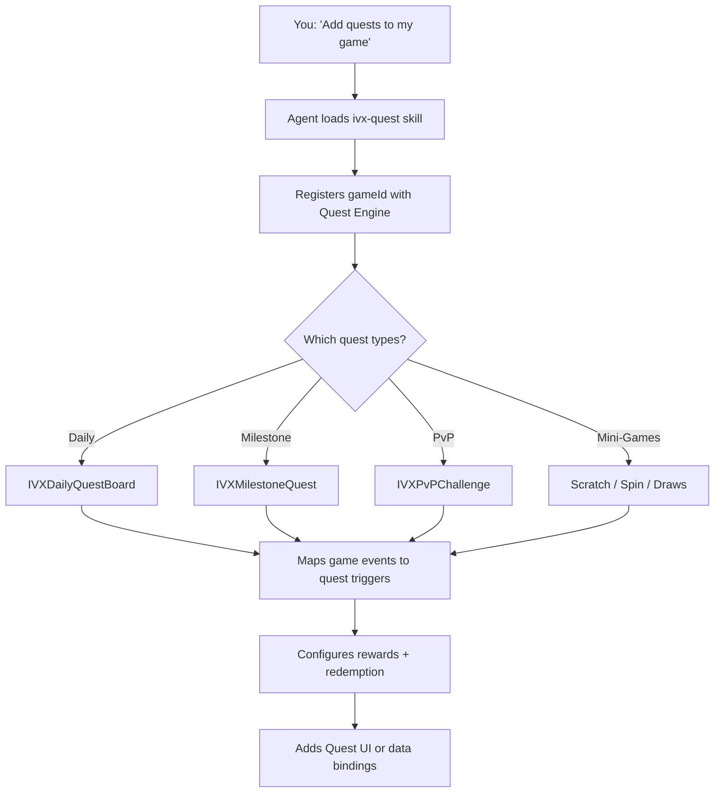

# IntelliVerseX Quest System

## Overview

The Quest system in IntelliVerseX SDK lets any game add task-based rewards, daily missions, milestone challenges, PvP competitions, and mini-game quests with a single integration. It is powered by:

- **Quest Engine** — Defines quests, tracks progress, triggers completions
- **Reward Engine** — Issues XUT tokens, updates leaderboards, awards badges
- **User Canvas** — Aggregated player profile (play history, quest history, preferences, wallet balance)
- **Quest-GameID Canvas** — Per-game analytics (quest completion rates, popular quests, conversion data)
- **Nakama Analytics Layer** — Ingests game events, updates canvases, triggers quest progress webhooks

---

## When to Use

Ask your AI agent any of these:

- "Add quests to my game"
- "Set up daily missions for my puzzle game"
- "Add Scratch & Win scratch cards"
- "Add Spin & Win lucky wheel"
- "Add IntelliDraws lottery"
- "Set up PvP challenges between players"
- "Create milestone quests for level progression"
- "Wire my game's win events to quest progress"
- "Add quest rewards with gift card redemption"
- "Show the daily quest board in my game"

---

## What the Agent Does



---

## Step-by-Step Integration

### Step 1: Prerequisites

Ensure these are set up first:

| Requirement | How to Check |
|-------------|-------------|
| SDK initialized | `IVXBootstrap` is in scene / entry point |
| Nakama authenticated | `IVXClient.Session` is valid |
| Wallet module enabled | `IVXBootstrapConfig.EnableWallet = true` |

If any are missing, run the `ivx-sdk-setup` skill first.

### Step 2: Initialize Quest Manager

```csharp
using IntelliVerseX.Quest;

await IVXQuestManager.Instance.Initialize(new QuestConfig {
    GameId = "your-game-id",       // from IntelliVerseX dashboard
    EnableDailyBoard = true,        // rotating daily missions
    EnablePvP = true,               // PvP challenges
    EnableMiniGames = true,         // Scratch & Win, Spin & Win, IntelliDraws
    AutoTrackGameEvents = true      // auto-wire Nakama events to quest progress
});
```

### Step 3: Map Game Events to Quest Triggers

Game events are how the Quest Engine knows a player made progress. Send events whenever something meaningful happens in your game:

```csharp
// When a player wins a match
IVXQuestManager.Instance.SendGameEvent(new GameEvent {
    EventType = "match_won",
    Payload = new { score = 2500, opponent = "player123", duration = 120 }
});

// When a player reaches a new level
IVXQuestManager.Instance.SendGameEvent(new GameEvent {
    EventType = "level_reached",
    Payload = new { level = 15 }
});

// When a player achieves a high score
IVXQuestManager.Instance.SendGameEvent(new GameEvent {
    EventType = "score_achieved",
    Payload = new { score = 10000 }
});

// Custom event for your specific game mechanic
IVXQuestManager.Instance.SendGameEvent(new GameEvent {
    EventType = "boss_defeated",
    Payload = new { bossId = "dragon_king", difficulty = "hard" }
});
```

The Quest Engine matches these events against active quest definitions. If a quest requires `match_won` and the player sends that event, progress increments automatically.

### Step 4: Daily Quest Board

```csharp
// Fetch today's quests (auto-refreshed every 24 hours)
var board = await IVXDailyQuestBoard.Instance.GetTodaysQuests();

foreach (var quest in board.Quests) {
    // quest.Title        → "Win 3 Matches"
    // quest.Description  → "Win 3 multiplayer matches today"
    // quest.Progress     → 1
    // quest.Target       → 3
    // quest.XutReward    → 50
    // quest.QuestType    → QuestType.WinMatches
    // quest.IsCompleted  → false
    // quest.ExpiresAt    → DateTime (end of day UTC)
}

// Listen for quest completion
IVXDailyQuestBoard.Instance.OnQuestCompleted += async (questId) => {
    var reward = await IVXQuestManager.Instance.ClaimReward(questId);
    ShowRewardPopup(reward.XutAmount);
};
```

### Step 5: Add Mini-Game Quests

#### Scratch & Win

Players earn scratch cards by completing quests, then scratch to reveal XUT prizes:

```csharp
IVXQuestManager.Instance.AddMiniGame(QuestType.ScratchAndWin, new ScratchConfig {
    RewardTiers = new[] { 10, 25, 50, 100, 500 },        // XUT amounts
    Probabilities = new[] { 0.40f, 0.30f, 0.15f, 0.10f, 0.05f },
    CardArtTheme = "gold",                                 // visual theme
    RequiresQuestCompletion = true                         // only earned, not bought
});
```

**User flow:** Complete quest → Earn scratch card → Scratch to reveal → XUT credited to wallet

#### Spin & Win

Lucky wheel with weighted segments:

```csharp
IVXQuestManager.Instance.AddMiniGame(QuestType.SpinAndWin, new SpinConfig {
    Segments = 8,
    Rewards = new[] { 5, 10, 25, 50, 10, 5, 100, 25 },   // XUT per segment
    Colors = new[] { "#FF6B6B", "#4ECDC4", "#45B7D1", "#96CEB4",
                     "#FFEAA7", "#DDA0DD", "#FFD700", "#87CEEB" },
    GuaranteedWinAfter = 3,                                // pity mechanic
    SpinCost = 0                                           // free spins earned via quests
});
```

**User flow:** Complete quest → Earn free spin → Spin the wheel → XUT credited

#### IntelliDraws (Lottery)

Players earn draw tickets through gameplay, winners drawn at scheduled intervals:

```csharp
IVXQuestManager.Instance.AddMiniGame(QuestType.IntelliDraws, new DrawConfig {
    DrawSchedule = "daily",             // "daily", "weekly", or cron expression
    TicketsPerQuest = 1,                // tickets earned per quest completion
    MaxTicketsPerDraw = 10,             // max entries per player per draw
    PrizePool = 10000,                  // total XUT pool per draw
    WinnerCount = 5,                    // number of winners per draw
    DrawTime = "20:00 UTC"              // when the draw happens
});

// Listen for draw results
IVXQuestManager.Instance.OnDrawResult += (result) => {
    if (result.IsWinner) {
        ShowWinnerCelebration(result.PrizeAmount);
    }
};
```

**User flow:** Play game → Earn tickets → Enter draw → Winners announced → XUT distributed

### Step 6: Milestone Quests

Progressive quests that chain goals together:

```csharp
var milestones = await IVXMilestoneQuest.Instance.GetMilestones();
// Example chain:
// Tier 1: "Reach Level 5"   → 25 XUT
// Tier 2: "Reach Level 20"  → 100 XUT
// Tier 3: "Reach Level 50"  → 500 XUT
// Tier 4: "Reach Level 100" → 2000 XUT

// Custom milestone definitions via admin panel or code
await IVXMilestoneQuest.Instance.DefineChain(new MilestoneChain {
    GameId = "your-game-id",
    EventType = "level_reached",
    Tiers = new[] {
        new MilestoneTier { Target = 5,   XutReward = 25 },
        new MilestoneTier { Target = 20,  XutReward = 100 },
        new MilestoneTier { Target = 50,  XutReward = 500 },
        new MilestoneTier { Target = 100, XutReward = 2000 }
    }
});
```

### Step 7: PvP Challenges

Competitive quests where players race to complete objectives:

```csharp
// Create a PvP challenge
var challenge = await IVXPvPChallenge.Instance.Create(new PvPConfig {
    QuestType = QuestType.WinMatches,
    Target = 5,                          // first to 5 wins
    StakeAmount = 50,                    // each player stakes 50 XUT
    Duration = TimeSpan.FromHours(24),   // 24-hour window
    MinRankDiff = 200                    // matchmaking rank range
});

// Accept a challenge
await IVXPvPChallenge.Instance.Accept(challengeId);

// Track live progress
IVXPvPChallenge.Instance.OnProgressUpdate += (update) => {
    // update.MyProgress, update.OpponentProgress
    UpdatePvPUI(update);
};
```

### Step 8: Claim Rewards and Redemption

```csharp
// Claim XUT reward on completion
var reward = await IVXQuestManager.Instance.ClaimReward(questId);
// reward.XutAmount   → 50
// reward.BadgeId     → "first_quest_complete" (optional)
// reward.BonusItems  → [] (optional in-game items)

// Check wallet balance
var balance = await IVXWallet.Instance.GetBalance();
// balance.Xut → 1250

// Redemption options
var giftCards = await IVXRedemption.Instance.GetGiftCards(countryCode: "US");
var topUps = await IVXRedemption.Instance.GetMobileTopUps(countryCode: "IN");
var digitalItems = await IVXRedemption.Instance.GetDigitalMerch(category: "audiobooks");

// Redeem XUT for a gift card
await IVXRedemption.Instance.RedeemGiftCard(new RedeemRequest {
    ProductId = giftCards[0].Id,   // e.g. Amazon $10
    XutAmount = 1000
});

// Redeem XUT for digital merchandise (audiobook, video, game skin)
await IVXRedemption.Instance.RedeemDigitalMerch(new RedeemRequest {
    ProductId = digitalItems[0].Id,   // e.g. "audiobook-mystery-vol1"
    XutAmount = 200,
    DeliveryMethod = DeliveryMethod.InAppDownload
});
```

---

## Quest Types Reference

| Quest Type | Enum | Event Trigger | Typical Reward |
|-----------|------|--------------|---------------|
| Daily Mission | `QuestType.DailyMission` | Various (rotates) | 10–50 XUT |
| Win Matches | `QuestType.WinMatches` | `match_won` | 25–100 XUT |
| Reach Level | `QuestType.ReachLevel` | `level_reached` | 50–2000 XUT |
| Achieve Score | `QuestType.AchieveScore` | `score_achieved` | 25–500 XUT |
| Play Streak | `QuestType.PlayStreak` | `session_start` (consecutive days) | 50–200 XUT |
| Leaderboard Rank | `QuestType.LeaderboardRank` | Automatic (rank check) | 100–5000 XUT |
| Custom Event | `QuestType.CustomEvent` | Your custom event string | Configurable |
| Scratch & Win | `QuestType.ScratchAndWin` | Quest completion | 10–500 XUT |
| Spin & Win | `QuestType.SpinAndWin` | Quest completion | 5–100 XUT |
| IntelliDraws | `QuestType.IntelliDraws` | Quest completion (tickets) | Pool-based |
| Gift Card | `QuestType.GiftCard` | Wallet redemption | Gift card value |
| Survey | `QuestType.Survey` | Survey completion | 25–100 XUT |
| Referral | `QuestType.Referral` | Friend signup + first quest | 200–500 XUT |

---

## UI Prefabs

Pre-built UI components included in the `IntelliVerseX.QuestUI` assembly:

| Prefab | Description |
|--------|------------|
| `QuestBoardPanel` | Full daily quest board with progress bars |
| `QuestCard` | Single quest card with icon, progress, and claim button |
| `ScratchCardView` | Interactive scratch card with touch/mouse scratching |
| `SpinWheelView` | Animated lucky wheel with configurable segments |
| `DrawTicketView` | IntelliDraws ticket display with countdown to next draw |
| `PvPChallengeCard` | Side-by-side progress display for PvP challenges |
| `RewardPopup` | Animated reward celebration popup |
| `RedemptionBrowser` | Gift card / top-up catalog browser |

To use prefabs, drag them into your scene or instantiate at runtime:

```csharp
var questBoard = IVXQuestUI.Instance.ShowQuestBoard();
var scratchCard = IVXQuestUI.Instance.ShowScratchCard(cardId);
var spinWheel = IVXQuestUI.Instance.ShowSpinWheel();
```

---

## Event-to-Quest Mapping (Per GameID)

When integrating a new gameID, the agent maps your game's events to quest triggers:

```
Your Game Events          Quest Engine Triggers
─────────────────         ─────────────────────
match_won          →      QuestType.WinMatches
level_reached      →      QuestType.ReachLevel
score_achieved     →      QuestType.AchieveScore
session_start      →      QuestType.PlayStreak (streak tracking)
boss_defeated      →      QuestType.CustomEvent
item_collected     →      QuestType.CustomEvent
friend_invited     →      QuestType.Referral
```

New events can be registered at runtime:

```csharp
IVXQuestManager.Instance.RegisterEventMapping("combo_achieved", QuestType.CustomEvent);
```

---

## Admin Panel: Quest-GameID Canvas

The Quest-GameID Canvas in the admin panel provides per-game analytics:

| Metric | Description |
|--------|------------|
| Quest Completion Rate | % of assigned quests completed per game |
| Popular Quest Types | Most-completed quest types for this game |
| Avg. XUT Earned/Day | Average daily XUT earnings per player |
| Redemption Conversion | % of XUT earned that gets redeemed |
| PvP Engagement | % of players who participate in PvP challenges |
| Mini-Game Plays | Scratch / Spin / Draw usage stats |
| Event Frequency | Most common game events sent |
| Cold-Start Score | Confidence score for recommending this game's quests to new users |

---

## Testing

```csharp
// Enable test mode (no real XUT issued)
IVXQuestManager.Instance.SetTestMode(true);

// Simulate a game event
IVXQuestManager.Instance.SimulateEvent("match_won", count: 5);

// Force-complete a quest for testing
await IVXQuestManager.Instance.ForceComplete(questId);

// Reset daily board (test only)
await IVXDailyQuestBoard.Instance.ResetForTesting();
```

---

## Troubleshooting

| Symptom | Cause | Fix |
|---------|-------|-----|
| Quests not appearing | `EnableDailyBoard` is false | Set `QuestConfig.EnableDailyBoard = true` |
| Events not triggering progress | Event type mismatch | Check `EventType` string matches quest definition exactly |
| Rewards show 0 XUT | Wallet module not enabled | Set `IVXBootstrapConfig.EnableWallet = true` |
| Scratch card not interactive | Missing `QuestUI` assembly | Import `IntelliVerseX.QuestUI` package |
| PvP not finding opponents | Too narrow rank range | Increase `MinRankDiff` or wait for more players |
| Draw results delayed | Draw time not reached | Check `DrawConfig.DrawTime` setting |

---

## Dependencies

| Module | Required | Why |
|--------|----------|-----|
| `IntelliVerseX.Core` | Yes | SDK bootstrap and Nakama connection |
| `IntelliVerseX.Wallet` | Yes | XUT token balance and transactions |
| `IntelliVerseX.Backend` | Yes | Nakama RPC calls for quest operations |
| `IntelliVerseX.QuestUI` | Optional | Pre-built UI prefabs |
| `IntelliVerseX.Multiplayer` | Optional | Required only for PvP challenges |
