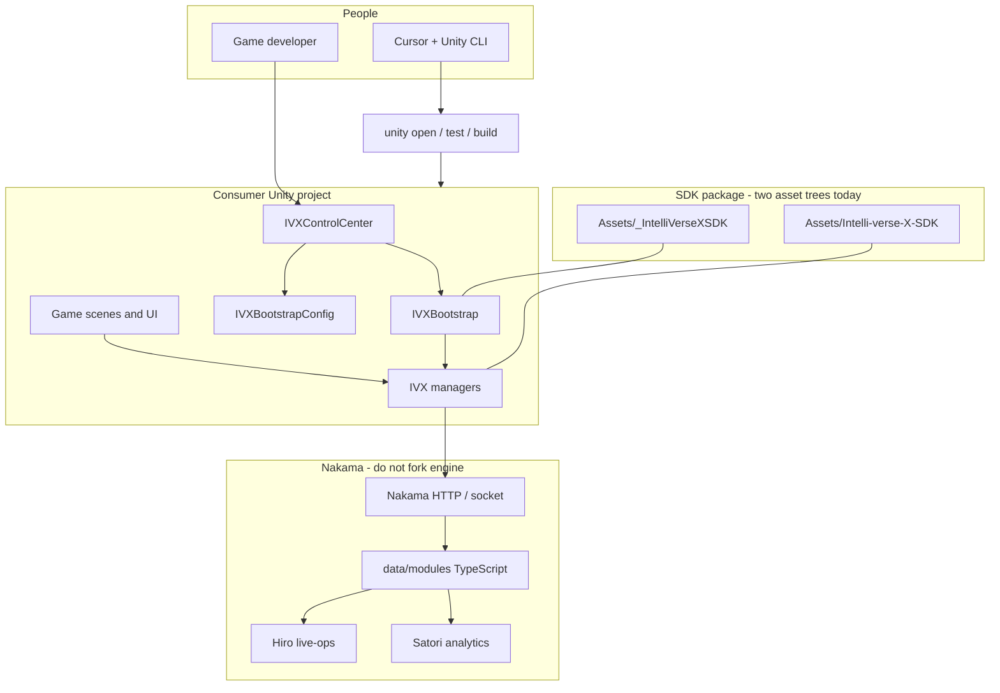
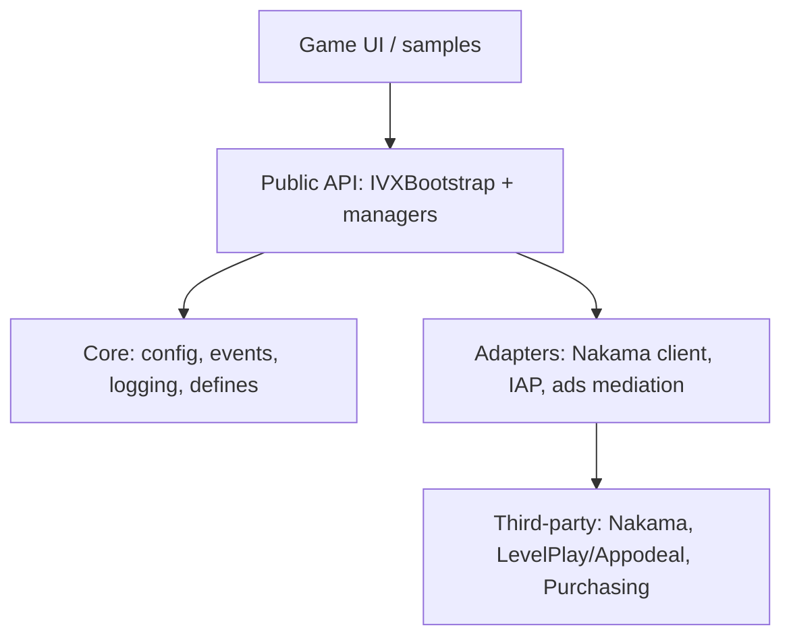
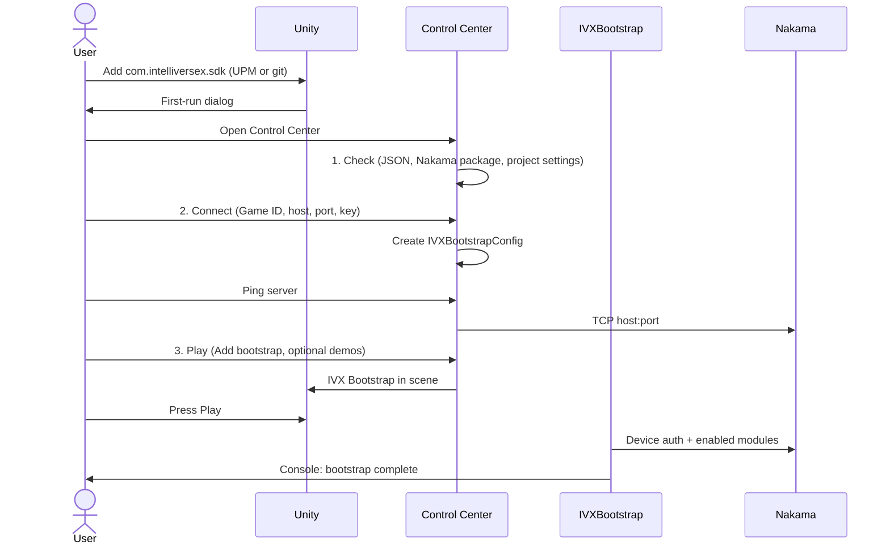
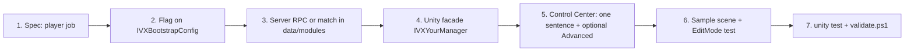
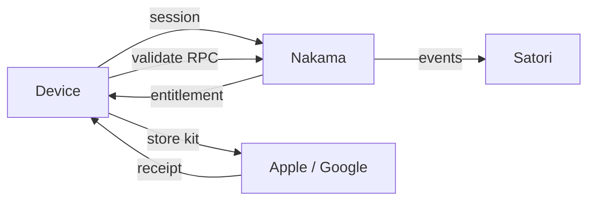

# IntelliVerseX System Design

**Status:** Living spec (Unity SDK + Nakama runtime)  
**Audience:** SDK owners, game teams, and anyone shipping a feature this week  
**Related:** [Unity SDK revamp plan](UNITY_SDK_REVAMP_PLAN.md), [World-class control plane plan](WORLD_CLASS_CONTROL_PLANE.md), [ADR-002 dual-tree layout](adr/ADR-002-dual-tree-layout.md), `.cursor/architecture.md`, `.cursor/NON_GOALS.md`

This is the single map of **how the product is supposed to work**: who owns which script, how a normal user gets from install to Play, and how we add features without another 4,800-line wizard.

---

## 1. One-sentence product

IntelliVerseX is a **game operating system**: Unity (and other engines) talk only to **public SDK facades**; those facades talk to **Nakama**; Nakama runs **authoritative modules** (identity, economy, live-ops, multiplayer). The Editor **Control Center** is the only thing a first-time user must learn.

---

## 2. How everything is managed (control planes)

There are four planes. Mixing them is how the repo got hard to use.

| Plane | Who uses it | What it manages | Source of truth |
|-------|-------------|-----------------|-----------------|
| **Editor (human)** | Indie / “any kid” | Install, connect, Play, demos | `IVXControlCenter` → config assets in the **game project** |
| **CLI (agent / CI)** | You + Cursor + GitHub Actions | Open, test, build, pipeline | Unity CLI (`unity`), never MCP first |
| **Runtime SDK** | Game code | Auth, ads, IAP, social, quiz | `IVXBootstrap` + `IVX*Manager` |
| **Server** | Live ops / infra | RPCs, matches, wallets, experiments | `C:\Office\Backend\nakama\data\modules` |

**Rule:** A new feature is not “done” until it has a **toggle on `IVXBootstrapConfig`**, a **Unity facade**, a **Nakama RPC (if it needs a server)**, a **Control Center or Advanced Setup action**, and a **test**. If any of those is missing, it is a prototype, not a shippable module.

---

## 3. System context (what talks to what)



**Hard boundaries**

- Game code **never** calls Heroic Labs Nakama APIs except through IVX types.
- Game code **never** registers RPCs. Server modules do.
- Do **not** add Unity Gaming Services (Cloud Save, Lobby) as a second live backend.
- Do **not** edit Nakama Go runtime, Photon, Appodeal, or Apple Auth.

---

## 4. Target runtime architecture (layers)



**Allowed dependencies (summary)**

- Core depends on **nothing** in other IVX modules.
- Every module may depend on Core.
- Identity and Backend may talk to each other (session + Nakama).
- Monetization may emit analytics; it must not own identity.
- No cycles. New modules attach **sideways** via bootstrap flags, not by reaching into siblings.

---

## 5. Script ownership — who is responsible for what

This is the RACI for code. If a file is not on this list, it is either a sample, a test, or debt.

### 5.1 Editor (install and control)

| Script | Owns | Must not own |
|--------|------|----------------|
| `Editor/IVXControlCenter.cs` | **Default UX.** Check / Connect / Play. Create `IVXBootstrapConfig`. Ping host:port. Add bootstrap to scene. Demo scenes. | Ads catalogs, IAP products, 10-tab sprawl |
| `Editor/IVXSDKSetupWizard.cs` | **Advanced Setup.** Per-module wiring (auth prefabs, friends, wallet, ads, IAP, More Of Us, platform validation) | First-run; kid path |
| `Editor/IVXSetupWizard.cs` | Legacy; **redirects to Control Center** | New UI |
| `Editor/IVXProjectSetup.cs` | Tags, layers, scripting defines, first-run prompt | Network / Nakama |
| `Editor/IVXConsumerAssetInstaller.cs` | Copy demo scenes/prefabs into the **game** Assets folder (UPM-safe) | Runtime logic |
| `Editor/IVXDependencyChecker.cs` / `IVXDependencyInstaller.cs` / `IVXDependencyValidator.cs` | Detect/install Newtonsoft, Nakama, optional packages | Gameplay |
| `Bootstrap/Editor/IVXBootstrapMenu.cs` | Docs links, dependency status dialog | Duplicate Control Center |
| `Bootstrap/Editor/IVXDefineSymbolManager.cs` | `INTELLIVERSEX_SDK`, `IVX_NAKAMA`, … | Feature flags that belong on the config SO |

### 5.2 Bootstrap and identity (the only path into the SDK)

| Script | Owns |
|--------|------|
| `Assets/_IntelliVerseXSDK/Bootstrap/IVXBootstrap.cs` | Singleton lifecycle, `InitializeAsync`, module start order, `OnBootstrapComplete` |
| `Assets/_IntelliVerseXSDK/Bootstrap/IVXBootstrapConfig.cs` | GameId, Nakama host/port/key/SSL, feature toggles (Hiro, Satori, AI, Discord, Multiplayer, Platform) |
| `Assets/Intelli-verse-X-SDK/Core/IntelliVerseXManager.cs` | Legacy umbrella manager — **do not add new features here**; route through Bootstrap |
| `Assets/Intelli-verse-X-SDK/Core/IntelliVerseXConfig.cs` | Legacy game config SO — migrate reads toward BootstrapConfig |
| Identity: `UserSessionManager.cs`, `APIManager.cs` | Session and HTTP to platform APIs |
| `Assets/Intelli-verse-X-SDK/Backend/IVXNakamaManager.cs` | Abstract Nakama realtime provider |
| `Assets/Intelli-verse-X-SDK/Backend/IVXWalletManager.cs` | Client wallet **display and RPC calls**; server is source of truth |

### 5.3 Feature managers (Unity)

Each manager is a **facade**: local cache + events + calls to Nakama or a store SDK. Gameplay stays in the game.

| Domain | Primary scripts | Server counterpart |
|--------|-----------------|--------------------|
| Ads | `IVXAdsManager`, `IVXAdsWaterfallManager`, `IVXWebGLAdsManager` | Impression / ILRD via analytics; no second ad SDK |
| IAP | `IVXIAPManager`, `IVXSubscriptionManager`, `IVXFreeTrialManager` | Nakama purchase validation RPCs |
| Social | `IVXFriendsManager`, `IVXClanManager`, `IVXGShareManager` | Friends / groups modules |
| Live ops | `IVXQuestManager`, `IVXDailyMissionsManager`, `IVXSeasonPassManager`, `IVXRetentionManager` | Hiro + `data/modules/src/hiro`, quests |
| Competition | `IVXTournamentManager`, `IVXLeagueManager`, `IVXGLeaderboardManager` | `src/tournaments`, leaderboard RPCs |
| Quiz | `IVXQuizSessionManager`, daily/weekly quiz | QuizVerse plugin in `main.ts` |
| Multiplayer | `IVXLobbyManager`, `IVXMatchmakingManager`, `IVXGameModeManager`, kernel | `MpKernelModule` + match templates |
| AI | `IVXAISessionManager`, `IVXAINPCDialogManager` | AI RPCs / external LLM — mock mode on `IVXAIConfig` |
| Discord | `IVXDiscordManager` | Discord Social SDK; optional |
| Analytics | `IVXAnalyticsManager` + Satori client | Satori + `AnalyticsAlerts` on server |
| Localization | `IVXLanguageManager` | String tables in the game; not Nakama |
| UI shell | `IVXUIManager` | Sample HUD only — **not** consumer art |

### 5.4 Nakama (`C:\Office\Backend\nakama`)

| Path | Owns |
|------|------|
| Nakama engine (`server/`, Go) | **Read-only.** Accounts, storage, matches, IAP validation primitives |
| `data/modules/src/main.ts` | **InitModule.** Register health, analytics hooks, MpKernel, QuizVerse, Hiro, crons |
| `data/modules/src/**/*.ts` | New RPCs and match logic. `postbuild.js` owns the RPC ID list |
| `data/modules/*.js` compiled output | Deploy artifact — do not hand-edit if a `.ts` source exists |
| `nakama_js_health` | Liveness: JS bundle actually loaded |

**Feature rule on the server:** register in `InitModule` inside a try/catch so one plugin cannot kill the whole runtime. Health RPC stays registered first.

---

## 6. Dual tree (current constraint)

Per [ADR-002](adr/ADR-002-dual-tree-layout.md) we **keep two folders** until UPM-only shipping is real:

| Tree | Role |
|------|------|
| `Assets/Intelli-verse-X-SDK/` | UPM `package.json`, Editor, ads/IAP, quiz, legacy identity/backend, Control Center |
| `Assets/_IntelliVerseXSDK/` | Bootstrap, AI, Hiro, Satori, Discord, new multiplayer, many demos |

**Contributor rule:** new **runtime modules** go in `_IntelliVerseXSDK` with their own `.asmdef`. New **editor UX** for first-run goes in `IVXControlCenter`, not a third wizard. Cross-tree calls need an explicit asmdef reference.

Long-term: one package `com.intelliversex.sdk` with samples in `Samples~`. Until then, Control Center hides the split from the user.

---

## 7. How a normal user uses it (kid path)

Goal: **under ten minutes**, no Package Manager archaeology, no 10 tabs.



**What they never need on day one:** Advanced Setup, define symbols, Hiro vs Satori theory, Graphify, MCP.

**Expert path (same product):** `unity open`, `unity test --mode EditMode`, `unity build --target Android`, Advanced Setup for ads/IAP, `tools/validate.ps1`.

---

## 8. How a game calls the SDK (after Play works)

```csharp
// Wait for bootstrap, then use facades. Do not FindObjectOfType for every manager.
void OnEnable()
{
    if (IVXBootstrap.Instance != null)
        IVXBootstrap.Instance.OnBootstrapComplete += OnReady;
}

void OnDisable()
{
    if (IVXBootstrap.Instance != null)
        IVXBootstrap.Instance.OnBootstrapComplete -= OnReady;
}

void OnReady(bool ok)
{
    if (!ok) return;
    // Example: IVXFriendsManager.Instance / wallet / quiz session APIs
}
```

**Easy-to-use contract**

1. One component in the first scene (`IVX Bootstrap`).
2. One ScriptableObject (`IVXBootstrapConfig`).
3. Feature on/off only via that config (strip cost when off).
4. Events on Enable/Disable; `HasInstance` before shutdown.
5. No GameId in code. No server key in git. Dashboard → Control Center → asset.

---

## 9. Shipping a new feature in days, not months

This is the factory. Skip a step and we get another hidden manager and another wizard tab.



| Step | Done when | Fast path |
|------|-----------|-----------|
| 1. Spec | One sentence: “Player can X.” No game-specific rules in the SDK | Template in `docs/guides/skills/` |
| 2. Flag | `_enableX` on bootstrap config, default **off** for risky features | Copy an existing toggle |
| 3. Server | `registerRpc` in a module; listed by postbuild; try/catch in `InitModule` | Clone a small RPC file, not a 1k-line `legacy_runtime.js` |
| 4. Facade | Public methods + events; no UI skins | Same singleton/`HasInstance` pattern |
| 5. Editor | Control Center shows “X ready” if flag+types exist; details in Advanced | **Do not** add a new top-level menu |
| 6. Sample | One scene in demos; kid can press Play | `IVXConsumerAssetInstaller` copies it |
| 7. Gate | EditMode test for the facade; RPC test or health for server | `unity test`; CI already has Unity 6 jobs |

**Velocity rules**

- **Default off.** Shipping faster means safe defaults, not enabling Discord+AI+Hiro on first import.
- **Vertical slices.** RPC + facade + one button in Advanced beats a perfect design doc with no Play mode.
- **One owner script.** A feature has one manager class. Helpers stay private/internal.
- **RPC names are API.** Rename = migration module (see QuizVerse migration). Never shadow IDs in `legacy_runtime.js`.
- **Config, not code.** Live numbers (rewards, topics, flags) live in Hiro/Satori/storage, not C# constants.
- **CLI in CI.** Humans use Control Center; robots use `unity test` / `unity build`. MCP is last.

---

## 10. Data and trust



- **Wallet, inventory, tournament scores, quiz answers:** server authoritative.
- **Ads / IAP UI:** client; **grants:** server after validation.
- **AI:** mock mode on `IVXAIConfig` for Editor; production keys never in the client binary if a proxy exists.

---

## 11. Scalability (load and org)

| Axis | How we scale |
|------|----------------|
| Players | Nakama clusters + authoritative matches; client is a thin facade |
| Features | Bootstrap flags + separate asmdefs so unused code stays cold |
| Teams | Dual tree + ADRs; new work in `_IntelliVerseXSDK` until UPM merge |
| Engines | Same RPC names; Unity is reference. Ports live under `SDKs/` and must not invent different IDs |
| Agents | Unity CLI first; Control Center for humans; Graphify for impact, not for runtime |

---

## 12. Quality bar (production-ready)

| Gate | Command / place |
|------|-----------------|
| Context + no `UnityEditor` in runtime | `tools/validate.ps1` |
| EditMode / PlayMode | `unity test` (project version `6000.3.6f1`) |
| JS runtime alive | `nakama_js_health` |
| Public API | No breaking signature without a major version |
| Secrets | GameId in local config; server key not committed |

---

## 13. World-class UX we are aiming at (checklist)

Treat this as the product bar for Editor + SDK, not a slogan.

1. **One window** for day one (Control Center). Advanced is opt-in.
2. **Plain language:** Check, Connect, Play — not “entitlement groups”.
3. **Fail loud:** empty GameId, unreachable host, Safe Mode — one HelpBox, one fix button.
4. **Demos install into the game project**, never write into a UPM cache.
5. **Play Mode is the docs.** If a sample needs a 12-step README, the API is wrong.
6. **Feature flags in the Inspector** on one SO, grouped, with tooltips that name the server system.
7. **No duplicate menus.** New tools go under Advanced or Control Center.
8. **CLI parity.** Anything CI needs is a `unity` command, not a hidden Editor menu.
9. **Cross-engine RPC stability.** Unity, JS, Godot call the same IDs.
10. **Kid test:** a new Unity user can see bootstrap complete without opening GitHub.

---

## 14. What we will not do (keeps us fast)

From NON_GOALS, restated for this design:

- No game-specific rules (quiz content, combat, level layout) inside managers.
- No consumer UI themes in the SDK.
- No new third-party SDK without license review.
- No DI rewrite of singletons without an ADR.
- No editing Nakama engine or ads vendor source.

---

## 15. Near-term build order (so this doc becomes true)

1. **Keep Control Center as the only first-run path** (done).
2. **Thin Advanced Setup:** extract tabs into small windows called from the wizard, instead of growing `IVXSDKSetupWizard.cs`.
3. **Single status object:** Control Center reads bootstrap flags + `TypeExists` + TCP ping (and later `nakama_js_health` HTTP).
4. **RPC catalog file** generated from `postbuild.js` → consumed by Unity tests (“client still calls live IDs”).
5. **UPM samples path** so dual-tree is invisible to consumers (ADR-002 long-term).

---

## 16. File index (open these, not the whole repo)

| Need | Open |
|------|------|
| This design | `docs/architecture/SYSTEM_DESIGN.md` |
| Layer rules | `.cursor/architecture.md` |
| Dual tree | `docs/architecture/adr/ADR-002-dual-tree-layout.md` |
| Kid install | `Assets/Intelli-verse-X-SDK/Editor/IVXControlCenter.cs` |
| Runtime start | `Assets/_IntelliVerseXSDK/Bootstrap/IVXBootstrap.cs` |
| Server start | `nakama/data/modules/src/main.ts` |
| Do not | Nakama `server/` Go, Appodeal, Photon |

When in doubt: **user-facing work goes through Control Center; server truth goes through `data/modules`; game code only talks to `IVX*` facades.**
