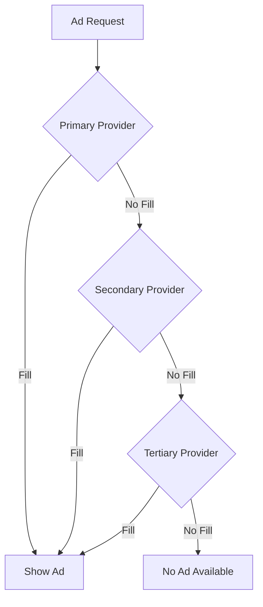

# Ads Configuration

Configure advertising networks - LevelPlay (ironSource), Appodeal, and AdMob.

---

## Overview

The IntelliVerseX SDK supports three advertising platforms:

| Platform | Banner | Interstitial | Rewarded | Best For |
|----------|--------|--------------|----------|----------|
| **LevelPlay** | ✅ | ✅ | ✅ | Most games |
| **Appodeal** | ✅ | ✅ | ✅ | Alternative |
| **AdMob** | ✅ | ✅ | ✅ | Simple integration |

---

## LevelPlay (ironSource) Setup

### 1. Dashboard Setup

1. Create account at [LevelPlay](https://www.is.com/)
2. Add your app
3. Note your **App Key**
4. Configure ad networks in mediation

### 2. SDK Configuration

In **IntelliVerseX > Game Config** under Ads Configuration:

| Setting | Value |
|---------|-------|
| Active Ad Provider | LevelPlay |
| LevelPlay App Key (Android) | Your Android app key |
| LevelPlay App Key (iOS) | Your iOS app key |
| Initialize on Start | true/false |

### 3. Ad Unit IDs

For LevelPlay, configure placements:

| Placement | Description |
|-----------|-------------|
| DefaultInterstitial | Standard interstitial placement |
| DefaultRewardedVideo | Standard rewarded placement |
| Banner_Bottom | Bottom banner placement |

---

## Appodeal Setup

### 1. Dashboard Setup

1. Create account at [Appodeal](https://appodeal.com/)
2. Add your app
3. Note your **App Key**
4. Configure networks in dashboard

### 2. SDK Configuration

In **IntelliVerseX > Game Config** under Ads Configuration:

| Setting | Value |
|---------|-------|
| Active Ad Provider | Appodeal |
| Appodeal App Key (Android) | Your Android app key |
| Appodeal App Key (iOS) | Your iOS app key |

### 3. Consent Configuration

Appodeal requires additional consent setup:

```csharp
// GDPR consent
Appodeal.updateGDPRUserConsent(GDPRUserConsent.Personalized);

// CCPA
Appodeal.updateCCPAUserConsent(CCPAUserConsent.OptIn);
```

---

## AdMob Setup

### 1. Dashboard Setup

1. Create account at [AdMob](https://admob.google.com/)
2. Add your app
3. Create ad units
4. Note your **App ID** and **Ad Unit IDs**

### 2. Platform Configuration

#### Android

Add to `Assets/Plugins/Android/res/values/strings.xml`:
```xml
<?xml version="1.0" encoding="utf-8"?>
<resources>
    <string name="admob_app_id">ca-app-pub-XXXXXXXXXXXXXXXX~XXXXXXXXXX</string>
</resources>
```

#### iOS

Add to `Info.plist`:
```xml
<key>GADApplicationIdentifier</key>
<string>ca-app-pub-XXXXXXXXXXXXXXXX~XXXXXXXXXX</string>
```

### 3. SDK Configuration

| Setting | Value |
|---------|-------|
| Active Ad Provider | AdMob |
| AdMob Banner ID | ca-app-pub-xxx/xxx |
| AdMob Interstitial ID | ca-app-pub-xxx/xxx |
| AdMob Rewarded ID | ca-app-pub-xxx/xxx |

---

## Test Ads

### Enable Test Mode

Always use test ads during development:

```csharp
// In IntelliVerseXConfig
// Enable Dev Test Ads: true
```

### Test Device IDs

Add your device as a test device:

```csharp
// AdMob test devices
// Configure in IntelliVerseXConfig:
// Test Device IDs: ["your-device-id"]
```

---

## Banner Configuration

### Position

Configure banner position:

```csharp
public enum BannerPosition
{
    Top,
    Bottom,
    TopLeft,
    TopRight,
    BottomLeft,
    BottomRight,
    Center
}

// In config or code:
IVXAdsManager.SetBannerPosition(BannerPosition.Bottom);
```

### Size

| Size | Dimensions | Best For |
|------|------------|----------|
| Banner | 320x50 | Standard phones |
| LargeBanner | 320x100 | Large phones |
| MediumRectangle | 300x250 | Tablets |
| SmartBanner | Auto | Responsive |

---

## Interstitial Configuration

### Show Frequency

Control how often interstitials appear:

```csharp
// In IntelliVerseXConfig:
// Show Interstitial Every N Actions: 3
// Minimum Seconds Between Ads: 60
```

### Capping

```csharp
// Daily cap
// Max Interstitials Per Day: 10

// Session cap
// Max Interstitials Per Session: 5
```

---

## Rewarded Video Configuration

### Reward Settings

Configure rewards in IntelliVerseXConfig:

```csharp
// Default reward amount: 100
// Reward currency: "Coins"
// Double reward for ads: true
```

### Reward Verification

For server-side verification:

```csharp
// Enable Server Verification: true
// Verification Endpoint: Your server URL

// Server receives callback with:
// - User ID
// - Transaction ID
// - Reward amount
// - Signature
```

---

## GDPR & Privacy

### Consent Flow

Configure consent collection:

```csharp
// In IntelliVerseXConfig:
// Auto Show Consent: true
// Consent Region: EU only / All users
```

### Programmatic Consent

```csharp
// Check if consent needed
if (IVXAdsManager.IsConsentRequired())
{
    // Show your consent UI
    bool userConsented = await ShowConsentDialog();
    
    // Update SDK
    IVXAdsManager.SetUserConsent(userConsented);
}
```

### ATT (iOS 14.5+)

```csharp
// App Tracking Transparency handled automatically
// Or manual control:
#if UNITY_IOS
IVXAdsManager.RequestTrackingAuthorization((status) =>
{
    Debug.Log($"ATT Status: {status}");
});
#endif
```

---

## Waterfall Configuration

### Mediation Partners

Configure in ad platform dashboard, not in SDK.

### Priority Settings

Most platforms auto-optimize, but you can:

```csharp
// Set ad network priority
// Higher eCPM networks first
// Done in dashboard, not code
```

---

## IVXAdNetworkConfig Field Reference

Complete mapping of every field in the `IVXAdsConfig` ScriptableObject:

### General Settings

| Field | Type | Default | Description |
|-------|------|---------|-------------|
| `ActiveAdProvider` | `AdProvider` | `LevelPlay` | Primary ad network (`LevelPlay`, `Appodeal`, `AdMob`) |
| `InitializeOnStart` | `bool` | `true` | Auto-initialize ads with SDK startup |
| `EnableDevTestAds` | `bool` | `false` | Use test ad units (never enable in production) |
| `TestDeviceIds` | `string[]` | `[]` | Device IDs for test mode |
| `EnableServerValidation` | `bool` | `false` | Route rewarded completions through Nakama |
| `ValidationTimeoutSec` | `float` | `10` | Server validation timeout in seconds |
| `GrantOnTimeout` | `bool` | `false` | Grant reward locally on timeout |

### Banner Settings

| Field | Type | Default | Description |
|-------|------|---------|-------------|
| `EnableBanner` | `bool` | `true` | Show banner ads |
| `BannerPosition` | `BannerPosition` | `Bottom` | Banner placement (`Top`, `Bottom`, `Center`) |
| `BannerSize` | `BannerSize` | `SmartBanner` | Banner size (`Banner`, `LargeBanner`, `MediumRectangle`, `SmartBanner`) |
| `BannerRefreshSec` | `int` | `30` | Auto-refresh interval in seconds |

### Interstitial Settings

| Field | Type | Default | Description |
|-------|------|---------|-------------|
| `EnableInterstitial` | `bool` | `true` | Show interstitial ads |
| `InterstitialFrequency` | `int` | `3` | Show every N actions |
| `MinSecondsBetweenAds` | `int` | `60` | Minimum cooldown between interstitials |
| `MaxInterstitialsPerDay` | `int` | `10` | Daily cap per user |
| `MaxInterstitialsPerSession` | `int` | `5` | Session cap per user |

### Rewarded Video Settings

| Field | Type | Default | Description |
|-------|------|---------|-------------|
| `EnableRewardedVideo` | `bool` | `true` | Show rewarded video ads |
| `DefaultRewardAmount` | `int` | `100` | Default reward for watching |
| `RewardCurrency` | `string` | `"Coins"` | Currency identifier for rewards |
| `DoubleRewardEnabled` | `bool` | `false` | Offer 2x reward option |

### LevelPlay Settings

| Field | Type | Default | Description |
|-------|------|---------|-------------|
| `LevelPlayAppKeyAndroid` | `string` | `""` | LevelPlay app key for Android |
| `LevelPlayAppKeyIOS` | `string` | `""` | LevelPlay app key for iOS |

### Appodeal Settings

| Field | Type | Default | Description |
|-------|------|---------|-------------|
| `AppodealAppKeyAndroid` | `string` | `""` | Appodeal app key for Android |
| `AppodealAppKeyIOS` | `string` | `""` | Appodeal app key for iOS |

### AdMob Settings

| Field | Type | Default | Description |
|-------|------|---------|-------------|
| `AdMobBannerIdAndroid` | `string` | `""` | AdMob banner ad unit ID (Android) |
| `AdMobBannerIdIOS` | `string` | `""` | AdMob banner ad unit ID (iOS) |
| `AdMobInterstitialIdAndroid` | `string` | `""` | AdMob interstitial ad unit ID (Android) |
| `AdMobInterstitialIdIOS` | `string` | `""` | AdMob interstitial ad unit ID (iOS) |
| `AdMobRewardedIdAndroid` | `string` | `""` | AdMob rewarded ad unit ID (Android) |
| `AdMobRewardedIdIOS` | `string` | `""` | AdMob rewarded ad unit ID (iOS) |

### Privacy & Consent Settings

| Field | Type | Default | Description |
|-------|------|---------|-------------|
| `AutoShowConsent` | `bool` | `true` | Show consent dialog on first launch |
| `ConsentRegion` | `ConsentRegion` | `EUOnly` | `EUOnly` or `AllUsers` |
| `COPPACompliant` | `bool` | `false` | Enable COPPA compliance mode |
| `EnableATT` | `bool` | `true` | Request App Tracking Transparency on iOS |

---

## Test Ad Unit IDs

Use these test IDs during development to avoid invalid traffic flags:

### AdMob Test Ad Units

| Format | Test Ad Unit ID | Platform |
|--------|----------------|----------|
| **Banner** | `ca-app-pub-3940256099942544/6300978111` | Android & iOS |
| **Interstitial** | `ca-app-pub-3940256099942544/1033173712` | Android & iOS |
| **Rewarded** | `ca-app-pub-3940256099942544/5224354917` | Android & iOS |
| **Rewarded Interstitial** | `ca-app-pub-3940256099942544/5354046379` | Android & iOS |
| **Native** | `ca-app-pub-3940256099942544/2247696110` | Android & iOS |

### LevelPlay Test App Keys

| Platform | Test App Key | Notes |
|----------|-------------|-------|
| **Android** | `demoapp` | LevelPlay demo app key |
| **iOS** | `demoapp` | LevelPlay demo app key |

!!! note "LevelPlay Demo Mode"
    Use `demoapp` as the app key to load test ads from all mediated networks. Replace with your real app key before production.

### Appodeal Test App Keys

| Platform | Test App Key | Notes |
|----------|-------------|-------|
| **Android** | `test` | Appodeal test mode key |
| **iOS** | `test` | Appodeal test mode key |

!!! warning "Never Ship with Test IDs"
    Using test ad unit IDs in production will result in **zero revenue** and possible account suspension. Always swap to real IDs before building your release.

---

## IVXAdsWaterfallManager

The `IVXAdsWaterfallManager` provides automatic failover between ad networks. If the primary provider fails to fill, the SDK falls back to the next provider in the priority chain.

### How It Works



### Configuring Waterfall Priority

Set the failover order in your `IVXAdsConfig`:

| Field | Type | Description |
|-------|------|-------------|
| `WaterfallEnabled` | `bool` | Enable multi-network failover |
| `WaterfallPriority` | `AdProvider[]` | Ordered list of providers to try |
| `WaterfallTimeoutMs` | `int` | Max wait per provider before trying next (default: `5000`) |

```
Waterfall Enabled:     ✅
Waterfall Priority:    [LevelPlay, Appodeal, AdMob]
Waterfall Timeout Ms:  5000
```

### Waterfall Behavior

| Scenario | Behavior |
|----------|----------|
| Primary fills | Ad shown from primary; no fallback attempted |
| Primary timeout | Falls to secondary after `WaterfallTimeoutMs` |
| All providers fail | `OnAdFailed` event fires with "no fill" error |
| Provider not configured | Skipped in waterfall (no error) |

### Code Example

```csharp
// Waterfall is transparent — use IVXAdsManager as normal
IVXAdsManager.Instance.ShowInterstitial();

// To check which provider filled an ad:
IVXAdsManager.OnAdShown += (adInfo) =>
{
    Debug.Log($"Ad filled by: {adInfo.NetworkName} (waterfall position: {adInfo.WaterfallIndex})");
};
```

### Revenue Impact

Using a waterfall typically increases fill rate by 15–30%:

| Configuration | Estimated Fill Rate |
|---------------|-------------------|
| Single provider | 60–80% |
| Two providers | 80–92% |
| Three providers | 90–98% |

---

## Analytics Integration

### Revenue Tracking

```csharp
// Enable ad revenue tracking
IVXAdsManager.OnAdRevenue += (revenue) =>
{
    // revenue.Amount
    // revenue.Currency
    // revenue.NetworkName
    // revenue.AdType
    
    // Send to your analytics
    IVXAnalyticsManager.TrackAdRevenue(revenue);
};
```

---

## Platform-Specific Settings

### Android

```csharp
// Android-specific in config:
// Use Immersive Mode: true (hides nav bar)
// Orientation Lock: None / Portrait / Landscape
```

### iOS

```csharp
// iOS-specific in config:
// SKAdNetwork: true
// App Store ID: Your app ID
```

### WebGL

!!! note "Limited Support"
    Most ad networks don't support WebGL. Consider:
    - Native web ad solutions
    - Disable ads on WebGL

---

## Common Configurations

### Casual Game

```
Banners: Bottom, SmartBanner
Interstitials: Every 3 level completions
Rewarded: 2x coins, extra lives
COPPA: Check if kids' game
```

### Hardcore Game

```
Banners: Disabled
Interstitials: Minimal, story breaks only
Rewarded: Premium items, continues
Frequency Cap: 30 ads/day
```

### Hypercasual

```
Banners: Always on
Interstitials: Every action (aggressive)
Rewarded: Every opportunity
Frequency: High
```

---

## Debugging

### Enable Debug Mode

```csharp
// Show ad mediation debug window
IVXAdsManager.ShowMediationDebugger();

// Log all ad events
IVXAdsManager.SetDebugLogging(true);
```

### Test Checklist

- [ ] Test ads load in editor
- [ ] Test ads work on device
- [ ] Rewarded callbacks fire correctly
- [ ] Revenue events tracked
- [ ] Consent UI shows properly

---

## Best Practices

### 1. User Experience

```csharp
// DON'T show ads during:
// - Tutorials
// - Critical gameplay
// - Purchases
// - Loading

// DO show ads:
// - Between levels
// - Natural breaks
// - User-initiated (rewarded)
```

### 2. Performance

```csharp
// Preload ads
IVXAdsManager.PreloadInterstitial();
IVXAdsManager.PreloadRewardedVideo();

// Check if ready before showing
if (IVXAdsManager.IsInterstitialReady())
{
    IVXAdsManager.ShowInterstitial();
}
```

### 3. Revenue Optimization

```csharp
// A/B test ad placements
// Monitor fill rates by network
// Adjust frequency based on retention
// Use rewarded > interstitials > banners ratio
```

---

## Troubleshooting

| Issue | Solution |
|-------|----------|
| No ads showing | Check app keys, test mode, internet |
| Low fill rate | Add more networks to mediation |
| Crashes on ad show | Update SDK, check ProGuard rules |
| Revenue not tracking | Enable revenue callback, check dashboard |

See [Runtime Issues](../troubleshooting/runtime-issues.md) for more solutions.
