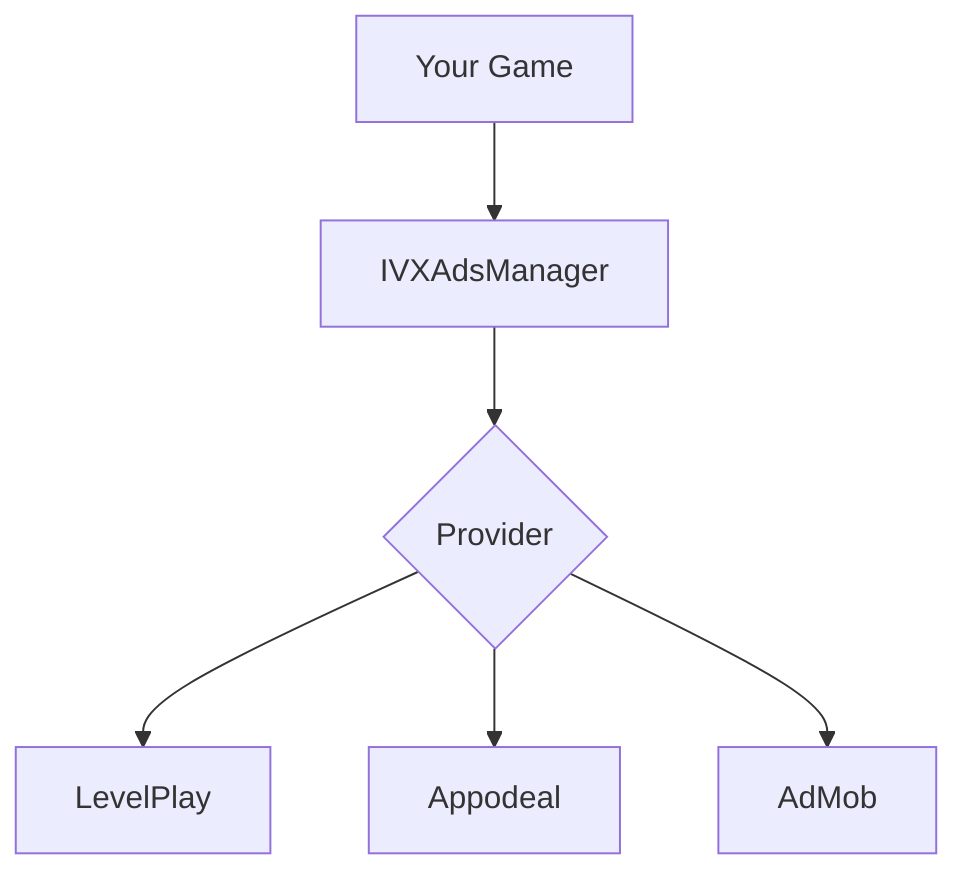

# Ad Integration Guide

Complete guide to integrating ads with LevelPlay, Appodeal, or AdMob.

---

## Overview

The IntelliVerseX SDK abstracts ad providers, letting you switch networks without code changes.



---

## Quick Start

### 1. Configure Provider

In **IntelliVerseX > Game Config**, select your ad provider.

### 2. Add App Keys

Enter your app keys for each platform (Android/iOS).

### 3. Initialize

```csharp
using IntelliVerseX.Monetization;

// Ads initialize automatically with SDK
// Or manually:
await IVXAdsManager.Instance.InitializeAsync();
```

---

## Banner Ads

### Show Banner

```csharp
public void ShowBanner()
{
    IVXAdsManager.Instance.ShowBanner(BannerPosition.Bottom);
}
```

### Hide Banner

```csharp
public void HideBanner()
{
    IVXAdsManager.Instance.HideBanner();
}
```

### Banner Events

```csharp
void Start()
{
    IVXAdsManager.OnBannerLoaded += () => Debug.Log("Banner loaded");
    IVXAdsManager.OnBannerFailed += (error) => Debug.Log($"Banner failed: {error}");
    IVXAdsManager.OnBannerClicked += () => Debug.Log("Banner clicked");
}
```

---

## Interstitial Ads

### Load Interstitial

```csharp
// Preload for faster display
public void PreloadInterstitial()
{
    IVXAdsManager.Instance.LoadInterstitial();
}
```

### Show Interstitial

```csharp
public void ShowInterstitial()
{
    if (IVXAdsManager.Instance.IsInterstitialReady())
    {
        IVXAdsManager.Instance.ShowInterstitial();
    }
    else
    {
        Debug.Log("Interstitial not ready");
        // Load for next time
        IVXAdsManager.Instance.LoadInterstitial();
    }
}
```

### Interstitial Events

```csharp
void Start()
{
    IVXAdsManager.OnInterstitialLoaded += () =>
    {
        Debug.Log("Interstitial ready");
    };
    
    IVXAdsManager.OnInterstitialFailed += (error) =>
    {
        Debug.Log($"Interstitial failed: {error}");
        // Try loading again after delay
        Invoke(nameof(LoadInterstitial), 30f);
    };
    
    IVXAdsManager.OnInterstitialShown += () =>
    {
        Debug.Log("Interstitial shown");
        // Pause game audio
        AudioListener.pause = true;
    };
    
    IVXAdsManager.OnInterstitialClosed += () =>
    {
        Debug.Log("Interstitial closed");
        // Resume game
        AudioListener.pause = false;
        // Preload next
        IVXAdsManager.Instance.LoadInterstitial();
    };
}
```

---

## Rewarded Video Ads

### Load Rewarded Video

```csharp
public void PreloadRewarded()
{
    IVXAdsManager.Instance.LoadRewardedVideo();
}
```

### Show Rewarded Video

```csharp
public void ShowRewardedVideo()
{
    if (IVXAdsManager.Instance.IsRewardedVideoReady())
    {
        IVXAdsManager.Instance.ShowRewardedVideo();
    }
    else
    {
        ShowToast("Video not available. Try again later.");
        IVXAdsManager.Instance.LoadRewardedVideo();
    }
}
```

### Handle Rewards

```csharp
void Start()
{
    IVXAdsManager.OnRewardedVideoCompleted += (reward) =>
    {
        // Player earned the reward!
        Debug.Log($"Reward earned: {reward.Amount} {reward.Currency}");
        
        // Grant reward
        AddCoins(reward.Amount);
        ShowRewardAnimation();
    };
    
    IVXAdsManager.OnRewardedVideoClosed += (wasRewarded) =>
    {
        if (!wasRewarded)
        {
            Debug.Log("User skipped - no reward");
            ShowToast("Watch the full video to earn rewards!");
        }
        
        // Preload next
        IVXAdsManager.Instance.LoadRewardedVideo();
    };
}
```

---

## Complete Implementation

### AdController.cs

```csharp
using IntelliVerseX.Monetization;
using UnityEngine;
using UnityEngine.UI;

public class AdController : MonoBehaviour
{
    [SerializeField] private Button _watchAdButton;
    [SerializeField] private Text _rewardText;
    
    private int _pendingReward;
    
    void Start()
    {
        SetupEventHandlers();
        PreloadAds();
        UpdateUI();
    }
    
    void SetupEventHandlers()
    {
        // Rewarded video events
        IVXAdsManager.OnRewardedVideoLoaded += OnRewardedLoaded;
        IVXAdsManager.OnRewardedVideoCompleted += OnRewardEarned;
        IVXAdsManager.OnRewardedVideoClosed += OnRewardedClosed;
        IVXAdsManager.OnRewardedVideoFailed += OnRewardedFailed;
        
        // Interstitial events
        IVXAdsManager.OnInterstitialClosed += OnInterstitialClosed;
    }
    
    void OnDestroy()
    {
        // Unsubscribe to prevent memory leaks
        IVXAdsManager.OnRewardedVideoLoaded -= OnRewardedLoaded;
        IVXAdsManager.OnRewardedVideoCompleted -= OnRewardEarned;
        IVXAdsManager.OnRewardedVideoClosed -= OnRewardedClosed;
        IVXAdsManager.OnRewardedVideoFailed -= OnRewardedFailed;
        IVXAdsManager.OnInterstitialClosed -= OnInterstitialClosed;
    }
    
    void PreloadAds()
    {
        IVXAdsManager.Instance.LoadRewardedVideo();
        IVXAdsManager.Instance.LoadInterstitial();
    }
    
    void UpdateUI()
    {
        bool hasAd = IVXAdsManager.Instance.IsRewardedVideoReady();
        _watchAdButton.interactable = hasAd;
        _rewardText.text = hasAd ? "Watch to earn 100 coins!" : "Loading...";
    }
    
    public void OnWatchAdClicked()
    {
        if (IVXAdsManager.Instance.IsRewardedVideoReady())
        {
            _pendingReward = 100;
            IVXAdsManager.Instance.ShowRewardedVideo();
        }
    }
    
    void OnRewardedLoaded()
    {
        UpdateUI();
    }
    
    void OnRewardEarned(RewardInfo reward)
    {
        // Give the reward
        GameManager.Instance.AddCoins(_pendingReward);
        ShowRewardPopup(_pendingReward);
    }
    
    void OnRewardedClosed(bool wasRewarded)
    {
        // Preload next ad
        IVXAdsManager.Instance.LoadRewardedVideo();
        UpdateUI();
    }
    
    void OnRewardedFailed(string error)
    {
        Debug.LogWarning($"Rewarded ad failed: {error}");
        _watchAdButton.interactable = false;
        
        // Retry after delay
        Invoke(nameof(RetryLoad), 30f);
    }
    
    void OnInterstitialClosed()
    {
        // Preload next
        IVXAdsManager.Instance.LoadInterstitial();
    }
    
    void RetryLoad()
    {
        IVXAdsManager.Instance.LoadRewardedVideo();
    }
    
    void ShowRewardPopup(int amount)
    {
        // Your reward UI
    }
}
```

---

## LevelPlay Specific

### Setup

1. Download LevelPlay SDK from Unity Asset Store or [ironSource](https://www.is.com/)
2. Import into project
3. In IntelliVerseXConfig:
   - Set Ad Provider: LevelPlay
   - Enter App Key

### Mediation Setup

Configure networks in LevelPlay dashboard:

1. AdMob
2. Facebook Audience Network
3. Unity Ads
4. Vungle
5. AppLovin

---

## Appodeal Specific

### Setup

1. Import Appodeal SDK
2. In IntelliVerseXConfig:
   - Set Ad Provider: Appodeal
   - Enter App Key

### Consent

```csharp
// Appodeal requires explicit consent handling
IVXAdsManager.Instance.SetGDPRConsent(userConsented);
IVXAdsManager.Instance.SetCCPAConsent(userOptedIn);
```

---

## AdMob Specific

### Setup

1. Add AdMob App ID to Player Settings
2. In IntelliVerseXConfig:
   - Set Ad Provider: AdMob
   - Enter Ad Unit IDs

### Test Ads

```csharp
// Always test with AdMob test ad units
// Banner: ca-app-pub-3940256099942544/6300978111
// Interstitial: ca-app-pub-3940256099942544/1033173712
// Rewarded: ca-app-pub-3940256099942544/5224354917
```

---

## Best Practices

### 1. Smart Loading

```csharp
// Load at appropriate times
void OnSceneLoaded(Scene scene, LoadSceneMode mode)
{
    // Preload for upcoming opportunities
    IVXAdsManager.Instance.LoadInterstitial();
    IVXAdsManager.Instance.LoadRewardedVideo();
}
```

### 2. Frequency Capping

```csharp
private int _adsShownThisSession = 0;
private const int MAX_ADS_PER_SESSION = 5;

public void ShowInterstitialIfAllowed()
{
    if (_adsShownThisSession < MAX_ADS_PER_SESSION)
    {
        IVXAdsManager.Instance.ShowInterstitial();
        _adsShownThisSession++;
    }
}
```

### 3. User Experience

```csharp
// DON'T show ads:
// - During tutorial
// - During intense gameplay
// - Immediately after purchase
// - Back-to-back (add cooldown)

// DO show ads:
// - Between levels
// - After game over
// - Natural pauses
// - User-initiated (rewarded)
```

### 4. Handle No Fill

```csharp
IVXAdsManager.OnInterstitialFailed += (error) =>
{
    if (error.Contains("no fill") || error.Contains("no ads"))
    {
        // Normal - no ads available
        // Try again later, don't spam requests
    }
};
```

---

## Revenue Tracking

### Track Ad Revenue

```csharp
IVXAdsManager.OnAdRevenue += (revenueData) =>
{
    // Track for analytics
    IVXAnalyticsManager.Instance.TrackEvent("ad_revenue", new Dictionary<string, object>
    {
        { "revenue", revenueData.Revenue },
        { "currency", revenueData.Currency },
        { "network", revenueData.NetworkName },
        { "ad_type", revenueData.AdType }
    });
};
```

---

## Troubleshooting

### Ads Not Loading

1. Check app keys are correct
2. Check internet connection
3. Verify dashboard setup complete
4. Check test mode settings
5. Review console for errors

### Low Fill Rate

1. Add more networks to mediation
2. Check ad unit setup in dashboard
3. Consider geo-targeting
4. Review eCPM floor settings

### Crashes on Ad Show

1. Update ad SDK to latest
2. Check ProGuard/R8 rules
3. Review AndroidManifest
4. Test on multiple devices

See [Ads Configuration](../configuration/ads-config.md) for detailed setup instructions.
