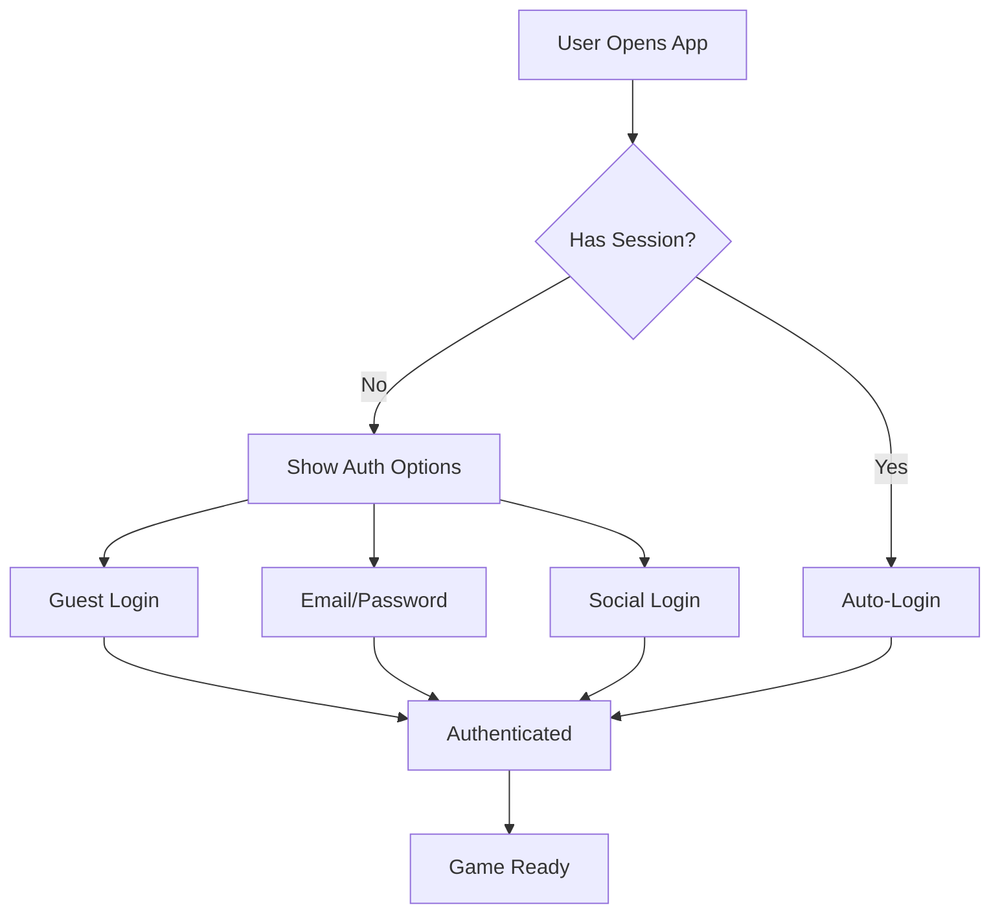

# Authentication Flow Guide

Complete guide to implementing user authentication in your game.

---

## Overview

The IntelliVerseX SDK supports multiple authentication methods:



---

## Authentication Methods

| Method | Persistence | Use Case |
|--------|-------------|----------|
| Guest | Device only | Quick start, testing |
| Email/Password | Cross-device | Core authentication |
| Google | Cross-device | Android users |
| Apple | Cross-device | iOS users (required) |
| Facebook | Cross-device | Social games |
| Link Accounts | N/A | Upgrade guest to permanent |

---

## Step 1: Guest Authentication

Start users quickly without friction:

```csharp
using IntelliVerseX.Identity;
using UnityEngine;

public class GuestAuth : MonoBehaviour
{
    public async void LoginAsGuest()
    {
        try
        {
            var identity = await IntelliVerseXUserIdentity.Instance.AuthenticateGuestAsync();
            
            Debug.Log($"Guest logged in: {identity.UserId}");
            Debug.Log($"Display name: {identity.DisplayName}");
            
            // Proceed to game
            LoadMainMenu();
        }
        catch (System.Exception ex)
        {
            Debug.LogError($"Guest login failed: {ex.Message}");
            ShowErrorMessage("Unable to connect. Please try again.");
        }
    }
}
```

!!! warning "Guest Limitations"
    Guest accounts are tied to the device. If the user reinstalls or clears data, the account is lost.
    Always offer account linking options.

---

## Step 2: Email/Password Registration

For users who want persistent accounts:

```csharp
public class EmailAuth : MonoBehaviour
{
    [SerializeField] private TMP_InputField _emailField;
    [SerializeField] private TMP_InputField _passwordField;
    [SerializeField] private TMP_InputField _confirmPasswordField;
    
    public async void Register()
    {
        // Validate input
        string email = _emailField.text.Trim();
        string password = _passwordField.text;
        string confirmPassword = _confirmPasswordField.text;
        
        if (!IsValidEmail(email))
        {
            ShowError("Please enter a valid email address");
            return;
        }
        
        if (password.Length < 8)
        {
            ShowError("Password must be at least 8 characters");
            return;
        }
        
        if (password != confirmPassword)
        {
            ShowError("Passwords do not match");
            return;
        }
        
        try
        {
            ShowLoadingIndicator();
            
            var identity = await IntelliVerseXUserIdentity.Instance
                .RegisterWithEmailAsync(email, password);
            
            Debug.Log($"Registered: {identity.Email}");
            
            // Optional: Send verification email
            await SendVerificationEmail(email);
            
            // Proceed
            LoadMainMenu();
        }
        catch (System.Exception ex)
        {
            if (ex.Message.Contains("already exists"))
            {
                ShowError("Email already registered. Try logging in.");
            }
            else
            {
                ShowError("Registration failed. Please try again.");
            }
        }
        finally
        {
            HideLoadingIndicator();
        }
    }
    
    private bool IsValidEmail(string email)
    {
        return System.Text.RegularExpressions.Regex.IsMatch(
            email, 
            @"^[\w-\.]+@([\w-]+\.)+[\w-]{2,4}$"
        );
    }
}
```

---

## Step 3: Email/Password Login

For returning users:

```csharp
public async void Login()
{
    string email = _emailField.text.Trim();
    string password = _passwordField.text;
    
    if (string.IsNullOrEmpty(email) || string.IsNullOrEmpty(password))
    {
        ShowError("Please enter email and password");
        return;
    }
    
    try
    {
        ShowLoadingIndicator();
        
        var identity = await IntelliVerseXUserIdentity.Instance
            .LoginWithEmailAsync(email, password);
        
        Debug.Log($"Welcome back, {identity.DisplayName}!");
        LoadMainMenu();
    }
    catch (System.Exception ex)
    {
        if (ex.Message.Contains("invalid") || ex.Message.Contains("credentials"))
        {
            ShowError("Invalid email or password");
        }
        else
        {
            ShowError("Login failed. Please try again.");
        }
    }
    finally
    {
        HideLoadingIndicator();
    }
}
```

---

## Step 4: Social Login

### Google Sign-In

```csharp
public async void LoginWithGoogle()
{
    try
    {
        ShowLoadingIndicator();
        
        // Initiates Google sign-in flow
        var identity = await IntelliVerseXUserIdentity.Instance
            .LoginWithGoogleAsync();
        
        Debug.Log($"Google login: {identity.Email}");
        LoadMainMenu();
    }
    catch (System.Exception ex)
    {
        if (ex.Message.Contains("cancelled"))
        {
            Debug.Log("User cancelled Google sign-in");
        }
        else
        {
            ShowError("Google sign-in failed");
        }
    }
    finally
    {
        HideLoadingIndicator();
    }
}
```

### Apple Sign-In (iOS)

```csharp
public async void LoginWithApple()
{
    #if UNITY_IOS || UNITY_STANDALONE_OSX
    try
    {
        ShowLoadingIndicator();
        
        var identity = await IntelliVerseXUserIdentity.Instance
            .LoginWithAppleAsync();
        
        // Note: Apple may hide email after first login
        Debug.Log($"Apple login: {identity.UserId}");
        LoadMainMenu();
    }
    catch (System.Exception ex)
    {
        if (ex.Message.Contains("cancelled"))
        {
            Debug.Log("User cancelled Apple sign-in");
        }
        else
        {
            ShowError("Apple sign-in failed");
        }
    }
    finally
    {
        HideLoadingIndicator();
    }
    #else
    ShowError("Apple Sign-In is only available on iOS/macOS");
    #endif
}
```

!!! info "App Store Requirement"
    If your app offers any social login, Apple Sign-In is **required** for iOS apps.

---

## Step 5: Account Linking

Upgrade guest accounts to persistent accounts:

```csharp
public class AccountLinking : MonoBehaviour
{
    public async void LinkWithEmail(string email, string password)
    {
        try
        {
            await IntelliVerseXUserIdentity.Instance
                .LinkEmailAsync(email, password);
            
            Debug.Log("Account linked with email!");
            ShowSuccess("Your progress is now saved to your account!");
        }
        catch (System.Exception ex)
        {
            if (ex.Message.Contains("already linked"))
            {
                ShowError("This email is already linked to another account");
            }
            else
            {
                ShowError("Failed to link account");
            }
        }
    }
    
    public async void LinkWithGoogle()
    {
        try
        {
            await IntelliVerseXUserIdentity.Instance.LinkGoogleAsync();
            ShowSuccess("Account linked with Google!");
        }
        catch (System.Exception ex)
        {
            ShowError("Failed to link Google account");
        }
    }
}
```

---

## Step 6: Password Reset

```csharp
public async void SendPasswordReset(string email)
{
    if (!IsValidEmail(email))
    {
        ShowError("Please enter a valid email address");
        return;
    }
    
    try
    {
        await IntelliVerseXUserIdentity.Instance.SendPasswordResetAsync(email);
        ShowSuccess("Password reset email sent. Check your inbox.");
    }
    catch (System.Exception ex)
    {
        // Don't reveal if email exists or not
        ShowSuccess("If an account exists, a reset email has been sent.");
    }
}
```

---

## Step 7: Session Management

### Auto-Login on App Start

```csharp
public class SessionManager : MonoBehaviour
{
    async void Start()
    {
        // Check for existing session
        if (IntelliVerseXUserIdentity.Instance.HasValidSession)
        {
            try
            {
                // Restore session
                await IntelliVerseXUserIdentity.Instance.RestoreSessionAsync();
                
                Debug.Log($"Session restored for {IntelliVerseXUserIdentity.Instance.CurrentUser.DisplayName}");
                LoadMainMenu();
            }
            catch
            {
                // Session expired or invalid
                ShowLoginScreen();
            }
        }
        else
        {
            ShowLoginScreen();
        }
    }
}
```

### Logout

```csharp
public async void Logout()
{
    // Confirm with user
    bool confirmed = await ShowConfirmationDialog(
        "Logout",
        "Are you sure you want to logout?"
    );
    
    if (!confirmed) return;
    
    try
    {
        await IntelliVerseXUserIdentity.Instance.LogoutAsync();
        LoadLoginScreen();
    }
    catch (System.Exception ex)
    {
        Debug.LogError($"Logout failed: {ex.Message}");
        // Force local logout anyway
        LoadLoginScreen();
    }
}
```

---

## Complete Authentication UI

```csharp
public class AuthenticationUI : MonoBehaviour
{
    [Header("Panels")]
    [SerializeField] private GameObject _loginPanel;
    [SerializeField] private GameObject _registerPanel;
    [SerializeField] private GameObject _loadingPanel;
    
    [Header("Login Fields")]
    [SerializeField] private TMP_InputField _loginEmail;
    [SerializeField] private TMP_InputField _loginPassword;
    
    [Header("Register Fields")]
    [SerializeField] private TMP_InputField _registerEmail;
    [SerializeField] private TMP_InputField _registerPassword;
    [SerializeField] private TMP_InputField _registerConfirm;
    
    [Header("Buttons")]
    [SerializeField] private Button _loginButton;
    [SerializeField] private Button _registerButton;
    [SerializeField] private Button _guestButton;
    [SerializeField] private Button _googleButton;
    [SerializeField] private Button _appleButton;
    
    private void Start()
    {
        // Setup buttons
        _loginButton.onClick.AddListener(() => LoginWithEmail());
        _registerButton.onClick.AddListener(() => Register());
        _guestButton.onClick.AddListener(() => LoginAsGuest());
        _googleButton.onClick.AddListener(() => LoginWithGoogle());
        
        #if UNITY_IOS
        _appleButton.gameObject.SetActive(true);
        _appleButton.onClick.AddListener(() => LoginWithApple());
        #else
        _appleButton.gameObject.SetActive(false);
        #endif
        
        // Check for existing session
        CheckExistingSession();
    }
    
    private async void CheckExistingSession()
    {
        ShowLoading(true);
        
        if (await IntelliVerseXUserIdentity.Instance.TryRestoreSessionAsync())
        {
            OnAuthenticationSuccess();
        }
        else
        {
            ShowLoading(false);
            ShowPanel(_loginPanel);
        }
    }
    
    private async void LoginWithEmail()
    {
        ShowLoading(true);
        try
        {
            await IntelliVerseXUserIdentity.Instance.LoginWithEmailAsync(
                _loginEmail.text,
                _loginPassword.text
            );
            OnAuthenticationSuccess();
        }
        catch (System.Exception ex)
        {
            ShowError(ex.Message);
        }
        finally
        {
            ShowLoading(false);
        }
    }
    
    private void OnAuthenticationSuccess()
    {
        var user = IntelliVerseXUserIdentity.Instance.CurrentUser;
        Debug.Log($"Authenticated: {user.DisplayName}");
        
        // Fire event or load next scene
        SceneManager.LoadScene("MainMenu");
    }
    
    private void ShowPanel(GameObject panel)
    {
        _loginPanel.SetActive(panel == _loginPanel);
        _registerPanel.SetActive(panel == _registerPanel);
    }
    
    private void ShowLoading(bool show)
    {
        _loadingPanel.SetActive(show);
    }
}
```

---

## Best Practices

### 1. Always Offer Guest Login

```csharp
// Make it easy to start playing
// Guest → Link later pattern
```

### 2. Handle Errors Gracefully

```csharp
// User-friendly messages
// Don't expose technical details
// Offer retry options
```

### 3. Secure Password Handling

```csharp
// Never store passwords locally
// Clear password fields after submission
// Use password input type
```

### 4. Remember User Choice

```csharp
// Save last login method
// Auto-select on return
PlayerPrefs.SetString("LastAuthMethod", "Google");
```

---

## Events to Handle

```csharp
// Subscribe to auth events
IntelliVerseXUserIdentity.OnAuthStateChanged += (state) =>
{
    switch (state)
    {
        case AuthState.Authenticated:
            OnUserLoggedIn();
            break;
        case AuthState.Unauthenticated:
            OnUserLoggedOut();
            break;
        case AuthState.Expired:
            OnSessionExpired();
            break;
    }
};
```

---

## Troubleshooting

| Issue | Solution |
|-------|----------|
| Session not persisting | Check storage permissions |
| Google login fails | Verify SHA-1 fingerprint |
| Apple login not showing | Check capability in Xcode |
| Password reset not received | Check spam folder |

See [Authentication Troubleshooting](../troubleshooting/runtime-issues.md#authentication-issues) for more solutions.
