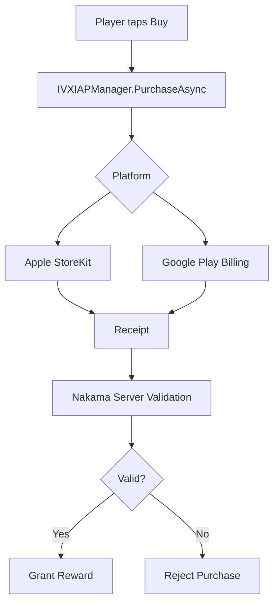
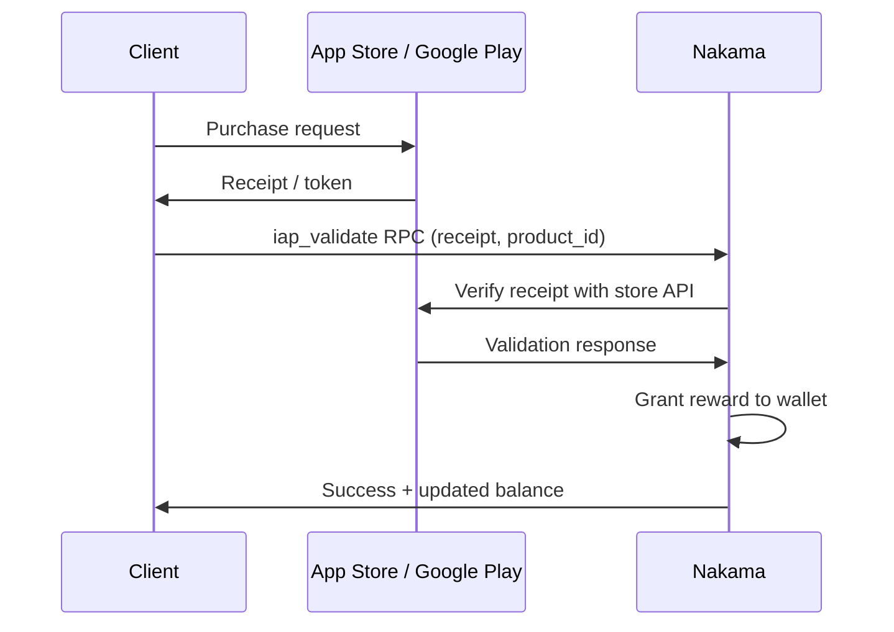

# IAP Integration Guide

Step-by-step guide to integrating in-app purchases with Apple App Store and Google Play.

---

## Overview

The IntelliVerseX SDK wraps platform-specific purchase APIs behind a unified interface. Define your products once in a ScriptableObject, and the SDK handles store communication, receipt validation, and reward fulfillment.



### Product Types

| Type | Description | Examples | Restorable? |
|------|-------------|----------|-------------|
| **Consumable** | Used once, can buy again | Coin packs, gem bundles, energy refills | No |
| **Non-Consumable** | Permanent one-time unlock | Remove ads, character skins, level packs | Yes |
| **Subscription** | Recurring access period | VIP pass, premium membership | Yes |

---

## Prerequisites

Before starting, ensure you have:

- [x] IntelliVerseX SDK installed ([Getting Started](../getting-started/index.md))
- [x] Nakama backend configured ([Nakama Integration](nakama-integration.md))
- [x] Apple Developer Program membership ($99/year)
- [x] Google Play Developer account ($25 one-time)
- [x] App created in both App Store Connect and Google Play Console

---

## Step 1: Create Products in Apple App Store Connect

1. Navigate to **App Store Connect > Your App > In-App Purchases**
2. Click **+** to create each product:

| Product ID | Type | Reference Name | Price |
|-----------|------|---------------|-------|
| `coins_500` | Consumable | 500 Coins Pack | $0.99 |
| `coins_1200` | Consumable | 1,200 Coins Pack | $1.99 |
| `coins_5000` | Consumable | 5,000 Coins Pack | $4.99 |
| `remove_ads` | Non-Consumable | Remove Ads | $2.99 |
| `vip_monthly` | Auto-Renewable Subscription | VIP Monthly | $4.99/mo |

3. For each product, add localized display names and descriptions
4. Submit for review (products must be approved before going live)

!!! note "Subscription Groups"
    Create a subscription group (e.g., "VIP Membership") before adding subscription products. Apple requires subscriptions to belong to a group.

---

## Step 2: Create Products in Google Play Console

1. Navigate to **Google Play Console > Your App > Monetize > Products**
2. Create **In-app products** (consumable/non-consumable):

| Product ID | Description | Price |
|-----------|-------------|-------|
| `coins_500` | 500 Coins Pack | $0.99 |
| `coins_1200` | 1,200 Coins Pack | $1.99 |
| `coins_5000` | 5,000 Coins Pack | $4.99 |
| `remove_ads` | Remove All Ads | $2.99 |

3. Create **Subscriptions** under **Monetize > Subscriptions**:

| Product ID | Base Plan | Price |
|-----------|-----------|-------|
| `vip_monthly` | monthly | $4.99/mo |

!!! tip "Matching Product IDs"
    Use **identical product IDs** across Apple and Google. The SDK uses one ID to resolve the correct store product on each platform.

---

## Step 3: Create the IVXIAPConfig ScriptableObject

In Unity, right-click in the Project window:

**Create > IntelliVerseX > IAP Configuration**

Place the asset in your configuration folder:

```
Assets/
└── _IntelliVerseXSDK/
    └── Resources/
        └── Configs/
            └── IAPConfig.asset
```

---

## Step 4: Define Products in the Config

Select the `IAPConfig` asset and add your products in the Inspector:

### Product Definition Table

| Field | Type | Description |
|-------|------|-------------|
| `ProductId` | `string` | Store product ID (must match Apple/Google) |
| `ProductType` | `enum` | `Consumable`, `NonConsumable`, or `Subscription` |
| `DisplayName` | `string` | Localized display name |
| `Description` | `string` | Localized description |
| `RewardType` | `string` | Currency ID or unlock ID |
| `RewardAmount` | `int` | Amount to grant (consumable only) |
| `PriceUSD` | `float` | Reference price in USD |

### Example Configuration

```
Products:
  [0] Product Id:     coins_500
      Product Type:   Consumable
      Display Name:   500 Coins
      Description:    A starter pack of 500 coins
      Reward Type:    coins
      Reward Amount:  500
      Price USD:      0.99

  [1] Product Id:     coins_1200
      Product Type:   Consumable
      Display Name:   1,200 Coins
      Description:    Best value coin bundle
      Reward Type:    coins
      Reward Amount:  1200
      Price USD:      1.99

  [2] Product Id:     coins_5000
      Product Type:   Consumable
      Display Name:   5,000 Coins
      Description:    Mega coin bundle with 25% bonus
      Reward Type:    coins
      Reward Amount:  5000
      Price USD:      4.99

  [3] Product Id:     remove_ads
      Product Type:   NonConsumable
      Display Name:   Remove Ads
      Description:    Remove all banner and interstitial ads forever
      Reward Type:    remove_ads
      Reward Amount:  1
      Price USD:      2.99

  [4] Product Id:     vip_monthly
      Product Type:   Subscription
      Display Name:   VIP Monthly
      Description:    Ad-free, daily bonus, exclusive content
      Reward Type:    vip
      Reward Amount:  1
      Price USD:      4.99

Server Validation:    ✅ Enabled
Test Mode:            ✅ (disable for production)
```

---

## Step 5: Initialize the IAP Manager

```csharp
using IntelliVerseX.Monetization;
using UnityEngine;

public class IAPBootstrap : MonoBehaviour
{
    [SerializeField] private IVXIAPConfig _iapConfig;

    private async void Start()
    {
        var result = await IVXIAPManager.Instance.InitializeAsync(_iapConfig);

        if (result.Success)
        {
            Debug.Log($"[IAP] Initialized with {result.ProductCount} products");
        }
        else
        {
            Debug.LogError($"[IAP] Init failed: {result.Error}");
        }
    }
}
```

After initialization, localized prices are available:

```csharp
var product = IVXIAPManager.Instance.GetProduct("coins_500");
string localizedPrice = product.LocalizedPrice;  // e.g., "$0.99", "€0,99", "¥120"
```

---

## Step 6: Purchase Flow

### Basic Purchase

```csharp
using IntelliVerseX.Monetization;

public class StoreUI : MonoBehaviour
{
    public async void OnBuyCoins500()
    {
        var result = await IVXIAPManager.Instance.PurchaseAsync("coins_500");

        if (result.Success)
        {
            await IVXWalletManager.Instance.GrantCurrencyAsync("coins", 500);
            ShowPurchaseSuccess("500 Coins added!");
        }
        else if (result.Cancelled)
        {
            Debug.Log("[IAP] User cancelled purchase");
        }
        else
        {
            Debug.LogError($"[IAP] Purchase failed: {result.Error}");
            ShowPurchaseError(result.Error);
        }
    }

    public async void OnBuyRemoveAds()
    {
        var result = await IVXIAPManager.Instance.PurchaseAsync("remove_ads");

        if (result.Success)
        {
            IVXAdsManager.Instance.SetAdsEnabled(false);
            PlayerPrefs.SetInt("ads_removed", 1);
            ShowPurchaseSuccess("Ads removed forever!");
        }
    }
}
```

### Purchase with Loading UI

```csharp
public async void OnPurchaseClicked(string productId)
{
    ShowLoadingOverlay(true);

    try
    {
        var result = await IVXIAPManager.Instance.PurchaseAsync(productId);

        if (result.Success)
        {
            var productConfig = _iapConfig.GetProduct(productId);
            await IVXWalletManager.Instance.GrantCurrencyAsync(
                productConfig.RewardType,
                productConfig.RewardAmount
            );
            ShowPurchaseSuccess(productConfig.DisplayName);
        }
        else if (!result.Cancelled)
        {
            ShowPurchaseError(result.Error);
        }
    }
    finally
    {
        ShowLoadingOverlay(false);
    }
}
```

---

## Step 7: Server-Side Receipt Validation

All purchases are validated through your Nakama backend to prevent fraud:



The SDK handles this automatically when `ServerValidation` is enabled in `IVXIAPConfig`:

```csharp
// Server validation is transparent to the caller
var result = await IVXIAPManager.Instance.PurchaseAsync("coins_500");
// result.Success is only true if server validated the receipt
```

The Nakama `iap_validate` RPC module:

1. Receives the receipt/token from the client
2. Calls Apple/Google verification APIs
3. Checks for duplicate transaction IDs
4. Credits the player's wallet
5. Logs the transaction for audit

---

## Step 8: Restore Purchases

Required for iOS App Store compliance. Restores non-consumable and subscription purchases:

```csharp
public async void OnRestorePurchasesClicked()
{
    ShowLoadingOverlay(true);

    var result = await IVXIAPManager.Instance.RestorePurchasesAsync();

    ShowLoadingOverlay(false);

    if (result.Success)
    {
        foreach (var restored in result.RestoredProducts)
        {
            Debug.Log($"[IAP] Restored: {restored.ProductId}");
            ApplyProductReward(restored.ProductId);
        }

        if (result.RestoredProducts.Count > 0)
        {
            ShowToast($"Restored {result.RestoredProducts.Count} purchase(s)");
        }
        else
        {
            ShowToast("No purchases to restore");
        }
    }
    else
    {
        ShowToast($"Restore failed: {result.Error}");
    }
}

private void ApplyProductReward(string productId)
{
    switch (productId)
    {
        case "remove_ads":
            IVXAdsManager.Instance.SetAdsEnabled(false);
            PlayerPrefs.SetInt("ads_removed", 1);
            break;
    }
}
```

!!! warning "iOS Requirement"
    Apple **rejects** apps that do not offer a Restore Purchases button for non-consumable and subscription products. Always include one in your settings or store UI.

---

## Subscription Management

### Checking Active Subscriptions

```csharp
public async void CheckVIPStatus()
{
    var status = await IVXIAPManager.Instance.GetSubscriptionStatusAsync("vip_monthly");

    if (status.IsActive)
    {
        Debug.Log($"[IAP] VIP active until {status.ExpiryDate}");
        EnableVIPFeatures();
    }
    else
    {
        Debug.Log("[IAP] VIP expired or not purchased");
        DisableVIPFeatures();
    }
}
```

### Handling Renewals

```csharp
private void OnEnable()
{
    IVXIAPManager.OnSubscriptionRenewed += HandleRenewal;
    IVXIAPManager.OnSubscriptionExpired += HandleExpiry;
}

private void HandleRenewal(SubscriptionInfo info)
{
    Debug.Log($"[IAP] Subscription renewed: {info.ProductId}, next renewal: {info.ExpiryDate}");
    EnableVIPFeatures();
}

private void HandleExpiry(SubscriptionInfo info)
{
    Debug.Log($"[IAP] Subscription expired: {info.ProductId}");
    DisableVIPFeatures();
    ShowRenewalPrompt();
}
```

### Subscription Status on App Launch

```csharp
private async void Start()
{
    await IVXIAPManager.Instance.InitializeAsync(_iapConfig);

    var vipStatus = await IVXIAPManager.Instance.GetSubscriptionStatusAsync("vip_monthly");
    if (vipStatus.IsActive)
    {
        EnableVIPFeatures();
    }
}
```

---

## Testing

### Apple Sandbox Testing

1. Create a **Sandbox Tester** in App Store Connect under **Users and Access**
2. On your test device, sign out of the real App Store
3. Launch your app — it will prompt for sandbox credentials on first purchase
4. Sandbox subscriptions renew on an accelerated schedule:

| Real Duration | Sandbox Duration |
|---------------|-----------------|
| 1 week | 3 minutes |
| 1 month | 5 minutes |
| 1 year | 1 hour |

### Google Play Test Accounts

1. In Google Play Console, go to **Settings > License Testing**
2. Add tester Gmail addresses
3. Testers can purchase without being charged
4. Use `IVXIAPConfig.TestMode = true` for development

### SDK Test Mode

```csharp
// In IVXIAPConfig:
// Test Mode: ✅

// When test mode is enabled:
// - Purchases succeed immediately without store interaction
// - No real charges occur
// - Receipts are mock-validated
// - Useful for UI testing and development
```

!!! danger "Disable Before Release"
    Always set `TestMode = false` before building a production release. Test mode bypasses all real store and validation logic.

---

## Pricing Strategy

### Localized Pricing

Apple and Google handle currency conversion automatically. Set your base price in USD and the stores generate localized equivalents.

| USD Price | Approximate Equivalents |
|-----------|------------------------|
| $0.99 | €0.99 · £0.99 · ¥160 · ₹89 |
| $4.99 | €5.49 · £4.99 · ¥800 · ₹449 |
| $9.99 | €10.99 · £9.99 · ¥1,600 · ₹899 |

### Recommended Price Tiers

| Tier | Price | Content | Conversion Target |
|------|-------|---------|-------------------|
| Entry | $0.99 | Small currency pack | 5–8% of users |
| Standard | $1.99–$4.99 | Medium packs, cosmetics | 2–4% of users |
| Premium | $9.99–$19.99 | Large packs, bundles | 0.5–1% of users |
| Whale | $49.99–$99.99 | Mega bundles, season pass | 0.1–0.3% of users |

### First-Purchase Offer

Offer a one-time starter bundle at a steep discount to convert free users:

```csharp
public async void ShowStarterBundle()
{
    bool hasPurchased = await IVXIAPManager.Instance.HasPurchasedAnyAsync();

    if (!hasPurchased)
    {
        ShowSpecialOffer("starter_bundle_5x", "5x Value! 2,500 coins for $0.99");
    }
}
```

---

## Purchase Analytics

Track IAP events through the Satori pipeline:

```csharp
IVXIAPManager.OnPurchaseCompleted += (purchase) =>
{
    IVXSatoriClient.TrackEvent("iap_purchase", new Dictionary<string, object>
    {
        { "product_id", purchase.ProductId },
        { "product_type", purchase.ProductType.ToString() },
        { "price_usd", purchase.PriceUSD },
        { "currency_code", purchase.CurrencyCode },
        { "is_first_purchase", purchase.IsFirstPurchase }
    });
};
```

---

## Troubleshooting

| Issue | Cause | Solution |
|-------|-------|----------|
| `PurchaseAsync` returns `Error` | Product not approved in store | Check store dashboard; wait for approval |
| "Product not found" | Product ID mismatch | Verify IDs match exactly between config and stores |
| Purchase succeeds but no reward | Server validation failing | Check Nakama logs for `iap_validate` errors |
| Restore returns empty | No prior non-consumable purchases | Expected behavior for consumable-only products |
| Subscription shows expired | Clock skew or renewal delay | Re-query status; renewals can take up to 24h |
| `InitializeAsync` fails | Store not configured for platform | Verify App Store / Play Console setup complete |
| Duplicate purchases | Missing consume call | SDK auto-consumes; check custom implementation |
| Prices show "$0.00" | Products in "waiting for review" state | Products must be approved to show real prices |

### Debug Mode

```csharp
IVXIAPManager.Instance.SetDebugMode(true);
// Logs all store communication, receipt data, and validation results
```

---

## See Also

- [Monetization Strategy Guide](monetization-strategy.md) — Overall revenue planning
- [Ad Integration Guide](ad-integration.md) — Banner, interstitial, rewarded ads
- [Offerwall Integration Guide](offerwall-integration.md) — Offerwall setup
- [Wallet Integration Guide](wallet-integration.md) — Currency management
- [Ads Configuration](../configuration/ads-config.md) — Ad network config reference
