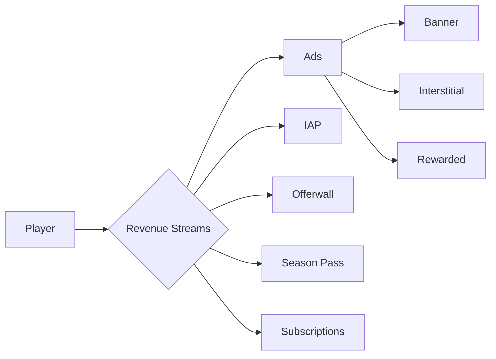
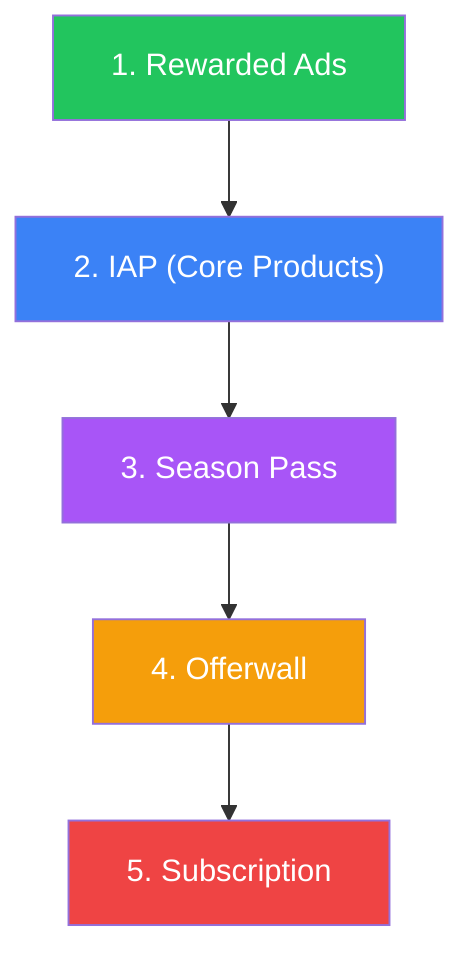

# Monetization Strategy Guide

A unified guide to planning and implementing revenue streams with the IntelliVerseX SDK.

---

## Overview

The IntelliVerseX SDK supports five distinct revenue streams. Each can be enabled independently or combined to maximize lifetime value (LTV) per player.



| Stream | SDK Class | Revenue Model | Effort |
|--------|-----------|---------------|--------|
| **Ads** | `IVXAdsManager` | CPM / CPC / CPI | Low |
| **In-App Purchases** | `IVXIAPManager` | One-time purchase | Medium |
| **Offerwall** | `IVXOfferwallManager` | CPA (cost-per-action) | Low |
| **Season Pass** | `IVXSeasonPassManager` | Recurring per season | High |
| **Subscriptions** | `IVXSubscriptionManager` | Recurring monthly/yearly | Medium |

---

## Revenue Streams

### 1. Advertising

Three ad formats optimized for different placements:

| Format | User Impact | Revenue/Impression | Best Placement |
|--------|-------------|-------------------|----------------|
| **Banner** | Low — always visible | $0.10–$0.50 eCPM | Gameplay screens |
| **Interstitial** | High — full screen | $2–$10 eCPM | Between levels, after game over |
| **Rewarded** | Positive — opt-in | $10–$40 eCPM | Extra lives, 2x coins, unlocks |

!!! tip "Rewarded First"
    Rewarded ads generate the highest eCPM and the best user sentiment. Always integrate these first.

### 2. In-App Purchases (IAP)

| Type | Description | Example |
|------|-------------|---------|
| **Consumable** | Used once, can repurchase | Coin packs, gem bundles |
| **Non-Consumable** | Permanent one-time unlock | Remove ads, character skins |
| **Subscription** | Recurring access | VIP pass, premium features |

### 3. Offerwall

Users complete third-party tasks (install apps, surveys, sign-ups) in exchange for in-game currency. Revenue is split between the offerwall provider and you.

- **Supported providers:** Pubscale, Xsolla
- **Average eCPM:** $20–$80 (varies heavily by geo)
- **Best for:** Giving non-paying users a path to earn premium currency

### 4. Season Pass

A time-limited progression track with free and premium tiers:

| Tier | Cost | Content |
|------|------|---------|
| **Free Track** | $0 | Basic rewards every few levels |
| **Premium Track** | $4.99–$14.99 | Exclusive cosmetics, currency, bonus XP |
| **Premium+ Track** | $9.99–$24.99 | Everything above + instant level skip |

### 5. Subscriptions

Recurring revenue for VIP or premium access:

| Plan | Price | Perks |
|------|-------|-------|
| **Weekly** | $0.99 | Ad removal, daily bonus |
| **Monthly** | $4.99 | All weekly perks + exclusive content |
| **Annual** | $39.99 | All monthly perks + 33% discount |

---

## Revenue Comparison

Expected ARPDAU (Average Revenue Per Daily Active User) by stream:

| Stream | Hypercasual | Casual | Midcore | Hardcore/RPG |
|--------|-------------|--------|---------|--------------|
| Banner Ads | $0.02–$0.05 | $0.01–$0.03 | — | — |
| Interstitial Ads | $0.05–$0.15 | $0.03–$0.08 | $0.01–$0.03 | — |
| Rewarded Ads | $0.03–$0.10 | $0.05–$0.15 | $0.02–$0.05 | $0.01–$0.03 |
| IAP | $0.01–$0.03 | $0.05–$0.15 | $0.10–$0.40 | $0.15–$0.60 |
| Offerwall | $0.005–$0.02 | $0.01–$0.05 | $0.02–$0.05 | $0.02–$0.05 |
| Season Pass | — | $0.02–$0.08 | $0.05–$0.15 | $0.10–$0.30 |
| Subscription | — | — | $0.03–$0.10 | $0.05–$0.20 |
| **Total ARPDAU** | **$0.10–$0.35** | **$0.17–$0.54** | **$0.23–$0.78** | **$0.33–$1.18** |

!!! note "Regional Variance"
    ARPDAU varies dramatically by geography. Tier-1 markets (US, UK, DE, JP) can be 5–10x higher than Tier-3 markets.

---

## Strategy Templates by Genre

### Hypercasual

**Revenue mix:** 80% Ads · 15% IAP · 5% Offerwall

```csharp
// Hypercasual monetization setup
var config = new IVXMonetizationConfig
{
    EnableBannerAds = true,
    EnableInterstitialAds = true,
    EnableRewardedAds = true,
    EnableIAP = true,
    EnableOfferwall = true,
    EnableSeasonPass = false,
    EnableSubscriptions = false,
    InterstitialFrequency = 2  // every 2 actions
};
```

| Placement | Format | Trigger |
|-----------|--------|---------|
| Always-on bottom | Banner | Gameplay |
| Between actions | Interstitial | Every 2–3 taps/levels |
| 2x reward button | Rewarded | After every reward screen |
| Coin shop fallback | Offerwall | When user lacks currency |

### Casual

**Revenue mix:** 50% Ads · 30% IAP · 10% Offerwall · 10% Season Pass

```csharp
var config = new IVXMonetizationConfig
{
    EnableBannerAds = true,
    EnableInterstitialAds = true,
    EnableRewardedAds = true,
    EnableIAP = true,
    EnableOfferwall = true,
    EnableSeasonPass = true,
    EnableSubscriptions = false,
    InterstitialFrequency = 3  // every 3 levels
};
```

| Placement | Format | Trigger |
|-----------|--------|---------|
| Menu screens | Banner | Non-gameplay screens |
| Level transitions | Interstitial | Every 3 levels |
| Extra life / continue | Rewarded | On fail |
| Cosmetic shop | IAP | Voluntary |
| Battle pass tab | Season Pass | Seasonal (6–8 weeks) |

### Midcore

**Revenue mix:** 20% Ads · 50% IAP · 10% Offerwall · 20% Season Pass

```csharp
var config = new IVXMonetizationConfig
{
    EnableBannerAds = false,
    EnableInterstitialAds = true,
    EnableRewardedAds = true,
    EnableIAP = true,
    EnableOfferwall = true,
    EnableSeasonPass = true,
    EnableSubscriptions = false,
    InterstitialFrequency = 5  // infrequent
};
```

| Placement | Format | Trigger |
|-----------|--------|---------|
| Speedup / skip timer | Rewarded | Voluntary |
| Natural story breaks | Interstitial | Sparse |
| Progression packs | IAP | Level-gated offers |
| Exclusive gear track | Season Pass | Monthly seasons |

### Hardcore / RPG

**Revenue mix:** 10% Ads · 40% IAP · 10% Offerwall · 30% Season Pass · 10% Subscription

```csharp
var config = new IVXMonetizationConfig
{
    EnableBannerAds = false,
    EnableInterstitialAds = false,
    EnableRewardedAds = true,
    EnableIAP = true,
    EnableOfferwall = true,
    EnableSeasonPass = true,
    EnableSubscriptions = true,
    InterstitialFrequency = 0  // disabled
};
```

| Placement | Format | Trigger |
|-----------|--------|---------|
| Optional bonus loot | Rewarded | Post-dungeon |
| Gacha / summon | IAP | Core loop |
| Premium battle pass | Season Pass | Every 4–6 weeks |
| VIP membership | Subscription | Permanent offer |

---

## Integration Order

Integrate revenue streams in this recommended order to maximize ROI on dev time:



| Priority | Stream | Rationale |
|----------|--------|-----------|
| 1 | **Rewarded Ads** | Easiest integration, highest eCPM, best user sentiment |
| 2 | **IAP** | Core revenue driver, define economy early |
| 3 | **Season Pass** | Strong retention driver + reliable revenue per season |
| 4 | **Offerwall** | Incremental revenue, low effort via SDK |
| 5 | **Subscription** | Requires established audience and proven value prop |

---

## SDK Class Mapping

Each revenue stream maps to a dedicated IntelliVerseX manager:

| Stream | Manager Class | Config ScriptableObject |
|--------|--------------|------------------------|
| Banner / Interstitial / Rewarded Ads | `IVXAdsManager` | `IVXAdsConfig` |
| In-App Purchases | `IVXIAPManager` | `IVXIAPConfig` |
| Offerwall | `IVXOfferwallManager` | `IVXOfferwallConfig` |
| Season Pass | `IVXSeasonPassManager` | `IVXSeasonPassConfig` |
| Subscriptions | `IVXSubscriptionManager` | `IVXIAPConfig` (subscription type) |
| Wallet / Currency | `IVXWalletManager` | — (Nakama-backed) |
| Revenue Analytics | `IVXSatoriClient` | — |

### Initialization

All monetization systems initialize through the SDK bootstrap:

```csharp
using IntelliVerseX.Monetization;

public class MonetizationBootstrap : MonoBehaviour
{
    [SerializeField] private IVXAdsConfig _adsConfig;
    [SerializeField] private IVXIAPConfig _iapConfig;
    [SerializeField] private IVXOfferwallConfig _offerwallConfig;

    private async void Start()
    {
        await IVXAdsManager.Instance.InitializeAsync(_adsConfig);
        await IVXIAPManager.Instance.InitializeAsync(_iapConfig);
        await IVXOfferwallManager.Instance.InitializeAsync(_offerwallConfig);
    }
}
```

---

## Anti-Patterns

!!! danger "Avoid These Mistakes"
    The following patterns will hurt retention, ratings, and long-term revenue.

| Anti-Pattern | Impact | Fix |
|-------------|--------|-----|
| Interstitial after every action | 1-star reviews, high churn | Cap at every 3–5 actions minimum |
| No rewarded ad option | Missed highest-eCPM format | Add rewarded for 2x coins, extra lives |
| Hard paywall on Day 1 | 90%+ users churn instantly | Offer generous free tier, paywall at Day 3+ |
| No free path to premium currency | Non-payers leave permanently | Add offerwall + rewarded ads as free path |
| IAP prices too high for market | Low conversion rate | Localize pricing, start with $0.99–$4.99 entry |
| Ads during tutorial | Terrible first impression | Disable ads for first 3–5 minutes |
| No ad cooldown | Banner blindness, frustration | Minimum 60s between interstitials |
| Rewarded ad with no real value | Users stop watching | Offer meaningful rewards (2x, extra life) |

---

## GDPR / COPPA Considerations

### GDPR (EU Users)

```csharp
if (IVXPrivacyManager.IsGDPRApplicable())
{
    bool consent = await IVXPrivacyManager.ShowConsentDialogAsync();
    IVXAdsManager.Instance.SetGDPRConsent(consent);
    IVXOfferwallManager.Instance.SetGDPRConsent(consent);
}
```

| Requirement | SDK Support |
|-------------|-------------|
| Consent before personalized ads | `IVXPrivacyManager.ShowConsentDialogAsync()` |
| Right to withdraw consent | `IVXPrivacyManager.RevokeConsentAsync()` |
| Data deletion request | `IVXPrivacyManager.RequestDataDeletionAsync()` |

### COPPA (Children Under 13)

```csharp
if (isChildDirectedApp)
{
    IVXAdsManager.Instance.SetCOPPACompliance(true);
    IVXOfferwallManager.Instance.SetEnabled(false);
    IVXIAPManager.Instance.SetParentalGateRequired(true);
}
```

!!! warning "Offerwall & Children"
    Offerwalls are **not permitted** in COPPA-compliant apps. Disable `IVXOfferwallManager` entirely when targeting children under 13.

### CCPA (California Users)

```csharp
if (IVXPrivacyManager.IsCCPAApplicable())
{
    IVXAdsManager.Instance.SetCCPAConsent(userOptedIn);
}
```

---

## A/B Testing Monetization

Use the IntelliVerseX Satori integration to run server-side experiments:

```csharp
var variant = await IVXSatoriClient.GetExperimentVariant("monetization_v2");

switch (variant)
{
    case "aggressive_ads":
        config.InterstitialFrequency = 2;
        break;
    case "balanced":
        config.InterstitialFrequency = 4;
        break;
    case "iap_focus":
        config.EnableInterstitialAds = false;
        config.EnableRewardedAds = true;
        break;
}
```

### Metrics to Track

| Metric | Description | Target |
|--------|-------------|--------|
| ARPDAU | Revenue per daily active user | Genre-dependent |
| Ad eCPM | Revenue per 1000 impressions | $5–$30 |
| IAP Conversion | % of users who purchase | 2–5% |
| ARPPU | Revenue per paying user | $5–$50 |
| D7 Retention | Users returning after 7 days | 15–30% |
| LTV | Lifetime value per user | $0.50–$5.00 |

---

## Revenue Analytics

Track all monetization events through the unified analytics pipeline:

```csharp
IVXAdsManager.OnAdRevenue += (data) =>
{
    IVXSatoriClient.TrackEvent("ad_revenue", new Dictionary<string, object>
    {
        { "ad_type", data.AdType },
        { "network", data.NetworkName },
        { "revenue", data.Revenue },
        { "currency", "USD" }
    });
};

IVXIAPManager.OnPurchaseCompleted += (purchase) =>
{
    IVXSatoriClient.TrackEvent("iap_purchase", new Dictionary<string, object>
    {
        { "product_id", purchase.ProductId },
        { "price", purchase.Price },
        { "currency", purchase.CurrencyCode }
    });
};
```

---

## Quick Decision Matrix

Use this matrix to decide which streams to enable based on your game:

| Question | Yes → Enable | No → Skip |
|----------|-------------|-----------|
| Sessions > 5 min? | Interstitial ads | Banner only |
| Natural reward moments? | Rewarded ads | — |
| Virtual economy? | IAP + Offerwall | — |
| Retention > D7 20%? | Season Pass | — |
| DAU > 10K? | Subscription | — |
| Targeting children? | — | Offerwall, personalized ads |

---

## See Also

- [Ad Integration Guide](ad-integration.md) — Detailed ad setup
- [Offerwall Integration Guide](offerwall-integration.md) — Offerwall setup
- [IAP Integration Guide](iap-integration.md) — In-app purchase setup
- [Wallet Integration Guide](wallet-integration.md) — Currency management
- [Privacy Guide](privacy.md) — GDPR/COPPA compliance
- [Ads Configuration](../configuration/ads-config.md) — Ad network config reference
