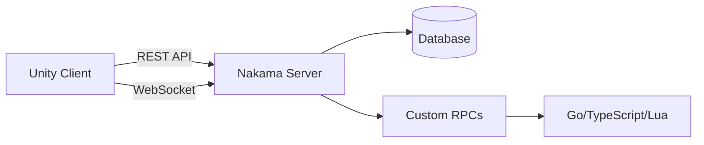

# Nakama Integration Guide

Deep integration with the Nakama game server backend.

---

## Overview

Nakama provides:

- **Authentication** - User accounts, social login
- **Realtime** - WebSockets for multiplayer
- **Storage** - Server-side data persistence
- **Leaderboards** - Global and friend rankings
- **RPCs** - Custom server-side logic
- **Tournaments** - Competition systems

---

## Architecture



---

## Connection Management

### Automatic Connection

The SDK handles connection automatically:

```csharp
// Connection happens during SDK initialization
// IntelliVerseXSDK.Initialize() connects to Nakama

// Check connection status
bool isConnected = IVXNakamaManager.Instance.IsConnected;
```

### Manual Connection

For advanced control:

```csharp
public async Task ConnectManually()
{
    // Connect to server
    await IVXNakamaManager.Instance.ConnectAsync();
    
    // Connect socket for realtime features
    await IVXNakamaManager.Instance.ConnectSocketAsync();
}
```

---

## Authentication

### Link with Nakama Session

```csharp
// After authentication, get the Nakama session
var session = IVXNakamaManager.Instance.Session;

// Session contains:
// - UserId
// - Username
// - AuthToken
// - RefreshToken
// - Expiry
```

### Custom Authentication

```csharp
// Authenticate with custom ID
await IVXNakamaManager.Instance.AuthenticateCustomAsync(
    customId: "unique-device-id",
    username: "Player123",
    create: true
);
```

---

## Storage

### Store User Data

```csharp
public async Task SavePlayerData()
{
    var data = new PlayerData
    {
        Level = 10,
        Experience = 5000,
        Coins = 1500
    };
    
    // Write to Nakama storage
    await IVXNakamaManager.Instance.WriteStorageObjectAsync(
        collection: "player_data",
        key: "profile",
        value: JsonUtility.ToJson(data),
        readPermission: 2,  // Owner only
        writePermission: 1  // Owner only
    );
}
```

### Read User Data

```csharp
public async Task<PlayerData> LoadPlayerData()
{
    var result = await IVXNakamaManager.Instance.ReadStorageObjectAsync(
        collection: "player_data",
        key: "profile"
    );
    
    if (result != null)
    {
        return JsonUtility.FromJson<PlayerData>(result.Value);
    }
    
    return new PlayerData(); // Default
}
```

### Permission Levels

| Value | Read | Write |
|-------|------|-------|
| 0 | No one | No one |
| 1 | Owner | Owner |
| 2 | Friends | - |
| 3 | Public | - |

---

## Leaderboards

### Submit Score

```csharp
public async Task SubmitHighScore(int score)
{
    await IVXNakamaManager.Instance.WriteLeaderboardRecordAsync(
        leaderboardId: "weekly_highscores",
        score: score,
        metadata: JsonUtility.ToJson(new { level = 10 })
    );
}
```

### Get Rankings

```csharp
public async Task<List<LeaderboardEntry>> GetTopScores()
{
    var records = await IVXNakamaManager.Instance.ListLeaderboardRecordsAsync(
        leaderboardId: "weekly_highscores",
        limit: 100
    );
    
    return records.Select(r => new LeaderboardEntry
    {
        Rank = r.Rank,
        Username = r.Username,
        Score = r.Score
    }).ToList();
}
```

### Get Around Player

```csharp
// Get scores around the current player
var aroundMe = await IVXNakamaManager.Instance.ListLeaderboardRecordsAroundOwnerAsync(
    leaderboardId: "weekly_highscores",
    ownerId: userId,
    limit: 10
);
```

---

## RPC Calls

### Call Server Function

```csharp
public async Task<T> CallRpc<T>(string functionName, object payload)
{
    string jsonPayload = JsonUtility.ToJson(payload);
    
    var response = await IVXNakamaManager.Instance.RpcAsync(
        id: functionName,
        payload: jsonPayload
    );
    
    return JsonUtility.FromJson<T>(response.Payload);
}

// Usage
var rewards = await CallRpc<RewardResponse>("claim_daily_reward", new { userId });
```

### Common RPCs

```csharp
// Claim daily reward
await IVXNakamaManager.Instance.RpcAsync("claim_daily_reward", "{}");

// Get quiz questions
var quiz = await IVXNakamaManager.Instance.RpcAsync("get_daily_quiz", "{}");

// Submit quiz answers
await IVXNakamaManager.Instance.RpcAsync("submit_quiz_answers", answersJson);
```

---

## Realtime Features

### Connect Socket

```csharp
public async Task ConnectRealtime()
{
    await IVXNakamaManager.Instance.ConnectSocketAsync();
    
    // Subscribe to events
    IVXNakamaManager.Instance.Socket.ReceivedMatchState += OnMatchState;
    IVXNakamaManager.Instance.Socket.ReceivedNotification += OnNotification;
}
```

### Send Realtime Message

```csharp
public async Task SendMatchState(long opCode, byte[] data)
{
    await IVXNakamaManager.Instance.Socket.SendMatchStateAsync(
        matchId: currentMatchId,
        opCode: opCode,
        state: data
    );
}
```

---

## Matchmaking

### Find Match

```csharp
public async Task FindMatch()
{
    // Add to matchmaking queue
    var ticket = await IVXNakamaManager.Instance.Socket.AddMatchmakerAsync(
        query: "+properties.skill:>=80",
        minCount: 2,
        maxCount: 4,
        stringProperties: new Dictionary<string, string>
        {
            { "region", "us-east" }
        },
        numericProperties: new Dictionary<string, double>
        {
            { "skill", 85.0 }
        }
    );
    
    // Wait for match
    IVXNakamaManager.Instance.Socket.ReceivedMatchmakerMatched += OnMatchFound;
}

private async void OnMatchFound(IMatchmakerMatched matched)
{
    // Join the match
    var match = await IVXNakamaManager.Instance.Socket.JoinMatchAsync(matched);
    currentMatchId = match.Id;
}
```

---

## Notifications

### Listen for Notifications

```csharp
public void SetupNotifications()
{
    IVXNakamaManager.Instance.Socket.ReceivedNotification += (notification) =>
    {
        Debug.Log($"Notification: {notification.Subject}");
        
        // Handle by type
        switch (notification.Code)
        {
            case 1: // Friend request
                HandleFriendRequest(notification);
                break;
            case 2: // Reward
                HandleReward(notification);
                break;
        }
    };
}
```

### List Pending Notifications

```csharp
var notifications = await IVXNakamaManager.Instance.ListNotificationsAsync(
    limit: 50,
    cacheableCursor: null
);

foreach (var n in notifications.Notifications)
{
    ProcessNotification(n);
}
```

---

## Error Handling

### Handle Nakama Errors

```csharp
try
{
    await IVXNakamaManager.Instance.RpcAsync("my_function", payload);
}
catch (ApiResponseException ex)
{
    // Server returned an error
    Debug.LogError($"API Error {ex.StatusCode}: {ex.Message}");
    
    switch (ex.StatusCode)
    {
        case 401:
            // Unauthorized - re-authenticate
            await RefreshAuth();
            break;
        case 404:
            // Not found
            break;
        case 500:
            // Server error - retry later
            break;
    }
}
catch (Exception ex)
{
    // Network or other error
    Debug.LogError($"Error: {ex.Message}");
}
```

---

## Best Practices

### 1. Batch Operations

```csharp
// Instead of multiple calls, batch when possible
var objects = new List<WriteStorageObject>
{
    new WriteStorageObject { Collection = "data", Key = "profile", Value = profileJson },
    new WriteStorageObject { Collection = "data", Key = "settings", Value = settingsJson }
};

await IVXNakamaManager.Instance.WriteStorageObjectsAsync(objects);
```

### 2. Cache Locally

```csharp
// Cache frequently accessed data
private PlayerData _cachedProfile;

public async Task<PlayerData> GetProfile()
{
    if (_cachedProfile == null)
    {
        _cachedProfile = await LoadFromServer();
    }
    return _cachedProfile;
}
```

### 3. Handle Reconnection

```csharp
IVXNakamaManager.Instance.OnDisconnected += async () =>
{
    Debug.Log("Disconnected, attempting reconnect...");
    await Task.Delay(2000);
    await IVXNakamaManager.Instance.ConnectSocketAsync();
};
```

---

## Server-Side Code Examples

### TypeScript RPC

```typescript
// Register RPC on server
function rpcClaimDailyReward(
    ctx: nkruntime.Context,
    logger: nkruntime.Logger,
    nk: nkruntime.Nakama,
    payload: string
): string {
    const userId = ctx.userId;
    
    // Check if already claimed
    const lastClaim = getLastClaimTime(nk, userId);
    if (isToday(lastClaim)) {
        throw Error("Already claimed today");
    }
    
    // Grant reward
    const reward = calculateReward(nk, userId);
    nk.walletUpdate(userId, { coins: reward });
    
    return JSON.stringify({ success: true, reward });
}

// Register in InitModule
initializer.registerRpc("claim_daily_reward", rpcClaimDailyReward);
```

---

## Troubleshooting

| Issue | Solution |
|-------|----------|
| Connection timeout | Check server URL, firewall |
| Session expired | Call refresh or re-authenticate |
| RPC not found | Verify function registered on server |
| Socket won't connect | Authenticate first, then connect socket |

See [Backend Configuration](../configuration/backend-config.md) for server setup.
