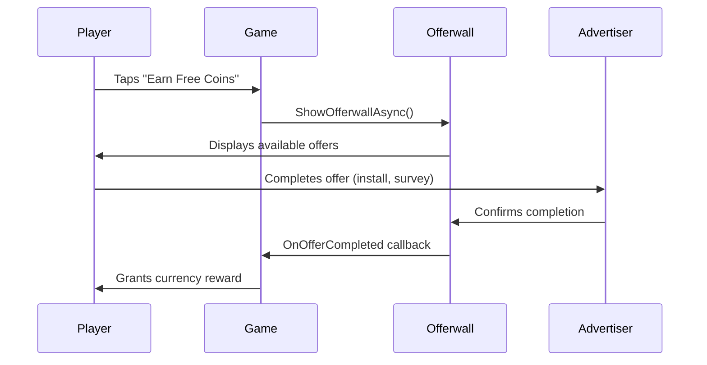
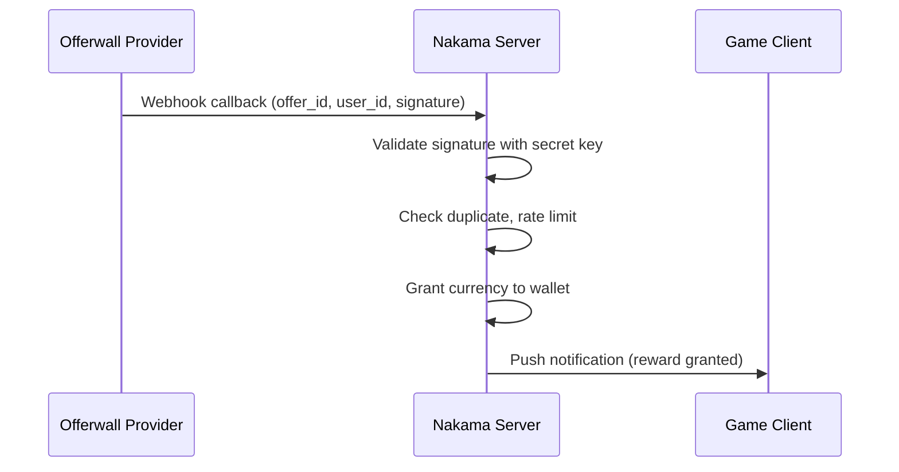

# Offerwall Integration Guide

Step-by-step guide to integrating offerwalls with Pubscale and Xsolla providers.

---

## Overview

An offerwall presents users with third-party tasks — installing apps, completing surveys, watching videos, or signing up for services — in exchange for in-game currency. Revenue is generated on a **cost-per-action (CPA)** basis: the advertiser pays when the user completes an action, and you receive a share.



### Why Use an Offerwall?

| Benefit | Description |
|---------|-------------|
| **Free-to-play monetization** | Non-paying users generate revenue |
| **Player-friendly** | 100% opt-in, no disruption to gameplay |
| **High eCPM** | $20–$80 eCPM in Tier-1 markets |
| **Retention boost** | Users earn premium currency without paying |

!!! warning "COPPA Compliance"
    Offerwalls are **not permitted** in apps directed at children under 13. Disable the offerwall entirely for COPPA-compliant apps.

---

## Supported Providers

| Provider | Offer Types | Regions | Revenue Share |
|----------|-------------|---------|---------------|
| **Pubscale** | App installs, surveys, sign-ups | Global | 70/30 (you/them) |
| **Xsolla** | App installs, in-app actions, subscriptions | Global | 65/35 (you/them) |

Both providers can run **simultaneously** in hybrid mode to maximize fill rate.

---

## Prerequisites

Before starting, ensure you have:

- [x] IntelliVerseX SDK installed ([Getting Started](../getting-started/index.md))
- [x] Nakama backend configured ([Nakama Integration](nakama-integration.md))
- [x] Virtual currency economy defined ([Wallet Integration](wallet-integration.md))
- [x] Pubscale publisher account and/or Xsolla publisher account

---

## Step 1: Create a Pubscale Account

1. Go to [Pubscale](https://pubscale.com) and create a publisher account
2. Add your app (Android bundle ID / iOS bundle ID)
3. Navigate to **Settings > API Keys**
4. Copy your **App ID** and **Secret Key**

!!! tip "Approval Time"
    Pubscale typically approves new apps within 24–48 hours. You can use test mode in the meantime.

---

## Step 2: Create a Xsolla Account

1. Go to [Xsolla Publisher Account](https://publisher.xsolla.com) and register
2. Create a new project for your game
3. Navigate to **Project Settings > Integration**
4. Copy your **Project ID** and **Merchant ID**
5. Set your **webhook URL** to your Nakama server: `https://your-nakama-host/v2/rpc/offerwall_xsolla_callback`

---

## Step 3: Create the IVXOfferwallConfig ScriptableObject

In Unity, right-click in the Project window:

**Create > IntelliVerseX > Offerwall Configuration**

This creates an `IVXOfferwallConfig` asset. Place it in your `Resources/` or configuration folder.

```
Assets/
└── _IntelliVerseXSDK/
    └── Resources/
        └── Configs/
            └── OfferwallConfig.asset
```

---

## Step 4: Configure the ScriptableObject

Select the `OfferwallConfig` asset in the Inspector and fill in the fields:

### Provider Settings

| Field | Type | Description |
|-------|------|-------------|
| `EnablePubscale` | `bool` | Enable Pubscale offers |
| `EnableXsolla` | `bool` | Enable Xsolla offers |
| `PubscaleAppId` | `string` | Your Pubscale App ID |
| `PubscaleSecretKey` | `string` | Your Pubscale Secret Key |
| `XsollaProjectId` | `string` | Your Xsolla Project ID |
| `XsollaMerchantId` | `string` | Your Xsolla Merchant ID |

### Reward Settings

| Field | Type | Description |
|-------|------|-------------|
| `DefaultCurrencyId` | `string` | Currency to grant (e.g., `"coins"`) |
| `UsdToCoinRate` | `float` | Conversion rate (e.g., `1000` = $1 → 1000 coins) |
| `BonusMultiplier` | `float` | Reward multiplier (e.g., `1.5` for 50% bonus events) |
| `MinPayoutThreshold` | `int` | Minimum reward to show offer (filters low-value offers) |

### Security Settings

| Field | Type | Description |
|-------|------|-------------|
| `EnableFraudProtection` | `bool` | Enable server-side validation |
| `EnableIPVerification` | `bool` | Verify user IP matches callback IP |
| `MaxCompletionsPerDay` | `int` | Daily completion cap per user |

### Example Configuration (Inspector)

```
Enable Pubscale:       ✅
Enable Xsolla:         ✅
Pubscale App Id:       ps_abc123def456
Pubscale Secret Key:   sk_live_xxxxxxxxxxxx
Xsolla Project Id:     12345
Xsolla Merchant Id:    67890
Default Currency Id:   coins
USD to Coin Rate:      1000
Bonus Multiplier:      1.0
Min Payout Threshold:  10
Enable Fraud Protection: ✅
Max Completions/Day:   20
```

---

## Step 5: Wire the Reward Callback

Subscribe to the `OnOfferCompleted` event to grant rewards when a user finishes an offer:

```csharp
using IntelliVerseX.Monetization;
using UnityEngine;

public class OfferwallRewardHandler : MonoBehaviour
{
    private void OnEnable()
    {
        IVXOfferwallManager.OnOfferCompleted += HandleOfferCompleted;
        IVXOfferwallManager.OnOfferFailed += HandleOfferFailed;
    }

    private void OnDisable()
    {
        IVXOfferwallManager.OnOfferCompleted -= HandleOfferCompleted;
        IVXOfferwallManager.OnOfferFailed -= HandleOfferFailed;
    }

    private async void HandleOfferCompleted(string offerId, OfferReward reward)
    {
        Debug.Log($"[Offerwall] Offer {offerId} completed: {reward.Amount} {reward.CurrencyId}");

        var result = await IVXWalletManager.Instance.GrantCurrencyAsync(
            reward.CurrencyId,
            reward.Amount
        );

        if (result.Success)
        {
            ShowRewardPopup(reward.Amount, reward.CurrencyId);
        }
    }

    private void HandleOfferFailed(string offerId, string error)
    {
        Debug.LogWarning($"[Offerwall] Offer {offerId} failed: {error}");
    }

    private void ShowRewardPopup(int amount, string currency)
    {
        // Display reward UI to the player
    }
}
```

---

## Step 6: Show the Offerwall UI

Display the offerwall when the user taps an "Earn Coins" button:

```csharp
using IntelliVerseX.Monetization;
using UnityEngine;
using UnityEngine.UI;

public class OfferwallUI : MonoBehaviour
{
    [SerializeField] private Button _earnCoinsButton;

    private void Start()
    {
        _earnCoinsButton.onClick.AddListener(OnEarnCoinsClicked);
        UpdateButtonState();

        IVXOfferwallManager.OnOfferwallOpened += () => Debug.Log("[Offerwall] Opened");
        IVXOfferwallManager.OnOfferwallClosed += () =>
        {
            Debug.Log("[Offerwall] Closed");
            UpdateButtonState();
        };
    }

    private async void OnEarnCoinsClicked()
    {
        if (!IVXOfferwallManager.Instance.IsAvailable())
        {
            ShowToast("Offers not available right now. Try again later.");
            return;
        }

        await IVXOfferwallManager.Instance.ShowOfferwallAsync();
    }

    private void UpdateButtonState()
    {
        _earnCoinsButton.interactable = IVXOfferwallManager.Instance.IsAvailable();
    }

    private void ShowToast(string message) { /* your toast UI */ }
}
```

---

## Hybrid Mode

When both Pubscale and Xsolla are enabled, the SDK operates in **hybrid mode**:

- Both providers' offers are merged into a single offerwall
- Offers are sorted by reward value (highest first)
- If one provider has no offers, the other fills the gap
- Duplicate offers are automatically deduplicated

```csharp
// Hybrid mode is automatic when both are enabled in config
// No additional code required

// To check individual provider availability:
bool hasPubscale = IVXOfferwallManager.Instance.IsProviderAvailable("pubscale");
bool hasXsolla = IVXOfferwallManager.Instance.IsProviderAvailable("xsolla");
```

---

## Revenue Optimization

### Offer Type Toggles

Control which offer types appear:

```csharp
var filterConfig = new OfferFilterConfig
{
    EnableAppInstalls = true,
    EnableSurveys = true,
    EnableSignups = true,
    EnableVideoOffers = true,
    EnableSubscriptionOffers = false  // disable high-friction offers
};

IVXOfferwallManager.Instance.SetOfferFilter(filterConfig);
```

### Bonus Multiplier Events

Run limited-time bonus events to boost engagement:

```csharp
// Weekend 2x bonus
IVXOfferwallManager.Instance.SetBonusMultiplier(2.0f);

// Reset after event
IVXOfferwallManager.Instance.SetBonusMultiplier(1.0f);
```

### USD-to-Coin Conversion

Tune your conversion rate to balance economy:

| Rate | $1 USD = | Player Perception |
|------|----------|-------------------|
| 100 | 100 coins | Low volume, coins feel valuable |
| 1,000 | 1,000 coins | Balanced |
| 10,000 | 10,000 coins | High volume, coins feel abundant |

!!! tip "Match Your IAP Economy"
    Set the offerwall conversion rate to match or slightly undercut your IAP store. If $1 buys 1,000 coins via IAP, set the offerwall rate to 800–1,000 coins per $1.

---

## Fraud Protection

### Client-Side Protection

```csharp
// Enabled via IVXOfferwallConfig.EnableFraudProtection = true
// Automatic behaviors:
// - Device fingerprinting
// - Session token rotation
// - Duplicate completion detection
```

### Server-Side Validation (Nakama)

All offer completions are validated through your Nakama backend:



The Nakama module `offerwall_rewards` handles:

- Signature verification against your Pubscale/Xsolla secret keys
- Duplicate transaction detection
- Daily completion rate limiting
- IP address verification (optional)
- Automatic wallet credit

---

## Analytics

Track offerwall performance through the Satori analytics pipeline:

```csharp
// These events are automatically tracked by the SDK:
// - offerwall_opened: user opened the offerwall
// - offerwall_closed: user closed without completing
// - offer_started: user clicked an offer
// - offer_completed: offer was validated and rewarded
// - offer_failed: offer validation failed

// Custom tracking example:
IVXSatoriClient.TrackEvent("offerwall_revenue", new Dictionary<string, object>
{
    { "provider", reward.Provider },
    { "offer_id", reward.OfferId },
    { "revenue_usd", reward.RevenueUsd },
    { "coins_granted", reward.Amount }
});
```

### Key Metrics to Monitor

| Metric | Description | Healthy Range |
|--------|-------------|---------------|
| Offerwall Open Rate | % of DAU opening offerwall | 5–15% |
| Offer Completion Rate | % of opens → completions | 10–30% |
| Revenue per Completion | Average USD per completed offer | $0.20–$2.00 |
| Fraud Rate | % of flagged completions | < 5% |

---

## Troubleshooting

| Issue | Cause | Solution |
|-------|-------|----------|
| Offerwall shows no offers | Provider not approved, geo mismatch | Check provider dashboard status; test from Tier-1 country |
| `OnOfferCompleted` never fires | Webhook URL misconfigured | Verify Nakama webhook endpoint in provider dashboard |
| Rewards doubled | Missing duplicate detection | Enable `EnableFraudProtection` in config |
| "Provider not available" error | SDK not initialized, config missing | Call `InitializeAsync()` with valid config before showing |
| Offers load slowly | Network latency, cold cache | Pre-fetch with `IVXOfferwallManager.Instance.PreloadOffersAsync()` |
| User reports missing reward | Webhook delivery failure | Check Nakama logs; implement retry queue in Nakama module |
| Low fill rate | Single provider, low-tier geo | Enable hybrid mode (both Pubscale + Xsolla) |
| Crash on Android | ProGuard stripping provider SDK | Add keep rules for Pubscale/Xsolla classes |

### Debug Mode

```csharp
// Enable verbose logging for offerwall
IVXOfferwallManager.Instance.SetDebugMode(true);

// Test with mock offers (no real provider calls)
IVXOfferwallManager.Instance.SetTestMode(true);
```

---

## Complete Integration Example

```csharp
using IntelliVerseX.Monetization;
using UnityEngine;

public class OfferwallController : MonoBehaviour
{
    [SerializeField] private IVXOfferwallConfig _config;

    private async void Start()
    {
        await IVXOfferwallManager.Instance.InitializeAsync(_config);

        IVXOfferwallManager.OnOfferCompleted += async (offerId, reward) =>
        {
            var result = await IVXWalletManager.Instance.GrantCurrencyAsync(
                reward.CurrencyId, reward.Amount
            );

            if (result.Success)
            {
                Debug.Log($"[Offerwall] Granted {reward.Amount} {reward.CurrencyId}");
            }
        };

        IVXOfferwallManager.OnOfferFailed += (offerId, error) =>
        {
            Debug.LogWarning($"[Offerwall] Failed: {error}");
        };
    }

    public async void ShowOfferwall()
    {
        if (IVXOfferwallManager.Instance.IsAvailable())
        {
            await IVXOfferwallManager.Instance.ShowOfferwallAsync();
        }
    }
}
```

---

## See Also

- [Monetization Strategy Guide](monetization-strategy.md) — Overall monetization planning
- [Ad Integration Guide](ad-integration.md) — Banner, interstitial, rewarded ads
- [IAP Integration Guide](iap-integration.md) — In-app purchases
- [Wallet Integration Guide](wallet-integration.md) — Currency management
- [Privacy Guide](privacy.md) — GDPR/COPPA compliance
