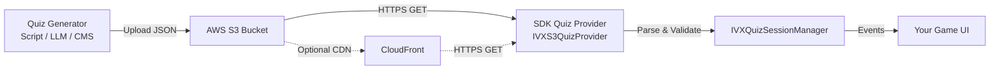

# Quiz Content Pipeline — S3 Setup, Generation & Custom Trivia

This guide walks through the **end-to-end content pipeline** for quizzes in the IntelliVerseX SDK: how quiz JSON is structured, where it lives on S3, how the SDK resolves it at runtime, and how to wire up your own S3 bucket for a **new game** with custom daily, weekly, or entirely new quiz types.

---

## Architecture Overview



| Component | Role |
|-----------|------|
| **S3 Bucket** | Public (or CloudFront-fronted) object store holding quiz JSON files |
| **Quiz Generator** | Python script, LLM API, or CMS that produces quiz JSON and uploads to S3 |
| **IVXS3QuizProvider** | SDK class that fetches quiz JSON by date/id from your S3 URL |
| **IVXDailyQuizService** / **IVXWeeklyQuizService** | Higher-level services with caching, fallback, and localization |
| **IVXQuizSessionManager** | Drives the quiz gameplay loop (questions, answers, scoring) |

---

## Step 1 — Create Your S3 Bucket

### 1a. Create the bucket

```bash
aws s3 mb s3://my-game-quiz-content --region us-east-1
```

### 1b. Enable public read (or use CloudFront)

=== "Public bucket policy"

    ```json
    {
      "Version": "2012-10-17",
      "Statement": [{
        "Sid": "PublicRead",
        "Effect": "Allow",
        "Principal": "*",
        "Action": "s3:GetObject",
        "Resource": "arn:aws:s3:::my-game-quiz-content/*"
      }]
    }
    ```

=== "CloudFront + OAI (recommended for production)"

    1. Create a CloudFront distribution pointed at the S3 bucket.
    2. Create an Origin Access Identity (OAI) and attach it.
    3. Restrict the bucket policy to the OAI only.
    4. Use the CloudFront domain as your `S3_BASE_URL`.

### 1c. Organize the folder structure

```
my-game-quiz-content/
├── daily/
│   ├── dailyquiz-2026-04-01.json
│   ├── dailyquiz-2026-04-02.json
│   ├── dailyquiz-prem-en-2026-04-01.json
│   └── dailyquiz-prem-hi-2026-04-01.json
├── weekly/
│   ├── 2026-1-14-fortune_en.json
│   ├── 2026-1-14-emoji_en.json
│   └── 2026-1-14-health_hi.json
└── custom/
    ├── halloween-trivia.json
    ├── sports-pack-1.json
    └── science-challenge.json
```

---

## Step 2 — Understand the JSON Schemas

### Daily Quiz JSON

**File naming**: `dailyquiz-{YYYY}-{MM}-{DD}.json`

**Example**: `dailyquiz-2026-04-01.json`

```json
{
  "quizId": "dailyquiz-2026-04-01",
  "generated_at": "2026-04-01T00:00:00Z",
  "today_quiz": {
    "topic": "General Knowledge",
    "difficulty": "medium",
    "generated_at": "2026-04-01T00:00:00Z",
    "questions": [
      {
        "id": "q1",
        "question": "What is the capital of France?",
        "options": ["London", "Paris", "Berlin", "Madrid"],
        "correct_answer": 1,
        "explanation": "Paris has been the capital of France since the 10th century.",
        "hints": {
          "text": "It's known as the City of Light",
          "audio_url": "https://my-bucket.s3.amazonaws.com/audio/hint-q1.mp3"
        },
        "languages": {
          "en": {
            "question": "What is the capital of France?",
            "options": ["London", "Paris", "Berlin", "Madrid"],
            "explanation": "Paris has been the capital since the 10th century.",
            "hints": { "text": "City of Light" },
            "question_audio_url": "",
            "options_audio_urls": []
          },
          "hi": {
            "question": "फ्रांस की राजधानी क्या है?",
            "options": ["लंदन", "पेरिस", "बर्लिन", "मैड्रिड"],
            "explanation": "पेरिस 10वीं शताब्दी से फ्रांस की राजधानी रहा है।",
            "hints": { "text": "इसे रोशनी का शहर कहा जाता है" },
            "question_audio_url": "",
            "options_audio_urls": []
          }
        }
      }
    ]
  }
}
```

!!! info "Fields reference"
    | Field | Type | Required | Description |
    |-------|------|----------|-------------|
    | `quizId` | string | Yes | Unique identifier, typically `dailyquiz-YYYY-MM-DD` |
    | `today_quiz.questions` | array | Yes | Array of question objects (minimum 1) |
    | `questions[].id` | string | Yes | Unique question id |
    | `questions[].question` | string | Yes | Default (English) question text |
    | `questions[].options` | string[] | Yes | 2-6 answer options |
    | `questions[].correct_answer` | int | Yes | 0-based index of the correct option |
    | `questions[].explanation` | string | No | Shown after answering |
    | `questions[].hints` | object | No | `{ text, audio_url }` |
    | `questions[].languages` | object | No | Keyed by locale code, each with localized `question`, `options`, `explanation`, `hints` |

### Premium Daily Quiz JSON

**File naming**: `dailyquiz-prem-{lang}-{YYYY}-{MM}-{DD}.json`

```json
{
  "quizId": "dailyquiz-prem-en-2026-04-01",
  "topic": "Advanced Science",
  "difficulty": "hard",
  "generated_at": "2026-04-01T00:00:00Z",
  "premium_questions": [
    {
      "id": "pq1",
      "question": "What particle mediates the strong nuclear force?",
      "options": ["Photon", "Gluon", "W boson", "Graviton"],
      "correct_answer": 1,
      "explanation": "Gluons bind quarks together inside protons and neutrons."
    }
  ]
}
```

### Weekly Quiz JSON

**File naming**: `{YYYY}-{D}-{WW}-{type}_{lang}.json`

Where `D` = day-of-week uploaded (1-7), `WW` = ISO week number, `type` = quiz type.

**Example**: `2026-2-14-fortune_en.json` = Week 14 of 2026, uploaded Tuesday, Fortune type, English.

```json
{
  "quizId": "fortune-2026-W14",
  "topic": {
    "en": "What kind of leader are you?",
    "hi": "आप किस प्रकार के नेता हैं?"
  },
  "today_quiz": {
    "questions": [
      {
        "id": "fq1",
        "question": "When a team disagrees, you usually...",
        "options": [
          "Listen to all sides then decide",
          "Let the majority rule",
          "Step back and observe",
          "Take charge immediately"
        ],
        "correct_answer": 0,
        "explanation": "Active listening is a hallmark of servant leadership.",
        "languages": {
          "hi": {
            "question": "जब टीम असहमत होती है, तो आप आमतौर पर...",
            "options": ["सबकी सुनें", "बहुमत", "देखें", "कमान लें"]
          }
        }
      }
    ]
  }
}
```

**Weekly quiz types**: `fortune`, `emoji`, `prediction`, `health` (or define your own).

### Custom / Generic Quiz JSON

For any non-daily, non-weekly quiz (trivia packs, seasonal events, etc.), use the generic `IVXQuizData` format:

```json
{
  "quizId": "halloween-trivia-2026",
  "title": "Halloween Trivia",
  "description": "Spooky knowledge challenge!",
  "language": "en",
  "questions": [
    {
      "questionText": "What country originated Halloween?",
      "options": ["USA", "Ireland", "Mexico", "Romania"],
      "correctAnswerIndex": 1,
      "category": "History",
      "difficulty": 2,
      "explanation": "Halloween originated from the ancient Celtic festival of Samhain in Ireland.",
      "hint": "Think Celtic traditions"
    }
  ]
}
```

---

## Step 3 — Generate Quiz Content

### Option A: LLM-based generation (recommended)

Use any LLM API (OpenAI, Anthropic, etc.) to auto-generate quiz content, then upload to S3.

```python
#!/usr/bin/env python3
"""generate_daily_quiz.py — Generate and upload daily quiz JSON to S3."""

import json
import boto3
from datetime import datetime, timedelta
from openai import OpenAI

client = OpenAI()  # uses OPENAI_API_KEY env var
s3 = boto3.client("s3")

BUCKET = "my-game-quiz-content"
LANGUAGES = ["en", "hi", "es", "fr"]

def generate_questions(topic: str, count: int = 10, lang: str = "en") -> list:
    """Generate quiz questions via LLM."""
    prompt = f"""Generate {count} multiple-choice trivia questions about "{topic}".
Return JSON array. Each object must have:
- "id": unique string (e.g. "q1")
- "question": the question text in {lang}
- "options": exactly 4 answer strings
- "correct_answer": 0-based index of the correct option
- "explanation": 1-sentence explanation
Return ONLY the JSON array, no markdown."""

    response = client.chat.completions.create(
        model="gpt-4o",
        messages=[{"role": "user", "content": prompt}],
        temperature=0.7,
    )
    return json.loads(response.choices[0].message.content)


def build_daily_quiz(date: datetime, topic: str = "General Knowledge") -> dict:
    """Build the full daily quiz JSON structure."""
    questions = generate_questions(topic, count=10)
    return {
        "quizId": f"dailyquiz-{date:%Y-%m-%d}",
        "generated_at": date.isoformat() + "Z",
        "today_quiz": {
            "topic": topic,
            "difficulty": "medium",
            "generated_at": date.isoformat() + "Z",
            "questions": questions,
        },
    }


def upload_to_s3(quiz: dict, key: str):
    """Upload quiz JSON to S3."""
    s3.put_object(
        Bucket=BUCKET,
        Key=key,
        Body=json.dumps(quiz, indent=2, ensure_ascii=False),
        ContentType="application/json",
        CacheControl="public, max-age=86400",
    )
    print(f"Uploaded: s3://{BUCKET}/{key}")


if __name__ == "__main__":
    today = datetime.utcnow()

    # Generate for the next 7 days
    for offset in range(7):
        date = today + timedelta(days=offset)
        quiz = build_daily_quiz(date, topic="General Knowledge")
        key = f"daily/dailyquiz-{date:%Y-%m-%d}.json"
        upload_to_s3(quiz, key)

    print("Done! 7 days of quizzes uploaded.")
```

### Option B: Nakama server-side generation

Add a scheduled RPC on your Nakama server that generates quizzes and stores them in S3:

```go
// server/rpcs/quiz_generate.go
func QuizGenerateDaily(ctx context.Context, logger runtime.Logger,
    db *sql.DB, nk runtime.NakamaModule,
    payload string) (string, error) {

    // 1. Call your LLM endpoint to generate questions
    // 2. Format as the daily quiz JSON schema
    // 3. Upload to S3 using AWS SDK
    // 4. Return success

    return `{"status":"ok","quizId":"dailyquiz-2026-04-01"}`, nil
}
```

Register a CRON trigger in your Nakama server config to call this RPC daily at midnight UTC.

### Option C: Manual / CMS upload

For small studios, create quizzes manually in a spreadsheet or CMS, export to JSON, and upload via the AWS CLI:

```bash
# Upload a single daily quiz
aws s3 cp dailyquiz-2026-04-01.json \
  s3://my-game-quiz-content/daily/dailyquiz-2026-04-01.json \
  --content-type application/json \
  --cache-control "public, max-age=86400"

# Bulk upload a folder
aws s3 sync ./quizzes/ s3://my-game-quiz-content/ \
  --content-type application/json
```

---

## Step 4 — Wire Your S3 URL into the SDK

### Option A: Use `IVXS3QuizProvider` (generic quizzes)

Point the provider at your bucket's HTTPS URL:

```csharp
using IntelliVerseX.Quiz;

string myBucketUrl = "https://my-game-quiz-content.s3.us-east-1.amazonaws.com/daily";

var provider = new IVXS3QuizProvider(myBucketUrl);
IVXQuizSessionManager.Instance.Initialize(provider);

// Fetch today's daily quiz
await IVXQuizSessionManager.Instance.StartDailyQuizAsync();
```

The provider constructs the URL as `{baseUrl}/dailyquiz-{yyyy-MM-dd}.json` and tries a 7-day fallback window automatically.

### Option B: Use `IVXDailyQuizService` (daily + premium)

The `IVXDailyQuizService` has a hardcoded `S3_BASE_URL`. To use your own bucket, **subclass or modify** the constant:

```csharp
using IntelliVerseX.Quiz.DailyQuiz;

// Option 1: Fork the service and change S3_BASE_URL
// In your copy of IVXDailyQuizService.cs:
private const string S3_BASE_URL = "https://my-game-quiz-content.s3.us-east-1.amazonaws.com/daily/";

// Option 2: Use IVXS3QuizProvider + IVXQuizSessionManager (recommended)
var provider = new IVXS3QuizProvider(
    "https://my-game-quiz-content.s3.us-east-1.amazonaws.com/daily"
);
IVXQuizSessionManager.Instance.Initialize(provider);
```

### Option C: Use `IVXWeeklyQuizService` (weekly quiz types)

Same approach — the service's `S3_BASE_URL` points to a specific bucket. Override it for your game:

```csharp
// In your copy of IVXWeeklyQuizService.cs:
private const string S3_BASE_URL = "https://my-game-quiz-content.s3.us-east-1.amazonaws.com/weekly/";
```

### Option D: Use `IVXHybridQuizProvider` (S3 + local fallback)

For offline-first experiences, use a hybrid provider:

```csharp
var s3Provider = new IVXS3QuizProvider(
    "https://my-game-quiz-content.s3.us-east-1.amazonaws.com/daily"
);
var localProvider = new IVXLocalQuizProvider("Quizzes/fallback_quiz");

var hybridProvider = new IVXHybridQuizProvider(s3Provider, localProvider);
IVXQuizSessionManager.Instance.Initialize(hybridProvider);
```

!!! tip "CloudFront recommended"
    For production, put CloudFront in front of your S3 bucket. This gives you:

    - Global edge caching (faster loads worldwide)
    - HTTPS with custom domain (`quiz.mygame.com`)
    - No direct S3 public access needed
    - Request analytics and WAF protection

---

## Step 5 — Create Custom Quiz Types

The SDK's quiz system is designed to be **extensible**. You can create entirely new quiz types beyond daily and weekly.

### 5a. Implement `IIVXQuizProvider`

```csharp
using IntelliVerseX.Quiz;

/// <summary>
/// Custom provider for themed trivia packs stored on S3.
/// </summary>
public class MyTriviaPack​Provider : IIVXQuizProvider
{
    private readonly string _s3BaseUrl;

    public MyTriviaPack​Provider(string s3BaseUrl)
    {
        _s3BaseUrl = s3BaseUrl.TrimEnd('/');
    }

    public async Task<IVXQuizResult> FetchQuizAsync(string quizId)
    {
        string url = $"{_s3BaseUrl}/custom/{quizId}.json";
        var result = await IVXNetworkRequest.GetAsync(url, IVXRetryPolicy.Default, 15);

        if (!result.IsSuccess)
            return IVXQuizResult.FailureResult(result.ErrorMessage);

        var quizData = JsonConvert.DeserializeObject<IVXQuizData>(result.Data);
        return IVXQuizResult.SuccessResult(quizData, url);
    }

    public Task<IVXQuizResult> FetchQuizAsync(DateTime date)
    {
        string quizId = $"trivia-{date:yyyy-MM-dd}";
        return FetchQuizAsync(quizId);
    }
}
```

### 5b. Use it in your game

```csharp
var provider = new MyTriviaPackProvider(
    "https://my-game-quiz-content.s3.us-east-1.amazonaws.com"
);
IVXQuizSessionManager.Instance.Initialize(provider);

// Load a specific trivia pack
await IVXQuizSessionManager.Instance.StartSessionAsync("halloween-trivia-2026");
```

### 5c. Example quiz types for games

| Quiz Type | Naming Convention | Use Case |
|-----------|-------------------|----------|
| **Daily trivia** | `dailyquiz-{YYYY-MM-DD}.json` | New questions every day |
| **Weekly themed** | `{YYYY}-{D}-{WW}-{type}_{lang}.json` | Fortune, emoji, prediction, health |
| **Seasonal event** | `event-{event-id}.json` | Halloween, Christmas, game anniversary |
| **Category pack** | `pack-{category}-{number}.json` | Science Pack 1, History Pack 3 |
| **Tournament** | `tournament-{id}.json` | Competitive fixed-question set |
| **User-generated** | `ugc-{userId}-{quizId}.json` | Community-created quizzes |

---

## Step 6 — Automate with CI/CD

### GitHub Actions example

```yaml
name: Generate Daily Quiz
on:
  schedule:
    - cron: '0 0 * * *'  # Midnight UTC daily
  workflow_dispatch: {}

jobs:
  generate:
    runs-on: ubuntu-latest
    steps:
      - uses: actions/checkout@v4

      - uses: actions/setup-python@v5
        with:
          python-version: '3.12'

      - name: Install dependencies
        run: pip install openai boto3

      - name: Generate and upload quizzes
        env:
          OPENAI_API_KEY: ${{ secrets.OPENAI_API_KEY }}
          AWS_ACCESS_KEY_ID: ${{ secrets.AWS_ACCESS_KEY_ID }}
          AWS_SECRET_ACCESS_KEY: ${{ secrets.AWS_SECRET_ACCESS_KEY }}
          AWS_DEFAULT_REGION: us-east-1
        run: python scripts/generate_daily_quiz.py
```

### Scheduled Nakama CRON

If you prefer server-side generation, add a CRON job to your Nakama server that calls the generation RPC at midnight UTC daily. See the [Nakama runtime docs](https://heroiclabs.com/docs/nakama/server-framework/recipes/cron-jobs/) for scheduling.

---

## Step 7 — Validate Your Setup

### Checklist

- [ ] S3 bucket created and accessible via HTTPS
- [ ] JSON files follow the correct naming convention for their quiz type
- [ ] JSON validates against the schema (use `jsonlint` or a test script)
- [ ] Quiz has at least 1 question with valid `correct_answer` index
- [ ] All `options` arrays have 2+ entries
- [ ] `correct_answer` index is within the `options` array bounds
- [ ] Languages object (if present) uses supported locale codes
- [ ] CloudFront distribution set up (for production)
- [ ] SDK provider points to the correct base URL
- [ ] Fallback works — delete today's file and verify the SDK loads yesterday's quiz

### Quick validation script

```python
#!/usr/bin/env python3
"""validate_quiz.py — Validate quiz JSON files before upload."""

import json
import sys

def validate(filepath: str) -> list[str]:
    errors = []
    with open(filepath) as f:
        data = json.load(f)

    if "quizId" not in data and "today_quiz" not in data and "questions" not in data:
        errors.append("Missing quizId, today_quiz, or questions at root level")
        return errors

    questions = []
    if "today_quiz" in data and "questions" in data["today_quiz"]:
        questions = data["today_quiz"]["questions"]
    elif "premium_questions" in data:
        questions = data["premium_questions"]
    elif "questions" in data:
        questions = data["questions"]

    if not questions:
        errors.append("No questions found")
        return errors

    for i, q in enumerate(questions):
        prefix = f"Question {i+1}"
        if "question" not in q and "questionText" not in q:
            errors.append(f"{prefix}: missing question text")
        opts = q.get("options", [])
        if len(opts) < 2:
            errors.append(f"{prefix}: needs at least 2 options, has {len(opts)}")
        correct = q.get("correct_answer", q.get("correctAnswerIndex", -1))
        if correct < 0 or correct >= len(opts):
            errors.append(f"{prefix}: correct_answer {correct} out of range [0, {len(opts)-1}]")

    return errors

if __name__ == "__main__":
    for path in sys.argv[1:]:
        errs = validate(path)
        if errs:
            print(f"FAIL {path}:")
            for e in errs:
                print(f"  - {e}")
            sys.exit(1)
        else:
            print(f"OK   {path}")
```

---

## URL Resolution Reference

### Daily Quiz

| Property | Value |
|----------|-------|
| **Base URL** | `https://{bucket}.s3.{region}.amazonaws.com/{game}/daily/` |
| **File pattern** | `dailyquiz-{YYYY}-{MM}-{DD}.json` |
| **Premium pattern** | `dailyquiz-prem-{lang}-{YYYY}-{MM}-{DD}.json` |
| **Fallback window** | 7 days (tries previous dates) |
| **Language fallback** | Falls back to `en` if locale not found |
| **SDK class** | `IVXS3QuizProvider` or `IVXDailyQuizService` |

### Weekly Quiz

| Property | Value |
|----------|-------|
| **Base URL** | `https://{bucket}.s3.{region}.amazonaws.com/{game}/weekly/` |
| **File pattern** | `{YYYY}-{D}-{WW}-{type}_{lang}.json` |
| **D** | Day of week uploaded (1=Mon … 7=Sun) |
| **WW** | ISO 8601 week number (1-53) |
| **type** | `fortune`, `emoji`, `prediction`, `health`, or custom |
| **Fallback window** | 8 weeks; tries all 7 upload days per week |
| **SDK class** | `IVXWeeklyQuizService` |

### Custom Quiz

| Property | Value |
|----------|-------|
| **Base URL** | `https://{bucket}.s3.{region}.amazonaws.com/{game}/custom/` |
| **File pattern** | `{quizId}.json` (any string you pass to `FetchQuizAsync`) |
| **SDK class** | `IVXS3QuizProvider` or custom `IIVXQuizProvider` |

---

## Supported Locales

The SDK normalizes language codes to one of these supported values:

`en`, `es`, `ar`, `fr`, `de`, `pt`, `hi`, `zh`, `ja`, `ko`, `id`, `ru`

Provide translations in the `languages` object of each question. The SDK resolves the player's language from `PlayerPrefs["SelectedLanguage"]` and falls back to `en`.

---

## Troubleshooting

| Symptom | Cause | Fix |
|---------|-------|-----|
| "No quiz available for the past 7 days" | No JSON files in the S3 path for the date range | Upload quiz files matching the naming convention |
| 403 Forbidden | Bucket policy doesn't allow public read | Update bucket policy or use CloudFront + OAI |
| 404 Not Found | Wrong file name or folder path | Verify naming convention matches exactly |
| "Failed to parse quiz JSON" | JSON is malformed or uses wrong schema | Run the validation script above |
| Wrong language shown | `PlayerPrefs["SelectedLanguage"]` not set or locale code mismatch | Set the language pref before loading; use supported codes |
| Quiz loads but shows 0 questions | `questions` array empty or nested under wrong key | Check `today_quiz.questions` vs `questions` vs `premium_questions` |

---

## See Also

- [Quiz API Reference](../api/quiz.md) — Full API for `IVXQuizSessionManager`, providers, and data models
- [Quiz Module](../modules/quiz.md) — Module overview
- [Daily Quiz Demo](../samples/daily-quiz-demo.md) — Sample daily quiz scene
- [Weekly Quiz Demo](../samples/weekly-quiz-demo.md) — Sample weekly quiz scene
