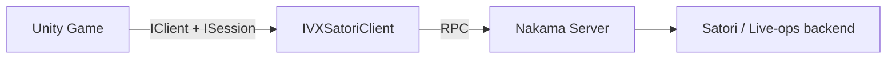

# Satori Analytics & Live-Ops Integration

The **`IntelliVerseX.Satori`** module exposes analytics, segmentation, feature flags, experiments, live events, in-app messaging, and metric queries through **Nakama RPC**. Your game uses the same authenticated Nakama session as the rest of IntelliVerseX; the server validates requests and forwards them to your Satori-compatible pipeline.

---

## Overview

Satori-style live-ops through this module typically covers:

| Area | What you can do |
|------|-----------------|
| **Analytics** | Send single or batched events with string metadata. |
| **Identity** | Read and update default/custom properties; computed fields come from the server. |
| **Audiences** | Resolve audience membership IDs for the current user. |
| **Feature flags** | Fetch one flag or many, with safe client-side defaults. |
| **A/B testing** | List experiments and resolve a variant for a specific experiment. |
| **Live events** | Discover events, join, and claim rewards. |
| **Messages** | Inbox list, mark read (and optional rewards), delete. |
| **Metrics** | Query dashboard-style metric series by ID and time range. |

All public calls go through **`IVXSatoriClient`** (`MonoBehaviour` singleton). Under the hood, **`IVXSatoriRpcClient`** issues JSON payloads to named RPCs (for example `satori_event`, `satori_flags_get`).



---

## Prerequisites

Before integrating, confirm the following:

1. **Nakama** — Unity project references the Nakama Unity SDK and defines `INTELLIVERSEX_HAS_NAKAMA` where required by your assembly setup.
2. **Authenticated session** — You have a valid `IClient` and `ISession` after login (see [Nakama Integration](nakama-integration.md) and [Backend module](../modules/backend.md)).
3. **`IVXBootstrap`** — With **`EnableSatori`** enabled (default), bootstrap ensures a GameObject with `IVXSatoriClient` exists. Bootstrap **does not** call `Initialize`; you wire Nakama after auth succeeds.
4. **Server-side RPCs** — Your Nakama project registers handlers for every RPC ID used by the client (listed under [Troubleshooting](#troubleshooting)). Without these, calls fail at runtime.

!!! note "Assembly reference"
    The Satori module depends on **IntelliVerseX.Core**, **IntelliVerseX.Backend**, Nakama, and **Newtonsoft.Json**. Ensure your game assembly references **`IntelliVerseX.Satori`**.

---

## Step 1 — Initialize the Satori client

`IVXSatoriClient` must be **initialized** before any async API. Initialization is **synchronous** and sets the internal RPC client; **`OnInitialized(true)`** is raised on success.

| Method | Purpose |
|--------|---------|
| `Initialize(IClient client, ISession session)` | Required first call; throws `ArgumentNullException` if either argument is null. |
| `RefreshSession(ISession session)` | Call after token refresh so RPCs use the current session. |

Typical pattern after bootstrap + auth:

```csharp
using IntelliVerseX.Satori;
using Nakama;

// After you have client and session (e.g. from IVXNakamaManager or custom wiring)
var satori = IVXSatoriClient.Instance;
if (satori != null && !satori.IsInitialized)
{
    satori.Initialize(nakamaClient, session);
}
```

!!! tip "Bootstrap wiring"
    See [Satori module – Setup](../modules/satori.md) for a full **post-bootstrap** example that rebuilds `IClient` from config and restores `ISession` from the bootstrap token.

---

## Step 2 — Capture events (single and batch)

### Single event

Use **`CaptureEventAsync`** for high-value or low-frequency signals (milestones, purchases, funnel steps).

```csharp
var meta = new Dictionary<string, string>
{
    ["level"] = "12",
    ["source"] = "main_menu"
};
await IVXSatoriClient.Instance.CaptureEventAsync("progression.level_reached", meta);
```

### Batch events

Use **`CaptureEventsBatchAsync`** when you have **many small events** in one frame or flush cycle. It returns **`IVXSatoriEventBatchResponse`** with counts for submitted vs. captured (after server validation).

```csharp
var batch = new List<IVXSatoriEvent>
{
    new IVXSatoriEvent("ui.screen_view", new Dictionary<string, string> { ["screen"] = "shop" }),
    new IVXSatoriEvent("economy.currency_spent", new Dictionary<string, string> { ["amount"] = "50", ["sku"] = "boost" })
};
var result = await IVXSatoriClient.Instance.CaptureEventsBatchAsync(batch);
// Inspect result.submitted and result.captured if your pipeline exposes them
```

### Event naming best practices

- Use **stable, lowercase snake_case** names with a **category prefix** (`progression.*`, `economy.*`, `social.*`, `technical.*`).
- Avoid PII in **event names**; put optional context in **metadata** keys that your privacy policy allows.
- Prefer **one semantic event** per user action rather than duplicate aliases (`buy` vs `purchase`).
- Keep metadata **string-valued**; normalize numbers and enums to strings for consistency.

---

## Step 3 — Identity properties (segment users)

**Identity** drives segmentation in the live-ops stack: default properties, custom properties you set from the client, and **computed** properties evaluated server-side.

```csharp
var identity = await IVXSatoriClient.Instance.GetIdentityAsync();
// identity.defaultProperties, identity.customProperties, identity.computedProperties

await IVXSatoriClient.Instance.UpdateIdentityAsync(
    defaultProperties: new Dictionary<string, string> { ["client_version"] = Application.version },
    customProperties: new Dictionary<string, string> { ["favorite_mode"] = "ranked" }
);
```

Use **`GetAudienceMembershipsAsync`** when you need explicit audience IDs for UI or logic:

```csharp
var audiences = await IVXSatoriClient.Instance.GetAudienceMembershipsAsync();
// List<string> of audience identifiers
```

!!! warning "Server authority"
    Treat **computed** properties and audience membership as **authoritative** for entitlement or economy decisions; client-side copies are for UX only unless your server also validates.

---

## Step 4 — Feature flags (gate features, defaults)

Flags are fetched by name with an optional **default string** used when the backend is unavailable or the flag is missing.

```csharp
var flag = await IVXSatoriClient.Instance.GetFlagAsync("new_shop_layout", defaultValue: "false");
bool enabled = flag.enabled;
string value = flag.value; // string payload from remote config
```

Fetch multiple known flags in one round trip:

```csharp
var names = new List<string> { "new_shop_layout", "seasonal_banner" };
var flags = await IVXSatoriClient.Instance.GetAllFlagsAsync(names);
```

**Gating pattern:** resolve flags after login (or on session refresh), cache locally for the session, and **fall back** to `defaultValue` when `enabled` is false or the call fails.

---

## Step 5 — A/B testing (experiments and variants)

List active experiments and the user’s assignments:

```csharp
var experiments = await IVXSatoriClient.Instance.GetExperimentsAsync();
foreach (var exp in experiments.experiments)
{
    var variant = exp.variant;
    // variant.name, variant.config (Dictionary<string, string>)
}
```

Resolve a **single** experiment by ID when you only need one path:

```csharp
var variant = await IVXSatoriClient.Instance.GetExperimentVariantAsync("exp_onboarding_flow_2026_q2");
if (variant != null)
{
    // Drive UI or gameplay from variant.name / variant.config
}
```

!!! note "Sticky assignment"
    Variant assignment is expected to remain **stable per user** on the server. Do not re-randomize on the client.

---

## Step 6 — Live events (list, join, claim)

**List** events; optionally filter by names when the RPC supports it:

```csharp
var live = await IVXSatoriClient.Instance.GetLiveEventsAsync();
// live.events — IVXSatoriLiveEvent entries (ids, config, etc.)

// Optional filter when you maintain a allowlist of event names server-side:
var filtered = await IVXSatoriClient.Instance.GetLiveEventsAsync(new List<string> { "weekend_double_xp" });
```

**Join** and **claim**:

```csharp
bool joined = await IVXSatoriClient.Instance.JoinLiveEventAsync(eventId);
IVXSatoriLiveEventReward reward = await IVXSatoriClient.Instance.ClaimLiveEventAsync(eventId, gameId: null);
```

Use **`gameId`** when your server differentiates rewards per game or app ID in a multi-title setup.

---

## Step 7 — In-app messages (inbox, read, delete)

```csharp
var inbox = await IVXSatoriClient.Instance.GetMessagesAsync();
foreach (var msg in inbox.messages)
{
    // msg.messageId, msg.subject, msg.body, msg.metadata, etc.
}

var readResult = await IVXSatoriClient.Instance.ReadMessageAsync(messageId, gameId: null);
// readResult may include updated message and optional reward

bool deleted = await IVXSatoriClient.Instance.DeleteMessageAsync(messageId);
```

**Read** typically marks the message consumed and may attach **rewards** (see **`IVXSatoriMessageReadResponse`**). Align UX with your product rules (e.g. claim-on-open vs. claim-on-tap).

---

## Step 8 — Metrics (query dashboard metrics from the client)

**`QueryMetricAsync`** returns time series points for a metric configured in your ops stack. Dates and granularity are **strings**; format must match what your server expects (often ISO-8601 dates).

```csharp
var series = await IVXSatoriClient.Instance.QueryMetricAsync(
    metricId: "dau",
    startDate: "2026-03-01",
    endDate: "2026-03-31",
    granularity: "day"
);
// series.dataPoints — IVXSatoriMetricDataPoint list
```

Prefer **server-side dashboards** for sensitive aggregates; use client queries for **sanitized** metrics or debug tooling.

---

## Best practices (summary)

| Topic | Recommendation |
|-------|----------------|
| **Event naming** | `category.action` snake_case; stable over releases; document in a schema. |
| **Metadata** | Keep keys short; avoid high-cardinality values in keys; no secrets. |
| **Batch vs single** | Batch for bursts; single for critical funnel events you want isolated in traces. |
| **Session refresh** | After Nakama token refresh, call **`RefreshSession`** so RPCs do not use an expired JWT. |
| **Initialization** | Guard with **`IsInitialized`**; subscribe to **`OnInitialized`** if you need late-bound UI. |
| **Resilience** | Catch RPC failures; use flag defaults and safe experiment fallbacks; never block gameplay on analytics. |

---

## Troubleshooting

| Symptom | Likely cause | What to check |
|---------|----------------|---------------|
| `InvalidOperationException` — not initialized | `Initialize` not called | Call after valid `ISession`; ensure `IVXSatoriClient.Instance` is not destroyed. |
| RPC errors / 404 | Missing server handler | Register RPCs with **exact** IDs: `satori_event`, `satori_events_batch`, `satori_identity_get`, `satori_identity_update_properties`, `satori_audiences_get_memberships`, `satori_flags_get`, `satori_flags_get_all`, `satori_experiments_get`, `satori_experiments_get_variant`, `satori_live_events_list`, `satori_live_events_join`, `satori_live_events_claim`, `satori_messages_list`, `satori_messages_read`, `satori_messages_delete`, `satori_metrics_query`. |
| Empty lists / default objects | Auth or mapping | Verify session user ID matches identity in Satori; check server logs for forwarding errors. |
| Stale flags or experiments | Cached session | Call **`RefreshSession`** after refresh; optionally refetch on app resume. |

!!! question "Still stuck?"
    Compare your server payload shapes with **`IVXSatoriModels`** in the SDK and the JSON envelope expected by **`IVXSatoriRpcClient`** (see module doc).

---

## See also

- [Satori module](../modules/satori.md) — namespaces, bootstrap, RPC client details, and model reference
- [Nakama Integration](nakama-integration.md) — sessions, storage, and general backend patterns
- [Backend module](../modules/backend.md) — Nakama managers and configuration
- [Analytics module](../modules/analytics.md) — broader analytics surface in IntelliVerseX
- [Configuration: Feature flags](../configuration/feature-flags.md) — project-level flag concepts

---

## API reference — `IVXSatoriClient`

| Method | Returns / behavior |
|--------|---------------------|
| `Initialize(IClient, ISession)` | Sync init; required before async calls |
| `RefreshSession(ISession)` | Updates RPC session after token refresh |
| `CaptureEventAsync(name, metadata)` | Single analytics event |
| `CaptureEventsBatchAsync(events)` | `IVXSatoriEventBatchResponse` |
| `GetIdentityAsync()` | `IVXSatoriIdentity` |
| `UpdateIdentityAsync(defaultProps, customProps)` | Property update RPC |
| `GetAudienceMembershipsAsync()` | `List<string>` |
| `GetFlagAsync(name, defaultValue)` | `IVXSatoriFlag` (`name`, `value`, `enabled`) |
| `GetAllFlagsAsync(names)` | `List<IVXSatoriFlag>` |
| `GetExperimentsAsync()` | `IVXSatoriExperimentsResponse` |
| `GetExperimentVariantAsync(experimentId)` | `IVXSatoriExperimentVariant` |
| `GetLiveEventsAsync(names?)` | `IVXSatoriLiveEventsResponse` |
| `JoinLiveEventAsync(eventId)` | `bool` |
| `ClaimLiveEventAsync(eventId, gameId?)` | `IVXSatoriLiveEventReward` |
| `GetMessagesAsync()` | `IVXSatoriMessagesResponse` |
| `ReadMessageAsync(messageId, gameId?)` | `IVXSatoriMessageReadResponse` |
| `DeleteMessageAsync(messageId)` | `bool` |
| `QueryMetricAsync(metricId, startDate?, endDate?, granularity?)` | `IVXSatoriMetricQueryResponse` |
