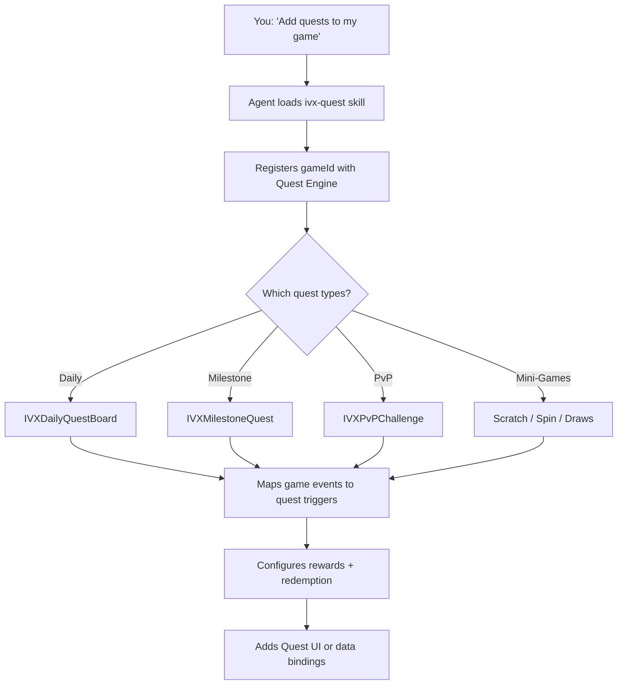

# Quest System

**Skill ID:** `ivx-quest`

---
name: ivx-quest
description: >-
  Add quest systems to IntelliVerseX SDK games. Use when the user says
  "add quests", "add daily missions", "add Scratch & Win", "add Spin & Win",
  "add IntelliDraws", "add lottery", "add PvP challenge", "quest rewards",
  "milestone quest", "set up daily quest board", "add scratch card",
  "add lucky wheel", "add draw", "quest redemption", "wire game events to quests",
  or needs help with any task-based reward system.
version: "1.0.0"
author: "IntelliVerse-X <team@intelli-verse-x.ai>"
allowed-tools:
  - Read
  - Write
  - Edit
  - Glob
  - Grep
  - Shell
---


## Overview

The Quest system in IntelliVerseX SDK lets any game add task-based rewards, daily missions, milestone challenges, PvP competitions, and mini-game quests with a single integration. It is powered by:

- **Quest Engine** — Defines quests, tracks progress, triggers completions
- **Reward Engine** — Issues XUT tokens, updates leaderboards, awards badges
- **User Canvas** — Aggregated player profile (play history, quest history, preferences, wallet balance)
- **Quest-GameID Canvas** — Per-game analytics (quest completion rates, popular quests, conversion data)
- **Nakama Analytics Layer** — Ingests game events, updates canvases, triggers quest progress webhooks

---

## When to Use

Ask your AI agent any of these:

- "Add quests to my game"
- "Set up daily missions for my puzzle game"
- "Add Scratch & Win scratch cards"
- "Add Spin & Win lucky wheel"
- "Add IntelliDraws lottery"
- "Set up PvP challenges between players"
- "Create milestone quests for level progression"
- "Wire my game's win events to quest progress"
- "Add quest rewards with gift card redemption"
- "Show the daily quest board in my game"

---

## What the Agent Does



---

## Step-by-Step Integration

### Step 1: Prerequisites

Ensure these are set up first:

| Requirement | How to Check |
|-------------|-------------|
| SDK initialized | `IVXBootstrap` is in scene / entry point |
| Nakama authenticated | `IVXClient.Session` is valid |
| Wallet module enabled | `IVXBootstrapConfig.EnableWallet = true` |

If any are missing, run the `ivx-sdk-setup` skill first.

### Step 2: Initialize Quest Manager

```csharp
using IntelliVerseX.Quest;

await IVXQuestManager.Instance.Initialize(new QuestConfig {
    GameId = "your-game-id",       // from IntelliVerseX dashboard
    EnableDailyBoard = true,        // rotating daily missions
    EnablePvP = true,               // PvP challenges
    EnableMiniGames = true,         // Scratch & Win, Spin & Win, IntelliDraws
    AutoTrackGameEvents = true      // auto-wire Nakama events to quest progress
});
```

### Step 3: Map Game Events to Quest Triggers

Game events are how the Quest Engine knows a player made progress. Send events whenever something meaningful happens in your game:

```csharp
// When a player wins a match
IVXQuestManager.Instance.SendGameEvent(new GameEvent {
    EventType = "match_won",
    Payload = new { score = 2500, opponent = "player123", duration = 120 }
});

// When a player reaches a new level
IVXQuestManager.Instance.SendGameEvent(new GameEvent {
    EventType = "level_reached",
    Payload = new { level = 15 }
});

// When a player achieves a high score
IVXQuestManager.Instance.SendGameEvent(new GameEvent {
    EventType = "score_achieved",
    Payload = new { score = 10000 }
});

// Custom event for your specific game mechanic
IVXQuestManager.Instance.SendGameEvent(new GameEvent {
    EventType = "boss_defeated",
    Payload = new { bossId = "dragon_king", difficulty = "hard" }
});
```

### Step 4: Daily Quest Board

```csharp
var board = await IVXDailyQuestBoard.Instance.GetTodaysQuests();

foreach (var quest in board.Quests) {
    // quest.Title        → "Win 3 Matches"
    // quest.Progress     → 1
    // quest.Target       → 3
    // quest.XutReward    → 50
    // quest.QuestType    → QuestType.WinMatches
    // quest.IsCompleted  → false
    // quest.ExpiresAt    → DateTime (end of day UTC)
}

IVXDailyQuestBoard.Instance.OnQuestCompleted += async (questId) => {
    var reward = await IVXQuestManager.Instance.ClaimReward(questId);
    ShowRewardPopup(reward.XutAmount);
};
```

### Step 5: Add Mini-Game Quests

#### Scratch & Win

Players earn scratch cards by completing quests, then scratch to reveal XUT prizes:

```csharp
IVXQuestManager.Instance.AddMiniGame(QuestType.ScratchAndWin, new ScratchConfig {
    RewardTiers = new[] { 10, 25, 50, 100, 500 },
    Probabilities = new[] { 0.40f, 0.30f, 0.15f, 0.10f, 0.05f },
    CardArtTheme = "gold",
    RequiresQuestCompletion = true
});
```

**User flow:** Complete quest → Earn scratch card → Scratch to reveal → XUT credited to wallet

#### Spin & Win

Lucky wheel with weighted segments:

```csharp
IVXQuestManager.Instance.AddMiniGame(QuestType.SpinAndWin, new SpinConfig {
    Segments = 8,
    Rewards = new[] { 5, 10, 25, 50, 10, 5, 100, 25 },
    Colors = new[] { "#FF6B6B", "#4ECDC4", "#45B7D1", "#96CEB4",
                     "#FFEAA7", "#DDA0DD", "#FFD700", "#87CEEB" },
    GuaranteedWinAfter = 3,
    SpinCost = 0
});
```

**User flow:** Complete quest → Earn free spin → Spin the wheel → XUT credited

#### IntelliDraws (Lottery)

Players earn draw tickets through gameplay, winners drawn at scheduled intervals:

```csharp
IVXQuestManager.Instance.AddMiniGame(QuestType.IntelliDraws, new DrawConfig {
    DrawSchedule = "daily",
    TicketsPerQuest = 1,
    MaxTicketsPerDraw = 10,
    PrizePool = 10000,
    WinnerCount = 5,
    DrawTime = "20:00 UTC"
});

IVXQuestManager.Instance.OnDrawResult += (result) => {
    if (result.IsWinner) {
        ShowWinnerCelebration(result.PrizeAmount);
    }
};
```

**User flow:** Play game → Earn tickets → Enter draw → Winners announced → XUT distributed

### Step 6: Milestone Quests

```csharp
await IVXMilestoneQuest.Instance.DefineChain(new MilestoneChain {
    GameId = "your-game-id",
    EventType = "level_reached",
    Tiers = new[] {
        new MilestoneTier { Target = 5,   XutReward = 25 },
        new MilestoneTier { Target = 20,  XutReward = 100 },
        new MilestoneTier { Target = 50,  XutReward = 500 },
        new MilestoneTier { Target = 100, XutReward = 2000 }
    }
});
```

### Step 7: PvP Challenges

```csharp
var challenge = await IVXPvPChallenge.Instance.Create(new PvPConfig {
    QuestType = QuestType.WinMatches,
    Target = 5,
    StakeAmount = 50,
    Duration = TimeSpan.FromHours(24),
    MinRankDiff = 200
});

await IVXPvPChallenge.Instance.Accept(challengeId);

IVXPvPChallenge.Instance.OnProgressUpdate += (update) => {
    UpdatePvPUI(update);
};
```

### Step 8: Claim Rewards and Redemption

```csharp
var reward = await IVXQuestManager.Instance.ClaimReward(questId);
var balance = await IVXWallet.Instance.GetBalance();

// Redemption options
var giftCards = await IVXRedemption.Instance.GetGiftCards(countryCode: "US");
await IVXRedemption.Instance.RedeemGiftCard(new RedeemRequest {
    ProductId = giftCards[0].Id,
    XutAmount = 1000
});
```

---

## Quest Types Reference

| Quest Type | Enum | Event Trigger | Typical Reward |
|-----------|------|--------------|---------------|
| Daily Mission | `QuestType.DailyMission` | Various (rotates) | 10–50 XUT |
| Win Matches | `QuestType.WinMatches` | `match_won` | 25–100 XUT |
| Reach Level | `QuestType.ReachLevel` | `level_reached` | 50–2000 XUT |
| Achieve Score | `QuestType.AchieveScore` | `score_achieved` | 25–500 XUT |
| Play Streak | `QuestType.PlayStreak` | `session_start` | 50–200 XUT |
| Leaderboard Rank | `QuestType.LeaderboardRank` | Automatic | 100–5000 XUT |
| Custom Event | `QuestType.CustomEvent` | Your custom event | Configurable |
| Scratch & Win | `QuestType.ScratchAndWin` | Quest completion | 10–500 XUT |
| Spin & Win | `QuestType.SpinAndWin` | Quest completion | 5–100 XUT |
| IntelliDraws | `QuestType.IntelliDraws` | Quest completion | Pool-based |
| Gift Card | `QuestType.GiftCard` | Wallet redemption | Gift card value |
| Survey | `QuestType.Survey` | Survey completion | 25–100 XUT |
| Referral | `QuestType.Referral` | Friend signup | 200–500 XUT |

---

## The 3 Straightforward Mini-Game Skills

These can be added to **any** game in under 15 minutes:

| Mini-Game | What It Is | Integration Time |
|-----------|-----------|-----------------|
| **Scratch & Win** | Virtual scratch card — scratch to reveal XUT prize | 10 min |
| **Spin & Win** | Lucky wheel with weighted segments and guaranteed-win tiers | 10 min |
| **IntelliDraws** | Lottery draw entries earned through gameplay | 15 min |

---

## UI Prefabs

| Prefab | Description |
|--------|------------|
| `QuestBoardPanel` | Full daily quest board with progress bars |
| `QuestCard` | Single quest card with icon, progress, and claim button |
| `ScratchCardView` | Interactive scratch card with touch/mouse scratching |
| `SpinWheelView` | Animated lucky wheel with configurable segments |
| `DrawTicketView` | IntelliDraws ticket display with countdown |
| `PvPChallengeCard` | Side-by-side progress for PvP challenges |
| `RewardPopup` | Animated reward celebration popup |
| `RedemptionBrowser` | Gift card / top-up catalog browser |

---

## Event-to-Quest Mapping (Per GameID)

```
Your Game Events          Quest Engine Triggers
─────────────────         ─────────────────────
match_won          →      QuestType.WinMatches
level_reached      →      QuestType.ReachLevel
score_achieved     →      QuestType.AchieveScore
session_start      →      QuestType.PlayStreak
boss_defeated      →      QuestType.CustomEvent
item_collected     →      QuestType.CustomEvent
friend_invited     →      QuestType.Referral
```

---

## Redemption Options

| Type | Provider | How It Works |
|------|----------|-------------|
| Gift Cards | Reloadly | XUT → gift card for 150+ brands |
| Mobile Top-Up | Reloadly | XUT → mobile airtime in 140+ countries |
| Cash Out | Platform wallet | XUT → bank transfer / PayPal |
| Merchandise | IntelliVerseX Store | XUT → physical merch |
| In-Game Items | Your game | XUT → premium skins, characters, boosters |

---

## Quest-GameID Canvas (Admin Panel)

| Metric | Description |
|--------|------------|
| Quest Completion Rate | % of assigned quests completed per game |
| Popular Quest Types | Most-completed quest types for this game |
| Avg. XUT Earned/Day | Average daily XUT earnings per player |
| Redemption Conversion | % of XUT earned that gets redeemed |
| PvP Engagement | % of players in PvP challenges |
| Mini-Game Plays | Scratch / Spin / Draw usage stats |
| Cold-Start Score | Confidence for recommending quests to new users |

---

## Testing

```csharp
IVXQuestManager.Instance.SetTestMode(true);
IVXQuestManager.Instance.SimulateEvent("match_won", count: 5);
await IVXQuestManager.Instance.ForceComplete(questId);
await IVXDailyQuestBoard.Instance.ResetForTesting();
```

---

## Troubleshooting

| Symptom | Cause | Fix |
|---------|-------|-----|
| Quests not appearing | `EnableDailyBoard` is false | Set `QuestConfig.EnableDailyBoard = true` |
| Events not triggering progress | Event type mismatch | Check `EventType` string matches quest definition |
| Rewards show 0 XUT | Wallet module not enabled | Set `IVXBootstrapConfig.EnableWallet = true` |
| Scratch card not interactive | Missing QuestUI assembly | Import `IntelliVerseX.QuestUI` package |
| PvP not finding opponents | Too narrow rank range | Increase `MinRankDiff` |
| Draw results delayed | Draw time not reached | Check `DrawConfig.DrawTime` setting |

---

## Dependencies

| Module | Required | Why |
|--------|----------|-----|
| `IntelliVerseX.Core` | Yes | SDK bootstrap and Nakama connection |
| `IntelliVerseX.Wallet` | Yes | XUT token balance and transactions |
| `IntelliVerseX.Backend` | Yes | Nakama RPC calls |
| `IntelliVerseX.QuestUI` | Optional | Pre-built UI prefabs |
| `IntelliVerseX.Multiplayer` | Optional | Required for PvP challenges |

---

## Related

- [Quest Module Reference](../../modules/quest.md)
- [Wallet & Economy Integration](../wallet-integration.md)
- [Live Operations Skill](ivx-live-ops.md)
- [AI Agent Skills Overview](../ai-agent-skills.md)
