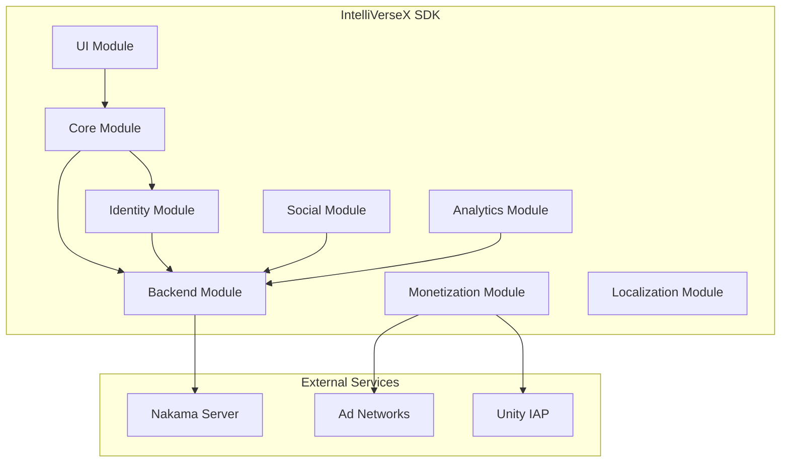

# IntelliVerseX SDK

<div class="grid cards" markdown>

-   :material-rocket-launch:{ .lg .middle } __Get Started in Minutes__

    ---

    Install IntelliVerseX SDK via Unity Package Manager and integrate powerful features into your game.

    [:octicons-arrow-right-24: Getting Started](getting-started/index.md)

-   :material-puzzle:{ .lg .middle } __15+ Modular Features__

    ---

    Authentication, Backend, Monetization, Analytics, Localization, Leaderboards, Social, and more.

    [:octicons-arrow-right-24: Explore Modules](modules/index.md)

-   :material-code-braces:{ .lg .middle } __Production-Ready API__

    ---

    Battle-tested in production games. Complete XML documentation for every public API.

    [:octicons-arrow-right-24: API Reference](api/index.md)

-   :material-help-circle:{ .lg .middle } __Comprehensive Support__

    ---

    Detailed troubleshooting guides, FAQ, and community support.

    [:octicons-arrow-right-24: Get Help](troubleshooting/index.md)

</div>

---

## What is IntelliVerseX SDK?

**IntelliVerseX SDK** is a complete, modular game development toolkit for Unity that provides everything you need to build production-ready mobile and cross-platform games. It integrates seamlessly with:

- **Nakama** for backend services (authentication, leaderboards, wallets, friends)
- **Multiple ad networks** (LevelPlay, Appodeal, AdMob) for monetization
- **Unity IAP** for in-app purchases
- **Photon PUN2** for multiplayer (optional)

### Key Features

| Feature | Description |
|---------|-------------|
| :material-shield-account: **Identity & Auth** | Multi-provider authentication (Device, Email, Apple, Google) |
| :material-cloud: **Backend** | Nakama server integration with RPC support |
| :material-cash: **Monetization** | IAP, Rewarded Ads, Interstitials, Banners, Offerwalls |
| :material-chart-line: **Analytics** | Event tracking and user behavior analysis |
| :material-translate: **Localization** | 12+ languages with RTL support |
| :material-database: **Storage** | Secure cloud saves and local persistence |
| :material-trophy: **Leaderboards** | Global and around-player rankings |
| :material-account-group: **Social** | Friends system, sharing, referrals |
| :material-head-question: **Quiz System** | Complete quiz game framework |
| :material-palette: **UI Components** | Production-ready UI utilities |

---

## Quick Install

Add to your `Packages/manifest.json`:

```json
{
  "dependencies": {
    "com.intelliversex.sdk": "https://github.com/Intelli-verse-X/Intelli-verse-X-Unity-SDK.git?path=Assets/_IntelliVerseXSDK"
  }
}
```

Or with a specific version:

```json
{
  "dependencies": {
    "com.intelliversex.sdk": "https://github.com/Intelli-verse-X/Intelli-verse-X-Unity-SDK.git?path=Assets/_IntelliVerseXSDK#v5.0.0"
  }
}
```

[:octicons-arrow-right-24: Full Installation Guide](getting-started/installation.md)

---

## Minimal Code Example

```csharp
using UnityEngine;
using IntelliVerseX.Core;
using IntelliVerseX.Identity;

public class GameInit : MonoBehaviour
{
    void Start()
    {
        // Initialize device identity
        IntelliVerseXUserIdentity.InitializeDevice();
        
        IVXLogger.Log("IntelliVerseX SDK Ready!");
    }
}
```

[:octicons-arrow-right-24: Quick Start Guide](getting-started/quickstart.md)

---

## Platform Support

| Platform | Status | Notes |
|----------|--------|-------|
| Android | :material-check-circle:{ .success } Fully Supported | API 21+ |
| iOS | :material-check-circle:{ .success } Fully Supported | iOS 12+ |
| WebGL | :material-check-circle:{ .success } Fully Supported | With ad limitations |
| Windows | :material-check-circle:{ .success } Fully Supported | Standalone |
| macOS | :material-check-circle:{ .success } Fully Supported | Standalone |

---

## Unity Version Support

| Unity Version | Status |
|---------------|--------|
| **Unity 6000.x** | :material-check-circle:{ .success } Fully Supported |
| **Unity 2023.3 LTS** | :material-check-circle:{ .success } Fully Supported (Minimum) |
| Unity 2022.x | :material-alert:{ .warning } May work, not officially supported |
| Unity 2021.x | :material-close-circle:{ .error } Not Supported |

---

## Architecture Overview



---

## Support

- :material-github: [GitHub Issues](https://github.com/Intelli-verse-X/Intelli-verse-X-Unity-SDK/issues) - Bug reports and feature requests
- :material-file-document: [Troubleshooting Guide](troubleshooting/index.md) - Common issues and solutions  
- :material-frequently-asked-questions: [FAQ](troubleshooting/faq.md) - Frequently asked questions

---

## License

IntelliVerseX SDK is licensed under the [MIT License](https://github.com/Intelli-verse-X/Intelli-verse-X-Unity-SDK/blob/main/LICENSE).

---

<div class="grid cards" markdown>

-   :material-clock-fast:{ .lg .middle } __Version 5.0.0__

    ---

    Latest stable release with production-ready features.
    
    [:octicons-arrow-right-24: Changelog](changelog.md)

</div>
