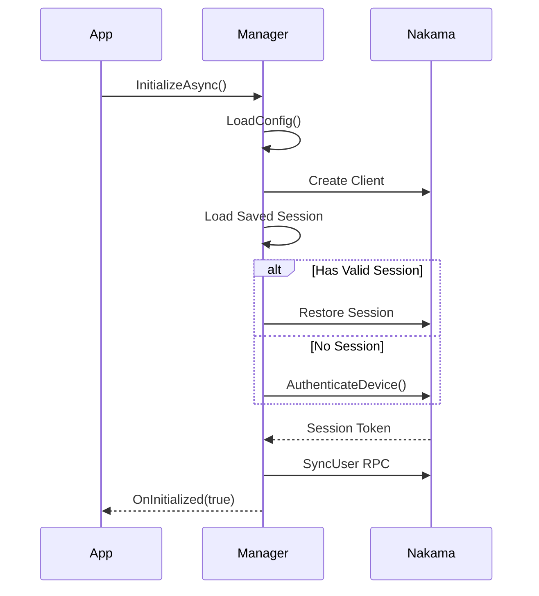

# Backend Module

The Backend module provides Nakama server integration for authentication, leaderboards, wallets, and real-time features.

---

## Overview

| | |
|---|---|
| **Namespace** | `IntelliVerseX.Backend` |
| **Assembly** | `IntelliVerseX.Backend` |
| **Dependencies** | `IntelliVerseX.Core`, `IntelliVerseX.Identity`, Nakama Unity SDK |

---

## Key Classes

### IVXNakamaManager

Abstract base class for Nakama integration. Extend this in your game.

```csharp
public abstract class IVXNakamaManager : MonoBehaviour
{
    // Configuration
    [SerializeField] protected IntelliVerseXConfig sdkConfig;
    public string GameId { get; }
    
    // Client state
    public IClient Client { get; }
    public ISession Session { get; }
    public bool IsInitialized { get; }
    public int CurrentWinStreak { get; }
    
    // Events
    public event Action<bool> OnInitialized;
    public event Action<IVXAllLeaderboardsResponse> OnLeaderboardsUpdated;
    public event Action<bool> OnScoreSubmitted;
    public event Action<IVXCalculateScoreRewardResponse> OnRewardCalculated;
    
    // Initialize
    public virtual async Task<bool> InitializeAsync();
    
    // Authentication
    public virtual async Task<bool> AuthenticateWithDeviceAsync();
    public virtual async Task<bool> AuthenticateWithCustomIdAsync(string customId);
    
    // Leaderboards
    public virtual async Task<IVXAllLeaderboardsResponse> GetAllLeaderboardsAsync(int limit = 10);
    public virtual async Task<bool> SubmitScoreAsync(int score);
    
    // Wallets
    public virtual async Task<IVXWalletBalance> GetWalletBalanceAsync();
    public virtual async Task<bool> UpdateWalletAsync(string currency, int amount);
    
    // Rewards
    public virtual async Task<IVXCalculateScoreRewardResponse> CalculateScoreRewardAsync(int score);
    
    // Override points
    protected virtual string GetLogPrefix();
    protected virtual string GetConfigResourcePath();
}
```

**Usage:**
```csharp
using IntelliVerseX.Backend;
using IntelliVerseX.Core;

// Create your game-specific manager
public class MyGameNakamaManager : IVXNakamaManager
{
    public static MyGameNakamaManager Instance { get; private set; }
    
    protected override void Awake()
    {
        if (Instance != null && Instance != this)
        {
            Destroy(gameObject);
            return;
        }
        Instance = this;
        DontDestroyOnLoad(gameObject);
        
        base.Awake();
    }
    
    protected override string GetLogPrefix() => "[MyGame]";
    
    protected override string GetConfigResourcePath() => "IntelliVerseX/MyGameConfig";
    
    // Add game-specific methods
    public async Task<MyGameData> GetGameDataAsync()
    {
        var response = await Client.RpcAsync(Session, "my_game_rpc", "{}");
        return JsonConvert.DeserializeObject<MyGameData>(response.Payload);
    }
}
```

---

### IVXBackendService

Simplified backend service wrapper.

```csharp
public class IVXBackendService : MonoBehaviour
{
    public static IVXBackendService Instance { get; }
    
    public bool IsConnected { get; }
    
    public async Task<bool> InitializeAsync();
    public async Task<T> CallRpcAsync<T>(string rpcId, object payload);
}
```

---

### IVXWalletManager

Currency and wallet management.

```csharp
public class IVXWalletManager
{
    // Events
    public event Action<IVXWalletBalance> OnBalanceUpdated;
    public event Action<string, int> OnCurrencyChanged;
    
    // Current balance
    public int Coins { get; }
    public int Gems { get; }
    public int Tokens { get; }
    
    // Methods
    public async Task<IVXWalletBalance> GetBalanceAsync();
    public async Task<bool> AddCurrencyAsync(string currency, int amount);
    public async Task<bool> SpendCurrencyAsync(string currency, int amount);
}
```

**Usage:**
```csharp
// Get current balance
var balance = await walletManager.GetBalanceAsync();
Debug.Log($"Coins: {balance.Coins}, Gems: {balance.Gems}");

// Add currency (e.g., from ad reward)
await walletManager.AddCurrencyAsync("coins", 100);

// Spend currency
if (walletManager.Coins >= 50)
{
    await walletManager.SpendCurrencyAsync("coins", 50);
}
```

---

### IVXIPGeolocationService

IP-based location detection using multiple free APIs with automatic fallback.

```csharp
public class IVXIPGeolocationService
{
    public static IVXIPGeolocationService Instance { get; }
    
    // Get location (with caching)
    public async Task<IPGeolocationResult> GetLocationAsync(
        bool forceRefresh = false, 
        CancellationToken ct = default);
    
    // Get cached location (synchronous)
    public IPGeolocationResult GetCachedLocation();
    
    // Check if cache is valid
    public bool IsCacheValid { get; }
    
    // Events
    public event Action<IPGeolocationResult> OnLocationFetched;
    public event Action<string> OnLocationError;
}

// Location result model
public class IPGeolocationResult
{
    public bool Success;
    public string IP;
    public string Country;        // "United States"
    public string CountryCode;    // "US"
    public string Region;         // "California"
    public string City;           // "San Francisco"
    public double Latitude;
    public double Longitude;
    public string Timezone;       // "America/Los_Angeles"
    public string ISP;
    public string Provider;       // Which API provided this result
    
    public string GetLocationString();  // "San Francisco, California, United States"
    public string GetShortLocation();   // "San Francisco, US"
}
```

**API Providers (priority order):**
1. ip-api.com (45 req/min, HTTP)
2. ipapi.co (30k/month, HTTPS)
3. geojs.io (unlimited, HTTPS)
4. geoplugin.net (120 req/min, HTTP)
5. ipinfo.io (50k/month, HTTPS)
6. country.is (country only, HTTPS)

---

## RPC Reference

The SDK communicates with Nakama via these RPCs:

| RPC Name | Purpose | Request | Response |
|----------|---------|---------|----------|
| `create_or_sync_user` | Create/sync user | `IVXCreateUserRequest` | `IVXUserResponse` |
| `submit_score_and_sync` | Submit score | `IVXSubmitScoreRequest` | `IVXSubmitScoreResponse` |
| `get_all_leaderboards` | Get rankings | Limit parameter | `IVXAllLeaderboardsResponse` |
| `calculate_score_reward` | Calculate rewards | Score | `IVXCalculateScoreRewardResponse` |
| `get_wallet_balance` | Get wallet | User ID | `IVXWalletBalance` |
| `update_wallet_balance` | Update wallet | Currency, Amount | Success |

---

## Data Models

### IVXAllLeaderboardsResponse

```csharp
public class IVXAllLeaderboardsResponse
{
    public List<IVXLeaderboardEntry> daily;
    public List<IVXLeaderboardEntry> weekly;
    public List<IVXLeaderboardEntry> allTime;
    public IVXLeaderboardEntry currentUser;
}

public class IVXLeaderboardEntry
{
    public string userId;
    public string username;
    public string displayName;
    public int score;
    public int rank;
    public long timestamp;
}
```

### IVXWalletBalance

```csharp
public class IVXWalletBalance
{
    public int coins;
    public int gems;
    public int tokens;
    public Dictionary<string, int> customCurrencies;
}
```

### IVXCalculateScoreRewardResponse

```csharp
public class IVXCalculateScoreRewardResponse
{
    public int baseReward;
    public int streakBonus;
    public int totalReward;
    public int currentStreak;
}
```

---

## Connection Lifecycle



---

## Usage Examples

### Initialize Backend

```csharp
public class GameInit : MonoBehaviour
{
    [SerializeField] private MyGameNakamaManager nakamaManager;
    
    async void Start()
    {
        // Subscribe to events
        nakamaManager.OnInitialized += HandleInitialized;
        nakamaManager.OnLeaderboardsUpdated += HandleLeaderboards;
        
        // Initialize
        bool success = await nakamaManager.InitializeAsync();
        
        if (!success)
        {
            ShowOfflineMode();
        }
    }
    
    void HandleInitialized(bool success)
    {
        if (success)
        {
            IVXLogger.Log("Backend connected!");
        }
    }
    
    void HandleLeaderboards(IVXAllLeaderboardsResponse data)
    {
        // Update UI with new leaderboard data
        UpdateLeaderboardUI(data);
    }
}
```

### Submit Score

```csharp
public async void OnGameComplete(int score)
{
    // Submit score
    bool success = await nakamaManager.SubmitScoreAsync(score);
    
    if (success)
    {
        // Calculate reward
        var reward = await nakamaManager.CalculateScoreRewardAsync(score);
        
        // Show reward UI
        ShowRewardPopup(reward.totalReward, reward.currentStreak);
    }
}
```

### Custom RPC Call

```csharp
public async Task<MyCustomData> GetCustomDataAsync()
{
    var payload = JsonConvert.SerializeObject(new { userId = "123" });
    
    var response = await nakamaManager.Client.RpcAsync(
        nakamaManager.Session,
        "my_custom_rpc",
        payload
    );
    
    return JsonConvert.DeserializeObject<MyCustomData>(response.Payload);
}
```

---

## Configuration

### Server Settings

Default server (shared IntelliVerseX backend):

```csharp
// Automatically configured via IVXNakamaConfig
Scheme: https
Host: nakama-rest.intelli-verse-x.ai
Port: 443
ServerKey: defaultkey
```

### Custom Server

To use your own Nakama server, update `IntelliVerseXConfig`:

```csharp
var config = ScriptableObject.CreateInstance<IntelliVerseXConfig>();
config.nakamaScheme = "https";
config.nakamaHost = "your-server.com";
config.nakamaPort = 443;
config.nakamaServerKey = "your-server-key";
```

---

## Error Handling

```csharp
try
{
    await nakamaManager.InitializeAsync();
}
catch (ApiResponseException ex)
{
    // Nakama API error
    IVXLogger.LogError($"API Error: {ex.Message}");
}
catch (HttpRequestException ex)
{
    // Network error
    IVXLogger.LogError($"Network Error: {ex.Message}");
    ShowOfflineMode();
}
```

---

## Best Practices

1. **Single Instance** - Create one NakamaManager marked `DontDestroyOnLoad`
2. **Handle Offline** - Always handle connection failures gracefully
3. **Batch Operations** - Combine related operations when possible
4. **Cache Responses** - Cache leaderboard/wallet data locally
5. **Refresh Periodically** - Refresh leaderboards on scene load, not continuously

---

## Related Documentation

- [Leaderboard Module](leaderboards.md) - Detailed leaderboard features
- [Social Module](social.md) - Friends system (uses Nakama)
- [Nakama Integration Guide](../guides/nakama-integration.md) - Advanced integration
