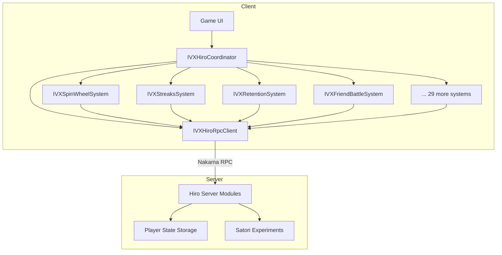

# Hiro Module

The Hiro module provides **server-authoritative metagame systems** powered by Nakama RPCs. All game economy, retention, monetization, social, and engagement logic runs on the server -- the client sends requests and receives validated results. This eliminates cheating vectors and enables live-ops tuning without client updates.

---

## Overview

| | |
|---|---|
| **Namespace** | `IntelliVerseX.Hiro`, `IntelliVerseX.Hiro.Systems` |
| **Assembly** | `IntelliVerseX.Hiro` |
| **Dependencies** | `IntelliVerseX.Core`, `IntelliVerseX.Backend`, Nakama Unity SDK, Newtonsoft.Json |
| **Entry Point** | `IVXHiroCoordinator` (singleton MonoBehaviour) |
| **Total Systems** | 33 |

---

## Setup

### Prerequisites

- A valid Nakama `IClient` and authenticated `ISession` (see [Backend Module](backend.md)).
- The `IVXHiroCoordinator` component attached to a persistent GameObject in the scene.

### Initialization

Call `InitializeSystems` **after** Nakama authentication succeeds. The coordinator creates all 33 system instances and injects the shared RPC client.

```csharp
using IntelliVerseX.Backend;
using IntelliVerseX.Hiro;
using Nakama;

public class GameBootstrap : MonoBehaviour
{
    [SerializeField] private MyGameNakamaManager _nakamaManager;

    private async void Start()
    {
        bool connected = await _nakamaManager.InitializeAsync();
        if (!connected) return;

        var coordinator = IVXHiroCoordinator.Instance;
        coordinator.OnInitialized += OnHiroReady;
        coordinator.InitializeSystems(
            _nakamaManager.Client,
            _nakamaManager.Session);
    }

    private void OnHiroReady(bool success)
    {
        if (success)
            Debug.Log("All Hiro systems ready.");
    }
}
```

### Session Refresh

When the Nakama token is refreshed, propagate the new session to all systems:

```csharp
IVXHiroCoordinator.Instance.RefreshSession(newSession);
```

---

## Available Systems

### Core Systems

| Property | Class | Description |
|---|---|---|
| `Economy` | `IVXEconomySystem` | Currency operations, donations, rewarded video credits |
| `Inventory` | `IVXInventorySystem` | Item management with categories, stacking, expiry |
| `Achievements` | `IVXAchievementsSystem` | Hierarchical achievements with sub-achievements |
| `Progression` | `IVXProgressionSystem` | XP, leveling, prestige |
| `Energy` | `IVXEnergySystem` | Time-gated energy with regeneration timers |
| `Stats` | `IVXStatsSystem` | Arbitrary numeric player stats |
| `Streaks` | `IVXStreaksSystem` | Daily streaks with milestone rewards |
| `EventLeaderboards` | `IVXEventLeaderboardSystem` | Time-limited competitive events with tiers |
| `Store` | `IVXStoreSystem` | Sectioned store with purchase limits and SKUs |
| `Challenges` | `IVXChallengesSystem` | Multi-player competitive challenges |
| `Teams` | `IVXTeamsSystem` | Team wallets, stats, and achievements |
| `Tutorials` | `IVXTutorialsSystem` | Step-by-step tutorial tracking with rewards |
| `Unlockables` | `IVXUnlockablesSystem` | Time-gated unlock slots |
| `Auctions` | `IVXAuctionsSystem` | Player-to-player auction house |
| `Incentives` | `IVXIncentivesSystem` | Referral codes, return bonuses |
| `Mailbox` | `IVXMailboxSystem` | In-game mail with attachments |
| `RewardBuckets` | `IVXRewardBucketSystem` | Tiered point-based reward tracks |
| `Personalizer` | `IVXPersonalizerSystem` | Per-player config overrides via Satori |
| `Base` | `IVXBaseSystem` | IAP validation, purchase history |
| `Leaderboards` | `IVXLeaderboardsSystem` | Persistent leaderboards with pagination |

### Engagement Systems

| Property | Class | Description |
|---|---|---|
| `SpinWheel` | `IVXSpinWheelSystem` | Lucky wheel with free, ad-gated, and currency spins |
| `SocialPressure` | `IVXSocialPressureSystem` | Social proof feeds and online counters |

### Retention Systems

| Property | Class | Description |
|---|---|---|
| `Retention` | `IVXRetentionSystem` | Session depth, churn risk, onboarding, comeback bonuses |
| `StreakShield` | `IVXStreakShieldSystem` | Consumable shields that protect daily streaks |
| `SessionBoosters` | `IVXSessionBoosterSystem` | Time-limited multiplier bonuses |
| `Appointments` | `IVXAppointmentSystem` | Scheduled reward windows (recurring or one-shot) |
| `DailyContent` | `IVXLimitedDailyContentSystem` | Rotating daily content slots with scarcity mechanics |

### Monetization Optimization Systems

| Property | Class | Description |
|---|---|---|
| `IAPTriggers` | `IVXIAPTriggerSystem` | Context-aware purchase offer triggers |
| `SmartAdTimer` | `IVXSmartAdTimerSystem` | Interstitial cooldowns, rewarded caps, banner eligibility |
| `AdRevenueOptimizer` | `IVXAdRevenueOptimizerSystem` | Per-segment placement configs and frequency caps |
| `Offerwall` | `IVXOfferwallSystem` | Third-party offerwall integration with server validation |

### Social Extension Systems

| Property | Class | Description |
|---|---|---|
| `FriendQuests` | `IVXFriendQuestSystem` | Cooperative quests with shared progress |
| `FriendStreaks` | `IVXFriendStreakSystem` | Bilateral daily interaction streaks between friends |
| `FriendBattles` | `IVXFriendBattleSystem` | Asynchronous 1v1 challenges with optional wagers |

---

## Spin Wheel

Server-authoritative lucky wheel. The server determines the winning segment via weighted random selection and credits rewards directly -- the client never decides the outcome.

### API

| Method | Returns | Description |
|---|---|---|
| `GetAsync(wheelId?)` | `IVXSpinWheelConfig` | Wheel config: segments, free/ad spin counts, costs |
| `SpinAsync(spinType, wheelId?)` | `IVXSpinWheelResult` | Execute a spin and receive the winning segment |

`spinType` values: `"free"`, `"ad"`, `"currency"`.

### Data Models

```csharp
public class IVXSpinWheelConfig
{
    public string wheelId;
    public string name;
    public List<IVXSpinWheelSegment> segments;
    public int freeSpinsRemaining;
    public int maxFreeSpinsPerDay;
    public long nextFreeSpinAt;
    public int adSpinsRemaining;
    public int maxAdSpinsPerDay;
    public IVXReward spinCost;
}

public class IVXSpinWheelSegment
{
    public string segmentId;
    public string label;
    public IVXReward reward;
    public float weight;
    public string color;
    public bool isJackpot;
}

public class IVXSpinWheelResult
{
    public string wheelId;
    public IVXSpinWheelSegment winningSegment;
    public IVXReward reward;
    public string spinType;
    public int freeSpinsRemaining;
    public int adSpinsRemaining;
}
```

### Example

```csharp
var wheel = IVXHiroCoordinator.Instance.SpinWheel;

// Load the wheel configuration
var config = await wheel.GetAsync();
Debug.Log($"Free spins left: {config.freeSpinsRemaining}");

// Render segments in the UI
foreach (var seg in config.segments)
{
    AddWheelSegment(seg.label, seg.color, seg.isJackpot);
}

// Execute a free spin
if (config.freeSpinsRemaining > 0)
{
    var result = await wheel.SpinAsync("free");
    if (result != null)
    {
        AnimateWheelTo(result.winningSegment.segmentId);
        ShowRewardPopup(result.reward);
    }
}
```

---

## Streaks and Retention

### Streaks

Track daily engagement streaks with configurable milestone rewards.

| Method | Returns | Description |
|---|---|---|
| `GetAsync(gameId?)` | `IVXStreaksGetResponse` | All streaks with current/best counts |
| `UpdateAsync(streakId, gameId?)` | `IVXStreak` | Increment or maintain a streak |
| `ClaimMilestoneAsync(streakId, milestone, gameId?)` | `IVXStreakClaimResponse` | Claim a milestone reward |

```csharp
public class IVXStreak
{
    public string streakId;
    public string name;
    public int currentCount;
    public int bestCount;
    public long lastUpdateSec;
    public long resetAt;
    public List<int> claimedMilestones;
}
```

### Retention

Tracks session depth, churn risk, onboarding progress, and comeback bonuses.

| Method | Returns | Description |
|---|---|---|
| `GetAsync()` | `IVXRetentionState` | Full retention state for the player |
| `HeartbeatAsync()` | `IVXRetentionHeartbeatResponse` | Send session heartbeat; may return time-gated rewards |
| `CompleteOnboardingStepAsync(step)` | `IVXRetentionState` | Advance onboarding and award step rewards |
| `ClaimComebackBonusAsync()` | `IVXRetentionHeartbeatResponse` | Claim absence bonus if eligible |

```csharp
public class IVXRetentionState
{
    public string userId;
    public long firstSessionAt;
    public long lastSessionAt;
    public int totalSessions;
    public int currentSessionDepth;
    public int daysSinceLastSession;
    public string churnRisk;           // "low", "medium", "high"
    public bool onboardingComplete;
    public int onboardingStep;
    public bool comebackBonusAvailable;
    public IVXReward comebackBonusReward;
}
```

### Streak Shield

Consumable shields that protect daily streaks from breaking. Replenished via ads, IAP, or in-game currency.

| Method | Returns | Description |
|---|---|---|
| `GetAsync()` | `IVXStreakShieldState` | Shield count, active status, expiry |
| `ActivateAsync()` | `IVXStreakShieldActivateResponse` | Consume one shield to protect the current streak |
| `ReplenishAsync(source, receiptOrId?)` | `IVXStreakShieldReplenishResponse` | Add shields via `"ad"`, `"iap"`, or `"currency"` |

### Session Boosters

Time-limited multiplier bonuses (XP, coins, etc.) that incentivize longer play sessions.

| Method | Returns | Description |
|---|---|---|
| `GetAsync()` | `IVXSessionBoosterState` | Active and available boosters |
| `ActivateAsync(boosterId, source?)` | `IVXSessionBoosterActivateResponse` | Activate a booster; source: `"inventory"`, `"ad"`, `"iap"` |
| `ClaimFreeAsync()` | `IVXSessionBoosterActivateResponse` | Claim the next free time-gated booster |

### Appointments

Time-limited reward windows that create habitual return behavior.

| Method | Returns | Description |
|---|---|---|
| `GetAsync()` | `IVXAppointmentState` | All appointments (active, upcoming, expired) |
| `ClaimAsync(appointmentId)` | `IVXAppointmentClaimResponse` | Claim reward within the active window |

### Limited Daily Content

Rotating daily content slots (challenges, deals, quizzes, reward chests) with server-controlled reset cadence.

| Method | Returns | Description |
|---|---|---|
| `GetAsync()` | `IVXDailyContentState` | All slots with claimed/locked states |
| `ClaimAsync(slotId, actionPayload?)` | `IVXDailyContentClaimResponse` | Claim a slot; pass proof-of-action if required |

### Example: Retention Flow

```csharp
var hiro = IVXHiroCoordinator.Instance;

// Session start: send heartbeat
var heartbeat = await hiro.Retention.HeartbeatAsync();
if (heartbeat?.reward != null)
{
    ShowRewardPopup(heartbeat.reward);
}

// Check comeback bonus
var state = await hiro.Retention.GetAsync();
if (state.comebackBonusAvailable)
{
    var bonus = await hiro.Retention.ClaimComebackBonusAsync();
    ShowWelcomeBackDialog(state.daysSinceLastSession, bonus?.reward);
}

// Update daily streak
var streak = await hiro.Streaks.UpdateAsync("daily_login");
if (streak != null && streak.currentCount == 7)
{
    var claimed = await hiro.Streaks.ClaimMilestoneAsync("daily_login", 7);
    ShowMilestoneReward(claimed?.reward);
}

// Protect the streak with a shield
var shield = await hiro.StreakShield.GetAsync();
if (!shield.shieldActive && shield.shieldsRemaining > 0)
{
    await hiro.StreakShield.ActivateAsync();
}
```

---

## Offerwalls

Server-authoritative offerwall integration with reward validation and deduplication. Supports third-party providers (Tapjoy, ironSource, etc.).

### API

| Method | Returns | Description |
|---|---|---|
| `GetAsync()` | `IVXOfferwallState` | Available, pending, and completed offers |
| `CompleteOfferAsync(offerId, provider, transactionId)` | `IVXOfferwallCompleteResponse` | Record offer completion from provider callback |
| `ClaimPendingAsync()` | `IVXOfferwallCompleteResponse` | Credit pending rewards to the player wallet |

### Data Models

```csharp
public class IVXOfferwallState
{
    public List<IVXOfferwallOffer> offers;
    public float totalEarned;
    public float pendingRewards;
}

public class IVXOfferwallOffer
{
    public string offerId;
    public string provider;
    public string title;
    public string description;
    public float rewardAmount;
    public string rewardCurrency;
    public bool completed;
    public long expiresAt;
}
```

### Example

```csharp
var offerwall = IVXHiroCoordinator.Instance.Offerwall;

// Display offerwall state
var state = await offerwall.GetAsync();
foreach (var offer in state.offers)
{
    if (!offer.completed)
        AddOfferCard(offer.title, offer.rewardAmount, offer.rewardCurrency);
}

// After provider S2S callback completes an offer
await offerwall.CompleteOfferAsync(
    offerId: "offer_123",
    provider: "tapjoy",
    transactionId: "txn_abc");

// Claim all pending rewards
if (state.pendingRewards > 0)
{
    var claimed = await offerwall.ClaimPendingAsync();
    ShowRewardPopup(claimed?.reward);
}
```

---

## Friend Systems

### Friend Quests

Cooperative quests between two friends with shared progress tracking and mutual rewards.

| Method | Returns | Description |
|---|---|---|
| `GetAsync()` | `IVXFriendQuestState` | Active, available, and completed quests |
| `AcceptAsync(questId, partnerId)` | `IVXFriendQuestAcceptResponse` | Accept a quest with a friend (both must accept) |
| `ReportProgressAsync(questId, amount)` | `IVXFriendQuestProgressResponse` | Report progress; server aggregates both players |

```csharp
public class IVXFriendQuest
{
    public string questId;
    public string title;
    public string description;
    public int targetValue;
    public int currentValue;
    public string partnerId;
    public string partnerName;
    public int partnerProgress;
    public IVXReward reward;
    public string status;       // "available", "active", "completed"
    public long expiresAt;
}
```

### Friend Streaks

Bilateral daily interaction streaks where both friends must contribute each day to maintain the streak.

| Method | Returns | Description |
|---|---|---|
| `GetAsync()` | `IVXFriendStreakState` | All friend streaks for the player |
| `InteractAsync(friendId)` | `IVXFriendStreakInteractResponse` | Record a daily interaction to maintain/advance the streak |
| `ClaimMilestoneAsync(streakId, day)` | `IVXFriendStreakInteractResponse` | Claim milestone reward (e.g. day 3, 7, 14, 30) |

```csharp
public class IVXFriendStreak
{
    public string streakId;
    public string friendId;
    public string friendName;
    public int currentStreak;
    public int longestStreak;
    public long lastInteractionAt;
    public bool myContributionToday;
    public bool friendContributionToday;
    public long expiresAt;
    public List<IVXFriendStreakMilestone> milestoneRewards;
}
```

### Friend Battles

Asynchronous 1v1 challenges with optional wagers and server-validated score submission.

| Method | Returns | Description |
|---|---|---|
| `GetAsync()` | `IVXFriendBattleState` | Pending, active, and recent battles |
| `SendChallengeAsync(friendId, gameMode, score?)` | `IVXFriendBattleSendResponse` | Send a challenge to a friend |
| `AcceptChallengeAsync(challengeId)` | `IVXFriendBattleSendResponse` | Accept a pending challenge |
| `SubmitScoreAsync(challengeId, score)` | `IVXFriendBattleSubmitResponse` | Submit score; winner determined when both submit |

```csharp
public class IVXFriendBattleChallenge
{
    public string challengeId;
    public string challengerId;
    public string challengerName;
    public int challengerScore;
    public string opponentId;
    public string opponentName;
    public int opponentScore;
    public string gameMode;
    public string status;       // "pending", "active", "completed"
    public IVXReward wager;
    public IVXReward winnerReward;
    public long expiresAt;
    public string winnerId;
}
```

### Example: Social Flow

```csharp
var hiro = IVXHiroCoordinator.Instance;

// Accept a friend quest
var questState = await hiro.FriendQuests.GetAsync();
var available = questState.availableQuests[0];
await hiro.FriendQuests.AcceptAsync(available.questId, friendUserId);

// Report quest progress after a game
var progress = await hiro.FriendQuests.ReportProgressAsync(
    available.questId, amount: 1);
if (progress is { completed: true })
{
    ShowCoopReward(progress.reward);
}

// Maintain a friend streak
var interact = await hiro.FriendStreaks.InteractAsync(friendUserId);
if (interact is { streak.currentStreak: 7 })
{
    var milestone = await hiro.FriendStreaks.ClaimMilestoneAsync(
        interact.streak.streakId, day: 7);
    ShowMilestoneReward(milestone?.milestoneReward);
}

// Send a friend battle challenge
var challenge = await hiro.FriendBattles.SendChallengeAsync(
    friendUserId, gameMode: "trivia_blitz", score: 850);
```

---

## Monetization Optimization

### IAP Triggers

Evaluates player behavior signals (win-streaks, low currency, session depth) and returns contextual purchase offers at optimal moments.

| Method | Returns | Description |
|---|---|---|
| `EvaluateAsync(context, contextValue?)` | `IVXIAPTriggerEvalResponse` | Evaluate context and return triggered offers |
| `DismissAsync(triggerId)` | `IVXIAPTriggerDismissResponse` | Record dismissal; updates cooldown timers |
| `RecordConversionAsync(triggerId, receipt)` | `bool` | Record successful IAP conversion with receipt validation |

Context values: `"post_game"`, `"store_visit"`, `"low_currency"`, `"win_streak"`, `"level_up"`.

```csharp
public class IVXIAPTrigger
{
    public string triggerId;
    public string offerSku;
    public string triggerType;
    public string displayTitle;
    public string displayMessage;
    public long expiresAt;
    public int priority;
    public Dictionary<string, string> metadata;
}
```

### Smart Ad Timer

Manages interstitial cooldowns, rewarded ad daily caps, and banner eligibility to balance revenue with player experience.

| Method | Returns | Description |
|---|---|---|
| `GetAsync()` | `IVXSmartAdTimerState` | Cooldowns, daily caps, banner status |
| `CanShowAsync(adType)` | `IVXSmartAdTimerState` | Check if an ad type can be shown now |
| `RecordImpressionAsync(adType, placementId?)` | `IVXSmartAdTimerRecordResponse` | Record impression; returns associated reward for rewarded ads |

`adType` values: `"interstitial"`, `"rewarded"`, `"banner"`.

```csharp
public class IVXSmartAdTimerState
{
    public int interstitialCooldownSec;
    public long nextInterstitialAt;
    public int rewardedAdsToday;
    public int maxRewardedAdsPerDay;
    public bool bannerEnabled;
    public int sessionAdCount;
}
```

### Ad Revenue Optimizer

Per-segment placement configurations, frequency caps, and reward multipliers with remote-configurable settings via Satori experiments.

| Method | Returns | Description |
|---|---|---|
| `GetConfigAsync()` | `IVXAdRevenueConfig` | Personalized ad placement config for the player |
| `RecordImpressionAsync(placementId, adNetwork?, revenue?)` | `IVXAdImpressionResponse` | Record impression with optional revenue attribution |

```csharp
public class IVXAdRevenueConfig
{
    public List<IVXAdPlacement> placements;
    public int globalFrequencyCapSec;
    public int sessionCap;
}

public class IVXAdPlacement
{
    public string placementId;
    public string adType;
    public int priority;
    public int cooldownSec;
    public float rewardMultiplier;
    public bool enabled;
}
```

### Example: Monetization Flow

```csharp
var hiro = IVXHiroCoordinator.Instance;

// After a game round, evaluate IAP triggers
var eval = await hiro.IAPTriggers.EvaluateAsync("post_game", contextValue: 5);
if (eval.triggers.Count > 0)
{
    var offer = eval.triggers[0];
    ShowOfferPopup(offer.displayTitle, offer.displayMessage, offer.offerSku);
}

// Check if an interstitial is allowed
var timer = await hiro.SmartAdTimer.CanShowAsync("interstitial");
if (timer != null && DateTimeOffset.UtcNow.ToUnixTimeSeconds() >= timer.nextInterstitialAt)
{
    ShowInterstitialAd();
    await hiro.SmartAdTimer.RecordImpressionAsync("interstitial", "post_game_interstitial");
}

// Check rewarded ad eligibility
var adState = await hiro.SmartAdTimer.GetAsync();
if (adState.rewardedAdsToday < adState.maxRewardedAdsPerDay)
{
    ShowRewardedAdButton();
}

// Record rewarded ad impression
var adResult = await hiro.SmartAdTimer.RecordImpressionAsync("rewarded", "double_coins");
if (adResult?.reward != null)
{
    CreditReward(adResult.reward);
}

// Record ad revenue for optimization
var adConfig = await hiro.AdRevenueOptimizer.GetConfigAsync();
foreach (var placement in adConfig.placements)
{
    if (placement.enabled)
        RegisterPlacement(placement.placementId, placement.rewardMultiplier);
}
```

---

## Events

### Coordinator Event

| Event | Signature | Description |
|---|---|---|
| `OnInitialized` | `Action<bool>` | Fired after `InitializeSystems` completes. `true` on success. |

### Subscribing

```csharp
IVXHiroCoordinator.Instance.OnInitialized += success =>
{
    if (success)
        LoadMainMenu();
    else
        ShowConnectionError();
};
```

---

## RPC Reference

All Hiro systems communicate with the Nakama server via the `IVXHiroRpcClient`, which wraps `IClient.RpcAsync` with typed JSON serialization, session validation, and error handling.

### RPC Client API

| Method | Returns | Description |
|---|---|---|
| `CallAsync<T>(rpcId, payload?)` | `HiroRpcResponse<T>` | Typed RPC call with automatic (de)serialization |
| `CallVoidAsync(rpcId, payload?)` | `bool` | Fire-and-forget RPC; returns success status |
| `UpdateSession(session)` | `void` | Swap the session after token refresh |

### Response Envelope

Every Hiro RPC returns a standard envelope:

```csharp
public class HiroRpcResponse<T>
{
    public bool success;
    public T data;
    public string error;
}
```

### Debug Logging

Toggle RPC debug logs at runtime:

```csharp
IVXHiroRpcClient.EnableDebugLogs = false;
```

### RPC ID Quick Reference

| System | RPC IDs |
|---|---|
| SpinWheel | `hiro_spin_wheel_get`, `hiro_spin_wheel_spin` |
| Streaks | `hiro_streaks_get`, `hiro_streaks_update`, `hiro_streaks_claim` |
| Retention | `hiro_retention_get`, `hiro_retention_heartbeat`, `hiro_retention_complete_onboarding`, `hiro_retention_claim_comeback` |
| StreakShield | `hiro_streak_shield_get`, `hiro_streak_shield_activate`, `hiro_streak_shield_replenish` |
| SessionBoosters | `hiro_session_booster_get`, `hiro_session_booster_activate`, `hiro_session_booster_claim_free` |
| Appointments | `hiro_appointment_get`, `hiro_appointment_claim` |
| DailyContent | `hiro_daily_content_get`, `hiro_daily_content_claim` |
| IAPTriggers | `hiro_iap_trigger_evaluate`, `hiro_iap_trigger_dismiss`, `hiro_iap_trigger_convert` |
| SmartAdTimer | `hiro_smart_ad_timer_get`, `hiro_smart_ad_timer_record`, `hiro_smart_ad_timer_can_show` |
| AdRevenueOptimizer | `hiro_ad_revenue_get_config`, `hiro_ad_revenue_record_impression` |
| Offerwall | `hiro_offerwall_get`, `hiro_offerwall_complete`, `hiro_offerwall_claim` |
| SocialPressure | `hiro_social_pressure_get` |
| FriendQuests | `hiro_friend_quest_get`, `hiro_friend_quest_accept`, `hiro_friend_quest_progress` |
| FriendStreaks | `hiro_friend_streak_get`, `hiro_friend_streak_interact`, `hiro_friend_streak_claim_milestone` |
| FriendBattles | `hiro_friend_battle_get`, `hiro_friend_battle_send`, `hiro_friend_battle_accept`, `hiro_friend_battle_submit` |

---

## Code Examples

### Complete Integration: Session Lifecycle

```csharp
using IntelliVerseX.Backend;
using IntelliVerseX.Hiro;
using UnityEngine;

public class HiroSessionManager : MonoBehaviour
{
    [SerializeField] private MyGameNakamaManager _nakama;

    private async void Start()
    {
        bool connected = await _nakama.InitializeAsync();
        if (!connected) return;

        var hiro = IVXHiroCoordinator.Instance;
        hiro.InitializeSystems(_nakama.Client, _nakama.Session);

        // 1. Session heartbeat
        var heartbeat = await hiro.Retention.HeartbeatAsync();

        // 2. Comeback bonus
        var retention = await hiro.Retention.GetAsync();
        if (retention.comebackBonusAvailable)
        {
            var bonus = await hiro.Retention.ClaimComebackBonusAsync();
            ShowWelcomeBack(bonus?.reward);
        }

        // 3. Daily streak
        var streak = await hiro.Streaks.UpdateAsync("daily_login");

        // 4. Check daily content
        var daily = await hiro.DailyContent.GetAsync();
        ShowDailyContentGrid(daily.slots);

        // 5. Load spin wheel
        var wheel = await hiro.SpinWheel.GetAsync();
        if (wheel.freeSpinsRemaining > 0)
            ShowFreeSpinBadge();

        // 6. Load social pressure
        var social = await hiro.SocialPressure.GetAsync();
        ShowFriendsOnline(social.friendsOnline);

        // 7. Evaluate monetization triggers
        var triggers = await hiro.IAPTriggers.EvaluateAsync("session_start");
        if (triggers.triggers.Count > 0)
            ShowSpecialOffer(triggers.triggers[0]);

        // 8. Check appointments
        var appts = await hiro.Appointments.GetAsync();
        foreach (var appt in appts.appointments)
        {
            if (!appt.claimed && !appt.expired)
                ShowAppointmentNotification(appt);
        }
    }
}
```

### Friend Battle Lifecycle

```csharp
var battles = IVXHiroCoordinator.Instance.FriendBattles;

// List pending challenges
var state = await battles.GetAsync();
foreach (var pending in state.pendingChallenges)
{
    ShowChallengeInvite(pending.challengerName, pending.gameMode);
}

// Accept a challenge
var accepted = await battles.AcceptChallengeAsync(challengeId);

// After playing, submit score
var result = await battles.SubmitScoreAsync(challengeId, score: 920);
if (result is { challenge.winnerId: var winnerId } && winnerId == myUserId)
{
    ShowVictoryScreen(result.reward);
}
```

### Ad Revenue Integration

```csharp
var adOptimizer = IVXHiroCoordinator.Instance.AdRevenueOptimizer;
var smartAd = IVXHiroCoordinator.Instance.SmartAdTimer;

// Fetch personalized ad config on session start
var config = await adOptimizer.GetConfigAsync();

// Before showing any ad, check eligibility
var canShow = await smartAd.CanShowAsync("rewarded");
bool eligible = canShow != null
    && canShow.rewardedAdsToday < canShow.maxRewardedAdsPerDay;

if (eligible)
{
    ShowRewardedAd(onComplete: async (network, revenue) =>
    {
        // Record impression for timer tracking
        await smartAd.RecordImpressionAsync("rewarded", "level_complete_reward");

        // Record impression for revenue optimization
        await adOptimizer.RecordImpressionAsync(
            placementId: "level_complete_reward",
            adNetwork: network,
            revenue: revenue);
    });
}
```

---

## Common Data Types

### IVXReward

Shared reward container used across all Hiro systems.

```csharp
public class IVXReward
{
    public Dictionary<string, float> currencies;  // e.g. { "coins": 500, "gems": 10 }
    public Dictionary<string, int> items;          // e.g. { "shield_token": 1 }
}
```

---

## Error Handling

All system methods handle RPC errors internally and return safe defaults (empty objects or `null`) rather than throwing. Check for `null` returns to detect failures:

```csharp
var result = await hiro.SpinWheel.SpinAsync("free");
if (result == null)
{
    Debug.LogWarning("Spin failed -- check network or session state.");
    ShowRetryDialog();
    return;
}
ShowSpinResult(result);
```

For lower-level error inspection, use the RPC client directly:

```csharp
var response = await hiro.RpcClient.CallAsync<IVXSpinWheelResult>(
    "hiro_spin_wheel_spin", new { spinType = "free" });

if (!response.success)
    Debug.LogError($"RPC failed: {response.error}");
```

---

## Best Practices

1. **Initialize once** -- Call `InitializeSystems` once after auth. The coordinator is a singleton with `DontDestroyOnLoad`.
2. **Heartbeat early** -- Send `Retention.HeartbeatAsync()` at session start and periodically during long sessions.
3. **Batch UI updates** -- Fetch multiple system states in parallel with `Task.WhenAll` to reduce loading time.
4. **Handle null returns** -- All system methods return `null` on failure. Always null-check before accessing result properties.
5. **Refresh sessions** -- Call `RefreshSession` whenever the Nakama token is refreshed to avoid expired session errors.
6. **Disable debug logs in production** -- Set `IVXHiroRpcClient.EnableDebugLogs = false` before release builds.
7. **Server is authoritative** -- Never trust client-side calculations for rewards, spin outcomes, or streak counts. The server is the source of truth.

---

## Architecture



---

## Related Documentation

- [Backend Module](backend.md) -- Nakama client setup and authentication
- [Social Module](social.md) -- Friends list (used by Friend systems)
- [Monetization Module](monetization.md) -- Ad SDK integration (used with SmartAdTimer)
- [Leaderboard Module](leaderboards.md) -- Standalone leaderboard features
- [Analytics Module](analytics.md) -- Event tracking for Hiro system usage
