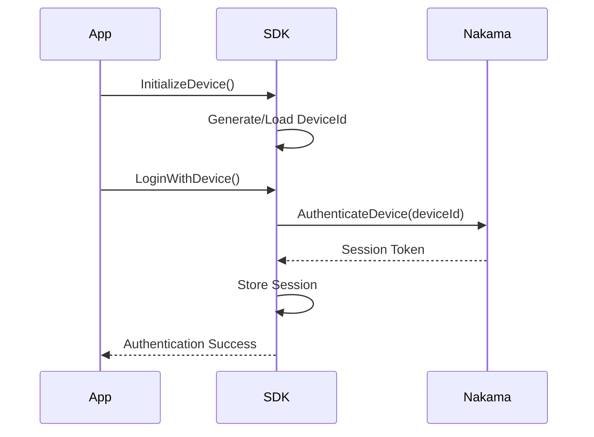
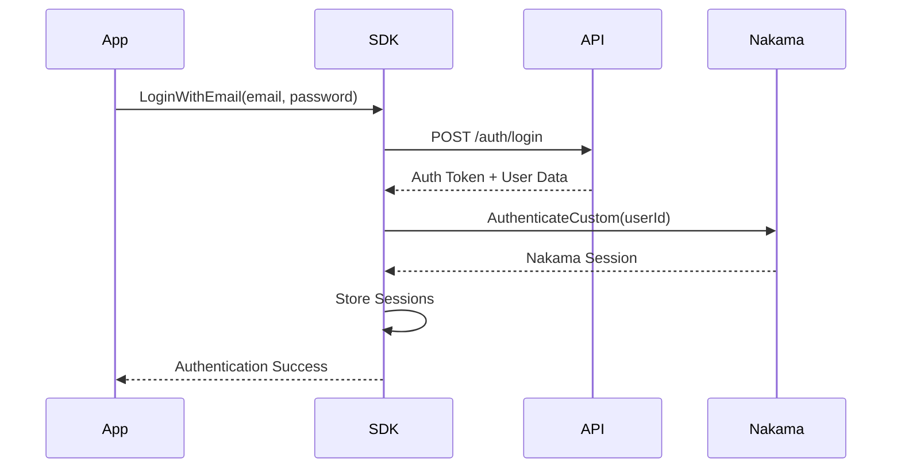

# Identity Module

The Identity module handles user authentication, sessions, and device identity management.

---

## Overview

| | |
|---|---|
| **Namespace** | `IntelliVerseX.Identity` |
| **Assembly** | `IntelliVerseX.Identity` |
| **Dependencies** | `IntelliVerseX.Core` |

---

## Key Classes

### IntelliVerseXUserIdentity

Static class holding the current user's identity data.

```csharp
public static class IntelliVerseXUserIdentity
{
    // Identity fields
    public static string UserId { get; }
    public static string UserName { get; }
    public static string DisplayName { get; }
    public static string FirstName { get; }
    public static string LastName { get; }
    public static string Email { get; }
    public static string IdpUsername { get; }
    public static string Role { get; }
    public static bool IsAdult { get; }
    public static string LoginType { get; }
    
    // Persistent fields (not cleared on logout)
    public static string GameId { get; set; }
    public static string DeviceId { get; }
    
    // Nakama-specific
    public static string NakamaUserId { get; }
    public static string NakamaSessionToken { get; }
    
    // Methods
    public static void InitializeDevice();
    public static void SyncFromUserSessionManager();
    public static void SetNakamaAuth(string nakamaUserId, string sessionToken);
    public static void Clear();
    public static bool IsValid();
}
```

**Usage:**
```csharp
using IntelliVerseX.Identity;

public class GameInit : MonoBehaviour
{
    void Start()
    {
        // Initialize device identity (generates unique device ID)
        IntelliVerseXUserIdentity.InitializeDevice();
        
        Debug.Log($"Device ID: {IntelliVerseXUserIdentity.DeviceId}");
    }
    
    void OnLoginSuccess()
    {
        // Sync user data from session
        IntelliVerseXUserIdentity.SyncFromUserSessionManager();
        
        Debug.Log($"Welcome, {IntelliVerseXUserIdentity.DisplayName}!");
    }
    
    void OnLogout()
    {
        // Clear user data (preserves DeviceId and GameId)
        IntelliVerseXUserIdentity.Clear();
    }
}
```

---

### UserSessionManager

Manages the current user session.

```csharp
public class UserSessionManager
{
    public static UserSessionManager Current { get; }
    
    // User data
    public string userId;
    public string userName;
    public string firstName;
    public string lastName;
    public string email;
    public string idpUsername;
    public string role;
    public bool isAdult;
    public string loginType;
    
    // Session state
    public bool IsLoggedIn { get; }
    public bool HasValidSession { get; }
    
    // Methods
    public void SetUserData(AuthResponse response);
    public void ClearSession();
    public void SaveSession();
    public void LoadSession();
}
```

**Usage:**
```csharp
// Check if user is logged in
if (UserSessionManager.Current != null && UserSessionManager.Current.IsLoggedIn)
{
    Debug.Log($"Logged in as: {UserSessionManager.Current.userName}");
}

// Clear session on logout
UserSessionManager.Current?.ClearSession();
```

---

### APIManager

HTTP client for identity API calls.

```csharp
public class APIManager : MonoBehaviour
{
    public static APIManager Instance { get; }
    
    // Authentication
    public async Task<AuthResponse> LoginAsync(LoginRequest request);
    public async Task<AuthResponse> RegisterAsync(RegisterRequest request);
    public async Task<bool> LogoutAsync();
    
    // User management
    public async Task<UserProfile> GetProfileAsync();
    public async Task<bool> UpdateProfileAsync(UpdateProfileRequest request);
    
    // Password
    public async Task<bool> ForgotPasswordAsync(string email);
    public async Task<bool> ResetPasswordAsync(ResetPasswordRequest request);
    
    // Social auth
    public async Task<AuthResponse> GoogleSignInAsync(string idToken);
    public async Task<AuthResponse> AppleSignInAsync(string identityToken);
}
```

---

### AuthService

Authentication service with multiple provider support.

```csharp
public static class AuthService
{
    // Events
    public static event Action<AuthState> OnAuthStateChanged;
    public static event Action<string> OnAuthError;
    
    // State
    public static AuthState CurrentState { get; }
    public static bool IsAuthenticated { get; }
    
    // Methods
    public static async Task<bool> LoginWithEmailAsync(string email, string password);
    public static async Task<bool> RegisterWithEmailAsync(string email, string password, string username);
    public static async Task<bool> LoginWithDeviceAsync();
    public static async Task<bool> LoginWithGoogleAsync();
    public static async Task<bool> LoginWithAppleAsync();
    public static async Task<bool> LogoutAsync();
}

public enum AuthState
{
    NotAuthenticated,
    Authenticating,
    Authenticated,
    Error
}
```

**Usage:**
```csharp
using IntelliVerseX.Identity;

public class LoginController : MonoBehaviour
{
    void Start()
    {
        AuthService.OnAuthStateChanged += HandleAuthStateChanged;
        AuthService.OnAuthError += HandleAuthError;
    }
    
    async void LoginWithEmail(string email, string password)
    {
        bool success = await AuthService.LoginWithEmailAsync(email, password);
        if (success)
        {
            // Navigate to main menu
        }
    }
    
    void HandleAuthStateChanged(AuthState state)
    {
        switch (state)
        {
            case AuthState.Authenticating:
                ShowLoadingSpinner();
                break;
            case AuthState.Authenticated:
                HideLoadingSpinner();
                LoadMainMenu();
                break;
        }
    }
    
    void HandleAuthError(string error)
    {
        ShowErrorDialog(error);
    }
}
```

---

## Authentication Flow

### Device Authentication



### Email Authentication



---

## Auth UI Panels

The Identity module includes pre-built UI panels:

### IVXCanvasAuth

Main authentication canvas controller.

```csharp
public class IVXCanvasAuth : MonoBehaviour
{
    public void ShowLogin();
    public void ShowRegister();
    public void ShowForgotPassword();
    public void ShowOTP();
    public void ShowReferral();
    
    public event Action OnLoginSuccess;
    public event Action OnRegisterSuccess;
}
```

### IVXPanelLogin

Login panel with email and social options.

### IVXPanelRegister

Registration panel with validation.

### IVXPanelForgotPassword

Password recovery panel.

### IVXPanelOTP

OTP verification panel.

### IVXPanelReferral

Referral code entry panel.

---

## Usage Examples

### Basic Login Flow

```csharp
using UnityEngine;
using IntelliVerseX.Identity;
using IntelliVerseX.Core;

public class AuthController : MonoBehaviour
{
    [SerializeField] private IVXCanvasAuth authCanvas;
    
    void Start()
    {
        // Initialize device first
        IntelliVerseXUserIdentity.InitializeDevice();
        
        // Subscribe to events
        authCanvas.OnLoginSuccess += HandleLoginSuccess;
        
        // Check for existing session
        if (UserSessionManager.Current?.HasValidSession == true)
        {
            // Auto-login
            HandleLoginSuccess();
        }
        else
        {
            // Show login UI
            authCanvas.ShowLogin();
        }
    }
    
    void HandleLoginSuccess()
    {
        // Sync identity data
        IntelliVerseXUserIdentity.SyncFromUserSessionManager();
        
        IVXLogger.Log($"Welcome back, {IntelliVerseXUserIdentity.DisplayName}!");
        
        // Load main game
        UnityEngine.SceneManagement.SceneManager.LoadScene("MainMenu");
    }
}
```

### Guest Account

```csharp
public async void PlayAsGuest()
{
    // Login with device ID only
    bool success = await AuthService.LoginWithDeviceAsync();
    
    if (success)
    {
        IVXLogger.Log("Playing as guest");
        // Guest account created with 4-day expiry
    }
}
```

### Social Login

```csharp
public async void LoginWithGoogle()
{
    try
    {
        bool success = await AuthService.LoginWithGoogleAsync();
        if (success)
        {
            // Linked to Google account
        }
    }
    catch (Exception ex)
    {
        IVXLogger.LogError($"Google sign-in failed: {ex.Message}");
    }
}

public async void LoginWithApple()
{
    // iOS only
    #if UNITY_IOS
    bool success = await AuthService.LoginWithAppleAsync();
    #endif
}
```

---

## Identity Validation

```csharp
// Check if user has valid identity for leaderboard operations
if (IntelliVerseXUserIdentity.IsValid())
{
    // Has both NakamaUserId and DisplayName
    await SubmitScore(score);
}
else
{
    IVXLogger.LogWarning("Cannot submit score: Identity not valid");
    // Prompt user to complete profile
}
```

---

## Data Persistence

Session data is automatically persisted:

| Data | Storage | Cleared On |
|------|---------|------------|
| DeviceId | PlayerPrefs | Never |
| Session Token | PlayerPrefs | Logout |
| User Data | Memory | Logout/App Close |
| Nakama Token | PlayerPrefs | Session Expiry |

---

## Best Practices

1. **Always call `InitializeDevice()` first** - Before any other identity operations
2. **Sync after login** - Call `SyncFromUserSessionManager()` after successful login
3. **Handle errors gracefully** - Subscribe to `OnAuthError` events
4. **Check `IsValid()` before operations** - Ensure identity is complete
5. **Clear on logout** - Call `Clear()` when user logs out

---

## Related Documentation

- [Core Module](core.md) - Foundation utilities
- [Backend Module](backend.md) - Nakama authentication
- [Authentication Guide](../guides/auth-flow.md) - Complete auth flow guide
