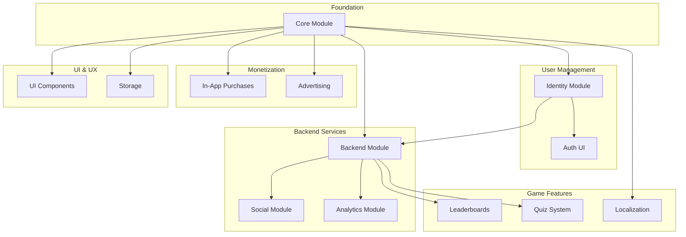

# SDK Modules

IntelliVerseX SDK is organized into modular components. Each module can be used independently or combined with others.

---

## Module Architecture



---

## Module Reference

### Core Modules

| Module | Namespace | Description |
|--------|-----------|-------------|
| [Core](core.md) | `IntelliVerseX.Core` | Foundation, logging, utilities |
| [Identity](identity.md) | `IntelliVerseX.Identity` | User identity, sessions, auth |
| [Backend](backend.md) | `IntelliVerseX.Backend` | Nakama integration |

### Feature Modules

| Module | Namespace | Description |
|--------|-----------|-------------|
| [Social](social.md) | `IntelliVerseX.Social` | Friends, sharing, referrals |
| [Leaderboards](leaderboards.md) | `IntelliVerseX.Leaderboard` | Rankings and scores |
| [Quiz](quiz.md) | `IntelliVerseX.Quiz` | Quiz game framework |
| [Localization](localization.md) | `IntelliVerseX.Localization` | Multi-language support |
| [Analytics](analytics.md) | `IntelliVerseX.Analytics` | Event tracking |

### Monetization Modules

| Module | Namespace | Description |
|--------|-----------|-------------|
| [Monetization](monetization.md) | `IntelliVerseX.Monetization` | IAP, Ads, Offerwalls |

### Utility Modules

| Module | Namespace | Description |
|--------|-----------|-------------|
| [UI](ui.md) | `IntelliVerseX.UI` | UI components |
| [Storage](storage.md) | `IntelliVerseX.Storage` | Data persistence |
| [More Of Us](more-of-us.md) | `IntelliVerseX.MoreOfUs` | Cross-promotion |

---

## Assembly Definitions

Each module has its own assembly definition:

| Assembly | Contains |
|----------|----------|
| `IntelliVerseX.Core` | Core utilities |
| `IntelliVerseX.Identity` | Identity management |
| `IntelliVerseX.Backend` | Nakama integration |
| `IntelliVerseX.Social` | Friends, sharing |
| `IntelliVerseX.Monetization` | IAP, ads |
| `IntelliVerseX.Analytics` | Event tracking |
| `IntelliVerseX.Localization` | Language support |
| `IntelliVerseX.Storage` | Data storage |
| `IntelliVerseX.Leaderboard` | Leaderboard features |
| `IntelliVerseX.Quiz` | Quiz logic |
| `IntelliVerseX.QuizUI` | Quiz UI components |
| `IntelliVerseX.UI` | General UI |
| `IntelliVerseX.MoreOfUs` | Cross-promotion |
| `IntelliVerseX.V2` | Next-gen features |
| `IntelliVerseX.Editor` | Editor tools |
| `IntelliVerseX.Auth` | Auth UI panels |

---

## Module Dependencies

```
Core (no dependencies)
├── Identity (→ Core)
│   └── Auth UI (→ Identity)
├── Backend (→ Core, Identity)
│   ├── Social (→ Backend)
│   ├── Analytics (→ Backend)
│   └── Leaderboards (→ Backend)
├── Localization (→ Core)
├── Storage (→ Core)
├── Monetization (→ Core)
├── UI (→ Core)
├── Quiz (→ Core, Backend)
└── MoreOfUs (→ Core, Backend)
```

---

## Quick Links

<div class="grid cards" markdown>

-   :material-cube:{ .lg .middle } __Core Module__

    ---
    
    Foundation classes, logging, singleton utilities, and configuration.
    
    [:octicons-arrow-right-24: Core Documentation](core.md)

-   :material-account-key:{ .lg .middle } __Identity Module__

    ---
    
    User identity, authentication, sessions, and device management.
    
    [:octicons-arrow-right-24: Identity Documentation](identity.md)

-   :material-cloud:{ .lg .middle } __Backend Module__

    ---
    
    Nakama server integration, RPC calls, wallets, and geolocation.
    
    [:octicons-arrow-right-24: Backend Documentation](backend.md)

-   :material-account-group:{ .lg .middle } __Social Module__

    ---
    
    Friends system, sharing, referrals, and rate-app prompts.
    
    [:octicons-arrow-right-24: Social Documentation](social.md)

-   :material-cash:{ .lg .middle } __Monetization Module__

    ---
    
    IAP, rewarded ads, interstitials, banners, and offerwalls.
    
    [:octicons-arrow-right-24: Monetization Documentation](monetization.md)

-   :material-translate:{ .lg .middle } __Localization Module__

    ---
    
    Multi-language support with 12+ languages and RTL layout.
    
    [:octicons-arrow-right-24: Localization Documentation](localization.md)

</div>

---

## External Dependencies by Module

| Module | Required Dependencies |
|--------|----------------------|
| Core | None |
| Identity | None |
| Backend | Nakama Unity SDK |
| Social | Backend module |
| Monetization | LevelPlay/Appodeal/AdMob |
| Localization | None |
| Quiz | Backend module |
| UI | TextMeshPro |
