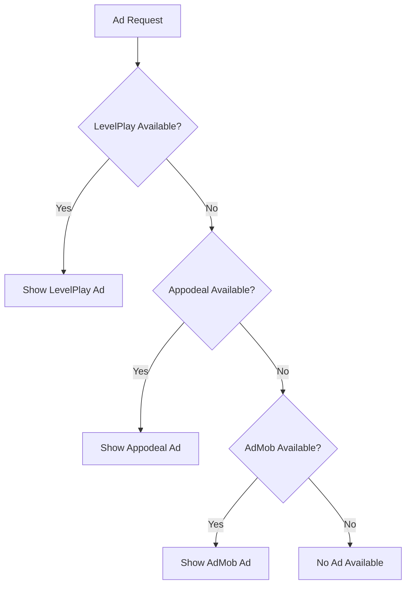

# Monetization Module

The Monetization module provides unified interfaces for in-app purchases (IAP), advertising (multiple networks), and offerwalls.

---

## Overview

| | |
|---|---|
| **Namespace** | `IntelliVerseX.Monetization` |
| **Assembly** | `IntelliVerseX.Monetization` |
| **Dependencies** | Platform SDKs (LevelPlay, Appodeal, AdMob), Unity Purchasing |

---

## Components

### IAP (In-App Purchases)

- Product catalog management
- Purchase flow handling
- Receipt validation
- Subscription management

### Ads (Advertising)

- Rewarded video ads
- Interstitial ads
- Banner ads
- Ad network waterfall

### Offerwalls

- Third-party offer integration
- Virtual currency rewards

---

## IAP System

### IVXIAPManager

```csharp
public static class IVXIAPManager
{
    // Events
    public static event Action<IVXPurchaseResult> OnPurchaseComplete;
    public static event Action<string> OnPurchaseFailed;
    public static event Action OnRestoreComplete;
    
    // State
    public static bool IsInitialized { get; }
    
    // Initialize
    public static void Initialize(string[] productIds);
    public static void Initialize(IVXIAPConfig config);
    
    // Products
    public static IVXProduct GetProduct(string productId);
    public static List<IVXProduct> GetAllProducts();
    
    // Purchase
    public static void PurchaseProduct(string productId, Action<IVXPurchaseResult> callback = null);
    
    // Restore
    public static void RestorePurchases(Action<bool> callback = null);
}
```

**Usage:**
```csharp
using IntelliVerseX.Monetization;

public class StoreController : MonoBehaviour
{
    void Start()
    {
        // Subscribe to events
        IVXIAPManager.OnPurchaseComplete += HandlePurchaseComplete;
        IVXIAPManager.OnPurchaseFailed += HandlePurchaseFailed;
        
        // Initialize with product IDs
        IVXIAPManager.Initialize(new[]
        {
            "com.mygame.coins_100",
            "com.mygame.coins_500",
            "com.mygame.premium",
            "com.mygame.subscription"
        });
    }
    
    void BuyCoins(string productId)
    {
        IVXIAPManager.PurchaseProduct(productId, result =>
        {
            if (result.success)
            {
                // Grant coins
                AddCoins(GetCoinsForProduct(productId));
                ShowPurchaseSuccessUI();
            }
        });
    }
    
    void HandlePurchaseComplete(IVXPurchaseResult result)
    {
        Debug.Log($"Purchase complete: {result.productId}");
        Debug.Log($"Transaction: {result.transactionId}");
    }
    
    void HandlePurchaseFailed(string error)
    {
        ShowErrorDialog(error);
    }
    
    void RestorePurchases()
    {
        IVXIAPManager.RestorePurchases(success =>
        {
            if (success)
                ShowToast("Purchases restored!");
            else
                ShowToast("Restore failed");
        });
    }
}
```

### IVXProduct

```csharp
public class IVXProduct
{
    public string productId;
    public string title;
    public string description;
    public string price;           // Formatted: "$4.99"
    public decimal priceDecimal;   // Raw: 4.99
    public string currencyCode;    // "USD"
    public IVXProductType type;
    public bool isAvailable;
}

public enum IVXProductType
{
    Consumable,
    NonConsumable,
    Subscription
}
```

### IVXSubscriptionManager

```csharp
public class IVXSubscriptionManager
{
    public static bool IsSubscribed(string productId);
    public static DateTime? GetExpirationDate(string productId);
    public static SubscriptionStatus GetStatus(string productId);
}
```

---

## Advertising System

### IVXAdsBootstrap

Automatic ad initialization component.

```csharp
public class IVXAdsBootstrap : MonoBehaviour
{
    [Header("Configuration")]
    [SerializeField] private bool initializeOnStart = true;
    [SerializeField] private IVXAdsConfig adsConfig;
    
    // Initialize manually
    public void Initialize();
}
```

**Setup:**
1. Add `IVXAdsBootstrap` prefab to your first scene
2. Configure ad unit IDs in the inspector
3. Ads will initialize automatically

### Ad Network Waterfall

The SDK supports multiple ad networks with automatic fallback:



### Rewarded Ads

```csharp
// Check if ad is available
if (IVXAdsManager.IsRewardedAdReady())
{
    // Show rewarded ad
    IVXAdsManager.ShowRewardedAd(
        onRewarded: () =>
        {
            // User earned reward
            walletManager.AddCoins(100);
        },
        onClosed: () =>
        {
            // Ad closed (may or may not have earned)
        },
        onFailed: (error) =>
        {
            Debug.LogError($"Ad failed: {error}");
        }
    );
}
else
{
    ShowNoAdAvailableUI();
}
```

### Interstitial Ads

```csharp
// Show at natural break points
public void OnLevelComplete()
{
    // Show interstitial (non-blocking)
    if (IVXAdsManager.IsInterstitialReady())
    {
        IVXAdsManager.ShowInterstitial(
            onClosed: () => LoadNextLevel()
        );
    }
    else
    {
        LoadNextLevel();
    }
}
```

### Banner Ads

```csharp
// Show banner
IVXAdsManager.ShowBanner(BannerPosition.Bottom);

// Hide banner
IVXAdsManager.HideBanner();

// Destroy banner
IVXAdsManager.DestroyBanner();
```

---

## WebGL Monetization

WebGL has a separate monetization system:

### IVXWebGLAdsManager

```csharp
public class IVXWebGLAdsManager
{
    public static void ShowVideoAd(Action onComplete);
    public static void ShowDisplayAd(Vector2 position, Vector2 size);
    public static void HideDisplayAd();
}
```

### IVXWebGLMonetizationManager

```csharp
public class IVXWebGLMonetizationManager
{
    public static void Initialize(IVXWebGLMonetizationSettings settings);
    public static bool IsAdReady();
}
```

---

## Offerwall

```csharp
public class IVXOfferwallManager
{
    public static bool IsAvailable { get; }
    public static void ShowOfferwall();
    
    public static event Action<int> OnOfferwallReward;
    public static event Action OnOfferwallClosed;
}
```

**Usage:**
```csharp
// Subscribe to rewards
IVXOfferwallManager.OnOfferwallReward += (coins) =>
{
    walletManager.AddCoins(coins);
    ShowToast($"Earned {coins} coins!");
};

// Show offerwall
if (IVXOfferwallManager.IsAvailable)
{
    IVXOfferwallManager.ShowOfferwall();
}
```

---

## Configuration

### IVXAdsConfig

```csharp
[Serializable]
public class IVXAdsConfig
{
    [Header("Enable/Disable")]
    public bool enableAds = true;
    
    [Header("LevelPlay (IronSource)")]
    public string levelPlayAndroidAppKey;
    public string levelPlayIosAppKey;
    
    [Header("Appodeal")]
    public string appodealAndroidAppKey;
    public string appodealIosAppKey;
    
    [Header("AdMob")]
    public string admobAndroidAppId;
    public string admobIosAppId;
    
    [Header("Ad Units")]
    public string rewardedAdUnitId;
    public string interstitialAdUnitId;
    public string bannerAdUnitId;
}
```

### IVXIAPConfig

```csharp
[CreateAssetMenu(fileName = "IAPConfig", menuName = "IntelliVerse-X/IAP Configuration")]
public class IVXIAPConfig : ScriptableObject
{
    public List<IVXProductDefinition> products;
    public bool validateReceipts = true;
    public bool restoreOnInit = true;
}

[Serializable]
public class IVXProductDefinition
{
    public string productId;
    public string productName;
    public IVXProductType productType;
    public int virtualCurrencyAmount;
}
```

---

## Platform Notes

| Feature | Android | iOS | WebGL | Standalone |
|---------|---------|-----|-------|------------|
| IAP | ✅ | ✅ | ❌ | ❌ |
| Rewarded Ads | ✅ | ✅ | ⚠️ | ❌ |
| Interstitials | ✅ | ✅ | ⚠️ | ❌ |
| Banners | ✅ | ✅ | ⚠️ | ❌ |
| Offerwalls | ✅ | ✅ | ❌ | ❌ |

⚠️ WebGL uses platform-specific implementation

---

## Best Practices

### Ad Frequency

```csharp
// Don't show ads too frequently
private float _lastInterstitialTime;
private const float INTERSTITIAL_COOLDOWN = 60f; // 60 seconds

void TryShowInterstitial()
{
    if (Time.time - _lastInterstitialTime < INTERSTITIAL_COOLDOWN)
        return;
    
    if (IVXAdsManager.IsInterstitialReady())
    {
        IVXAdsManager.ShowInterstitial();
        _lastInterstitialTime = Time.time;
    }
}
```

### Purchase Validation

```csharp
// Always validate purchases server-side
void HandlePurchaseComplete(IVXPurchaseResult result)
{
    if (!result.success) return;
    
    // Send receipt to server for validation
    _ = ValidatePurchaseOnServer(result.receipt);
}
```

### Error Handling

```csharp
IVXIAPManager.OnPurchaseFailed += (error) =>
{
    switch (error)
    {
        case "PurchaseCancelled":
            // User cancelled - no error message needed
            break;
        case "NetworkError":
            ShowErrorDialog("Please check your internet connection");
            break;
        default:
            ShowErrorDialog($"Purchase failed: {error}");
            break;
    }
};
```

---

## Testing

### Test Mode

For development, use test ad unit IDs:

```csharp
#if UNITY_EDITOR || DEVELOPMENT_BUILD
    // Use test IDs
    adsConfig.rewardedAdUnitId = "test_rewarded_ad";
#endif
```

### IAP Testing

- **Android:** Use test accounts or license testing
- **iOS:** Use sandbox tester accounts

---

## Related Documentation

- [Ads Demo](../samples/ads-demo.md) - Sample ad integration
- [Ad Integration Guide](../guides/ad-integration.md) - Step-by-step guide
