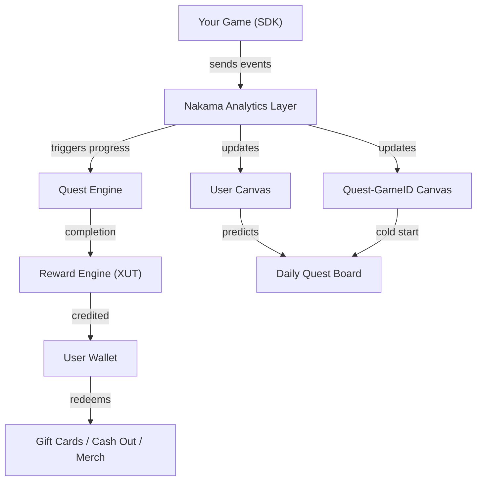

# Quest Module

The Quest module lets any game add task-based rewards, daily missions, milestone challenges, PvP competitions, and mini-game quests (Scratch & Win, Spin & Win, IntelliDraws) with a single SDK integration.

---

## Overview

| Namespace | `IntelliVerseX.Quest` |
| --- | --- |
| Assembly | `IntelliVerseX.Quest` |
| UI Assembly | `IntelliVerseX.QuestUI` |
| Backend | QuestX Economy API + Nakama |

---

## Features

- **Daily Quests** — Auto-refreshing daily task board per game
- **Milestone Quests** — Progressive rewards (Reach Level 5 → Level 20 → Level 50)
- **Game-Level Quests** — Quests tied to your game's specific events (win matches, clear levels, achieve scores)
- **Platform Quests** — Generic quests across all games (surveys, deals, referrals)
- **PvP Challenges** — Compete against other players on quest completion
- **Mini-Game Quests** — Scratch & Win, Spin & Win, IntelliDraws
- **Reward Redemption** — XUT tokens redeemable for gift cards, mobile top-ups, cash out, merchandise, in-game items

---

## Architecture



---

## Key Classes

| Class | Purpose |
| --- | --- |
| `IVXQuestManager` | Main quest lifecycle manager |
| `IVXQuest` | Quest data model |
| `IVXQuestProgress` | Per-user progress on a quest |
| `IVXQuestCompletion` | Completion result with rewards |
| `IVXDailyQuestBoard` | Daily quest board manager |
| `IVXMilestoneQuest` | Milestone/progressive quest chain |
| `IVXPvPChallenge` | PvP challenge manager |

---

## Quest Types

| Type | Enum | Description |
| --- | --- | --- |
| Daily Mission | `QuestType.DailyMission` | Refreshes every 24 hours |
| Milestone | `QuestType.Milestone` | Progressive goals (Level 5 → 20 → 50) |
| Win Matches | `QuestType.WinMatches` | Win N matches in your game |
| Reach Level | `QuestType.ReachLevel` | Reach a specific game level |
| Achieve Score | `QuestType.AchieveScore` | Hit a score threshold |
| Play Streak | `QuestType.PlayStreak` | Play N consecutive days |
| Leaderboard Rank | `QuestType.LeaderboardRank` | Reach top N on leaderboard |
| Custom Event | `QuestType.CustomEvent` | Triggered by your game's custom events |
| Scratch & Win | `QuestType.ScratchAndWin` | Scratch card mini-game |
| Spin & Win | `QuestType.SpinAndWin` | Lucky wheel spin |
| IntelliDraws | `QuestType.IntelliDraws` | Lottery/draw entry |
| Gift Card | `QuestType.GiftCard` | Redeem a gift card |
| Survey | `QuestType.Survey` | Complete a survey |
| Referral | `QuestType.Referral` | Refer friends |

---

## IVXQuestManager

The main entry point for all quest operations.

```csharp
public static class IVXQuestManager
{
    // ── Initialization ──
    public static void Initialize(string gameId);

    // ── Daily Quest Board ──
    public static async Task<IVXQuest[]> GetDailyQuestsAsync();
    public static async Task<IVXQuest[]> GetAllQuestsAsync(QuestFilter filter = null);
    public static async Task<IVXQuest[]> GetMilestoneQuestsAsync();
    public static async Task<IVXQuest[]> GetPvPChallengesAsync();

    // ── Progress Tracking ──
    public static async Task<IVXQuestProgress> GetProgressAsync(string questId);
    public static async Task<IVXQuestProgress> TrackProgressAsync(
        string questId, float value);
    public static async Task<IVXQuestProgress> IncrementProgressAsync(
        string questId, float delta = 1f);

    // ── Completion & Rewards ──
    public static async Task<IVXQuestCompletion> ClaimRewardAsync(string questId);
    public static async Task<RedemptionResult> RedeemXUTAsync(
        RedemptionType type, RedemptionOptions options);

    // ── Game Events (auto-progress) ──
    public static void SendEvent(string eventName, Dictionary<string, object> data);

    // ── Leaderboard ──
    public static async Task<LeaderboardEntry[]> GetQuestLeaderboardAsync(
        string questId, int limit = 50);

    // ── Events ──
    public static event Action<IVXQuest> OnQuestAvailable;
    public static event Action<IVXQuestProgress> OnQuestProgress;
    public static event Action<IVXQuestCompletion> OnQuestCompleted;
    public static event Action<IVXQuestCompletion> OnRewardClaimed;
    public static event Action<IVXQuest[]> OnDailyQuestsRefreshed;
}
```

---

## Quick Start

### 1. Initialize

```csharp
using IntelliVerseX.Quest;

public class GameBootstrap : MonoBehaviour
{
    void Start()
    {
        // Initialize with your gameID from the QuestX admin panel
        IVXQuestManager.Initialize("your-game-id-here");

        // Subscribe to events
        IVXQuestManager.OnQuestCompleted += HandleQuestComplete;
        IVXQuestManager.OnDailyQuestsRefreshed += HandleDailyRefresh;
    }

    void HandleQuestComplete(IVXQuestCompletion completion)
    {
        Debug.Log($"Quest complete! Earned {completion.XUTEarned} XUT");
        ShowRewardPopup(completion);
    }

    void HandleDailyRefresh(IVXQuest[] dailies)
    {
        Debug.Log($"{dailies.Length} new daily quests available!");
    }
}
```

### 2. Show Daily Quest Board

```csharp
using IntelliVerseX.Quest;

public class DailyQuestUI : MonoBehaviour
{
    [SerializeField] private Transform questListParent;
    [SerializeField] private GameObject questCardPrefab;

    async void OnEnable()
    {
        var dailyQuests = await IVXQuestManager.GetDailyQuestsAsync();

        foreach (var quest in dailyQuests)
        {
            var card = Instantiate(questCardPrefab, questListParent);
            card.GetComponent<QuestCard>().Setup(quest);
        }
    }
}
```

### 3. Send Game Events (Auto-Progress)

The SDK automatically maps your game events to quest progress. Just send events when things happen in your game:

```csharp
using IntelliVerseX.Quest;

public class GameplayManager : MonoBehaviour
{
    void OnLevelCleared(int levelNumber)
    {
        IVXQuestManager.SendEvent("level_cleared", new Dictionary<string, object>
        {
            { "level", levelNumber },
            { "score", currentScore },
            { "time_seconds", elapsedTime }
        });
    }

    void OnMatchWon(string opponentId)
    {
        IVXQuestManager.SendEvent("match_result", new Dictionary<string, object>
        {
            { "result", "win" },
            { "opponent_id", opponentId }
        });
    }

    void OnScoreAchieved(int score)
    {
        IVXQuestManager.SendEvent("score_achieved", new Dictionary<string, object>
        {
            { "score", score }
        });
    }
}
```

### 4. Track Progress Manually

For quests not driven by game events:

```csharp
// Increment progress (e.g., "Complete 5 surveys")
await IVXQuestManager.IncrementProgressAsync(questId);

// Set absolute progress (e.g., "Reach Level 20")
await IVXQuestManager.TrackProgressAsync(questId, currentLevel);

// Check progress
var progress = await IVXQuestManager.GetProgressAsync(questId);
Debug.Log($"Progress: {progress.Current}/{progress.Target} ({progress.Percent:P0})");
```

### 5. Claim Rewards

```csharp
var completion = await IVXQuestManager.ClaimRewardAsync(questId);
Debug.Log($"Claimed {completion.XUTEarned} XUT! Wallet balance: {completion.NewBalance}");
```

---

## Data Models

### IVXQuest

```csharp
public class IVXQuest
{
    public string Id { get; }
    public string Title { get; }
    public string Description { get; }
    public QuestType Type { get; }
    public QuestStatus Status { get; }

    // Goal
    public float TargetValue { get; }
    public float CurrentValue { get; }
    public float ProgressPercent { get; }

    // Reward
    public int RewardXUT { get; }
    public string RewardDescription { get; }

    // Timing
    public DateTime? ExpiresAt { get; }
    public TimeSpan? TimeRemaining { get; }
    public bool IsDaily { get; }

    // Game context
    public string GameId { get; }
    public string GameName { get; }
    public string Category { get; }
    public string Difficulty { get; } // easy, medium, hard

    // State
    public bool IsCompleted { get; }
    public bool IsClaimable { get; }
    public bool IsExpired { get; }

    // Milestone chain
    public int? MilestoneStep { get; }
    public int? TotalMilestones { get; }
    public IVXQuest NextMilestone { get; }
}

public enum QuestType
{
    DailyMission,
    Milestone,
    WinMatches,
    ReachLevel,
    AchieveScore,
    PlayStreak,
    LeaderboardRank,
    CustomEvent,
    ScratchAndWin,
    SpinAndWin,
    IntelliDraws,
    GiftCard,
    Survey,
    Referral,
    Social,
    Deal
}

public enum QuestStatus
{
    Available,
    InProgress,
    Completed,
    Claimed,
    Expired
}
```

### IVXQuestProgress

```csharp
public class IVXQuestProgress
{
    public string QuestId { get; }
    public float Current { get; }
    public float Target { get; }
    public float Percent { get; }
    public bool IsComplete { get; }
    public DateTime LastUpdated { get; }
    public Dictionary<string, object> Metadata { get; }
}
```

### IVXQuestCompletion

```csharp
public class IVXQuestCompletion
{
    public string QuestId { get; }
    public string QuestTitle { get; }
    public int XUTEarned { get; }
    public int BonusXUT { get; } // streak bonus, multiplier, etc.
    public int TotalXUT { get; }
    public int NewBalance { get; }
    public DateTime CompletedAt { get; }
    public string CompletionId { get; }

    // Milestone
    public bool HasNextMilestone { get; }
    public IVXQuest NextMilestone { get; }

    // Streak
    public int CurrentStreak { get; }
    public float StreakMultiplier { get; }
}
```

---

## Milestone Quests

Progressive quests with increasing rewards:

```csharp
using IntelliVerseX.Quest;

public class MilestoneUI : MonoBehaviour
{
    async void ShowMilestones()
    {
        var milestones = await IVXQuestManager.GetMilestoneQuestsAsync();

        foreach (var quest in milestones)
        {
            Debug.Log($"Step {quest.MilestoneStep}/{quest.TotalMilestones}: " +
                      $"{quest.Title} — {quest.RewardXUT} XUT " +
                      $"({quest.ProgressPercent:P0} complete)");
        }
    }
}
```

### Example Milestone Chains

Any game can define milestone chains:

| Game | Step 1 | Step 2 | Step 3 | Step 4 |
| --- | --- | --- | --- | --- |
| **Puzzle Game** | Clear 5 levels → 50 XUT | Clear 20 levels → 500 XUT | Clear 50 levels → 2,000 XUT | Clear 100 levels → 5,000 XUT |
| **Battle Royale** | Win 1 match → 100 XUT | Win 10 matches → 1,000 XUT | Win 50 matches → 5,000 XUT | Win 100 matches → 15,000 XUT |
| **Quiz Game** | Answer 10 questions → 50 XUT | Answer 100 questions → 1,000 XUT | 7-day streak → 2,000 XUT | Perfect week → 5,000 XUT |
| **Any Game** | Refer 5 friends → 100 XUT | Refer 10 friends → 1,500 XUT | Refer 25 friends → 5,000 XUT | Refer 50 friends → 15,000 XUT |

---

## PvP Challenges

Compete against other players on quest metrics:

```csharp
using IntelliVerseX.Quest;

public class PvPChallengeUI : MonoBehaviour
{
    async void ShowChallenges()
    {
        var challenges = await IVXQuestManager.GetPvPChallengesAsync();

        foreach (var challenge in challenges)
        {
            Debug.Log($"{challenge.Title} — " +
                      $"Ends: {challenge.TimeRemaining?.Hours}h " +
                      $"Prize: {challenge.RewardXUT} XUT");
        }
    }

    async void ShowLeaderboard(string questId)
    {
        var entries = await IVXQuestManager.GetQuestLeaderboardAsync(questId);

        foreach (var entry in entries)
        {
            Debug.Log($"#{entry.Rank} {entry.Username}: {entry.Score}");
        }
    }
}
```

---

## Mini-Game Quests

### Scratch & Win

```csharp
using IntelliVerseX.Quest;

// Trigger scratch card after quest completion
IVXQuestManager.OnQuestCompleted += (completion) =>
{
    if (completion.HasScratchCard)
    {
        IVXQuestUI.ShowScratchCard(completion.ScratchCardId);
    }
};
```

### Spin & Win

```csharp
// Show spin wheel (uses Hiro module integration)
var spinResult = await IVXQuestManager.TriggerSpinAsync();
Debug.Log($"Won: {spinResult.PrizeName} ({spinResult.XUTValue} XUT)");
```

### IntelliDraws

```csharp
// Enter a draw/lottery
await IVXQuestManager.EnterDrawAsync(drawId);
Debug.Log("Entered the draw! Results announced at end of week.");
```

---

## Reward Redemption

After earning XUT, users can redeem:

```csharp
using IntelliVerseX.Quest;

// Check wallet balance
int balance = await IVXQuestManager.GetWalletBalanceAsync();

// Redeem for gift card
var result = await IVXQuestManager.RedeemXUTAsync(
    RedemptionType.GiftCard,
    new RedemptionOptions
    {
        Amount = 500,
        ProductId = "amazon-10-usd"
    });

// Redeem for mobile top-up
var result = await IVXQuestManager.RedeemXUTAsync(
    RedemptionType.MobileTopUp,
    new RedemptionOptions
    {
        Amount = 300,
        PhoneNumber = "+1234567890",
        OperatorId = "t-mobile-us"
    });

// Redeem for in-game items (via Nakama economy)
var result = await IVXQuestManager.RedeemXUTAsync(
    RedemptionType.InGameItem,
    new RedemptionOptions
    {
        Amount = 100,
        ItemId = "legendary-sword"
    });
```

### Redemption Types

| Type | Enum | Backend |
| --- | --- | --- |
| Gift Card | `RedemptionType.GiftCard` | Reloadly API |
| Mobile Top-Up | `RedemptionType.MobileTopUp` | Reloadly API |
| Cash Out | `RedemptionType.CashOut` | Bank/PayPal |
| Merchandise | `RedemptionType.Merchandise` | Shipping partner |
| Coupon Code | `RedemptionType.Coupon` | QuestX coupon pool |
| In-Game Item | `RedemptionType.InGameItem` | Nakama economy |

---

## Game Event Mapping

When you send events via `IVXQuestManager.SendEvent()`, the backend automatically maps them to quest progress:

| Game Event | Maps to Quest Goal | Example |
| --- | --- | --- |
| `level_cleared` | `ReachLevel` | "Reach Level 20" progresses to level value |
| `match_result` (result=win) | `WinMatches` | "Win 5 Matches" increments by 1 |
| `score_achieved` | `AchieveScore` | "Score 10,000" updates to score value |
| `mission_completed` | `DailyMission` | "Complete Daily Mission" marks complete |
| `session_end` | `PlayStreak` | "Play 3 Days Straight" tracks calendar days |
| `custom_event` | `CustomEvent` | Any game-defined goal |

No additional configuration needed — define quests in the admin panel, send events from your game, the system handles the rest.

---

## Quest UI Prefabs

Ready-to-use UI components:

| Prefab | Description |
| --- | --- |
| `IVXDailyQuestBoard` | Complete daily quest board with tabs |
| `IVXQuestCard` | Single quest card with progress bar |
| `IVXMilestoneChain` | Milestone progress visualization |
| `IVXQuestRewardPopup` | Reward celebration popup |
| `IVXPvPLeaderboard` | PvP challenge leaderboard |
| `IVXScratchCard` | Scratch & win mini-game |
| `IVXSpinWheel` | Spin & win wheel |
| `IVXRedemptionPanel` | XUT redemption options |

---

## Admin Panel (QuestX Dashboard)

Game developers manage quests through the QuestX admin panel:

1. **Register your game** — Get a `gameId` and webhook secret
2. **Define event types** — Map your game events (level_cleared, match_won, etc.)
3. **Create quests** — Set goals, rewards, and duration
4. **Monitor analytics** — Track completion rates, conversion, and engagement

### Quest-GameID Canvas

The admin panel shows per-game analytics:

| Metric | Description |
| --- | --- |
| Quest Completion Rate | % of users who complete each quest |
| Avg Time to Complete | How long users take to finish |
| Top Performing Quests | Highest engagement quests |
| Drop-off Points | Where users abandon quests |
| Player Demographics | Who plays this game |
| Revenue per Quest | XUT earned per quest type |

---

## Webhook Integration

For server-to-server quest completion (without SDK):

```
POST https://quests.intelli-verse-x.ai/api/game-bridge/{gameId}/webhook
Content-Type: application/json
X-Webhook-Signature: {HMAC-SHA256 signature}

{
    "eventType": "level_cleared",
    "userId": "player-123",
    "data": {
        "level": 20,
        "score": 5000
    },
    "timestamp": "2026-04-14T10:30:00Z"
}
```

---

## Best Practices

### 1. Send Events Early and Often

```csharp
// Send events as they happen — don't batch
// The backend handles deduplication
void OnEnemyKilled()
{
    IVXQuestManager.SendEvent("enemy_killed", new Dictionary<string, object>
    {
        { "enemy_type", "boss" },
        { "weapon", "sword" }
    });
}
```

### 2. Handle Offline Gracefully

```csharp
// Events are queued when offline and sent when reconnected
// Quest progress syncs automatically on reconnection
IVXQuestManager.OnReconnected += async () =>
{
    var quests = await IVXQuestManager.GetDailyQuestsAsync();
    RefreshQuestUI(quests);
};
```

### 3. Show Progress Feedback

```csharp
IVXQuestManager.OnQuestProgress += (progress) =>
{
    ShowProgressToast($"{progress.Current}/{progress.Target}");

    if (progress.Percent >= 0.9f && !progress.IsComplete)
    {
        ShowAlmostThereNotification();
    }
};
```

### 4. Celebrate Completions

```csharp
IVXQuestManager.OnQuestCompleted += (completion) =>
{
    PlayConfettiEffect();
    ShowRewardPopup(completion);

    if (completion.HasNextMilestone)
    {
        ShowNextMilestoneTeaser(completion.NextMilestone);
    }
};
```

---

## Testing

### Test Events (Debug)

```csharp
#if UNITY_EDITOR
[ContextMenu("Simulate Level Clear")]
void DebugLevelClear()
{
    IVXQuestManager.SendEvent("level_cleared", new Dictionary<string, object>
    {
        { "level", 20 },
        { "score", 5000 }
    });
}

[ContextMenu("Reset Daily Quests")]
void DebugResetDaily()
{
    IVXNakamaManager.RpcAsync("quest/debug_reset_daily", new { gameId = "your-game-id" });
}

[ContextMenu("Grant Test XUT")]
void DebugGrantXUT()
{
    IVXNakamaManager.RpcAsync("quest/debug_grant_xut", new { amount = 1000 });
}
#endif
```

---

## Module Dependencies

```
Quest Module
├── Core (→ IntelliVerseX.Core)
├── Backend (→ IntelliVerseX.Backend / Nakama)
├── Identity (→ IntelliVerseX.Identity)
├── Hiro (→ IntelliVerseX.Hiro) — for Spin & Win, streaks
└── Analytics (→ IntelliVerseX.Analytics) — event tracking
```

---

## Related Documentation

- [Quest Integration Guide](../guides/quest-integration.md) — Step-by-step setup
- [AI Agent Skills — Quest Skill](../guides/skills/ivx-quest.md) — AI-assisted quest creation
- [Wallet & Economy](wallet.md) — XUT wallet and transactions
- [Hiro Systems](hiro.md) — Spin wheel, streaks, retention
- [Leaderboards](leaderboards.md) — PvP challenge rankings
- [Analytics](analytics.md) — Quest event tracking
