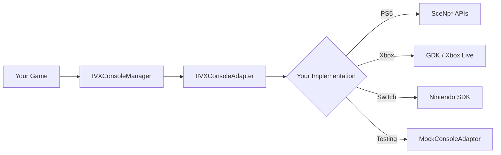
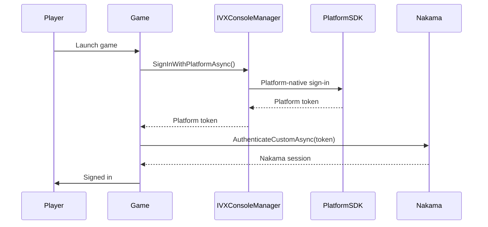

# Console Platforms (PS5 / Xbox / Switch)

> Console SDKs are under NDA. IntelliVerseX provides an abstract adapter interface — your studio implements the platform-specific bridge using its licensed SDK. This keeps the IntelliVerseX package free of NDA code while giving you full console integration.

---

## The Adapter Pattern



### Why an adapter?

1. **NDA compliance** — Sony, Microsoft, and Nintendo SDKs cannot be redistributed. IntelliVerseX never ships NDA-protected code.
2. **Compile isolation** — Console SDK headers and libraries are only available on licensed dev machines. The adapter pattern means the SDK compiles everywhere; only your bridge project needs the platform SDK.
3. **Testability** — `MockConsoleAdapter` lets you develop and test the full integration flow on any desktop without a dev kit.

---

## IIVXConsoleAdapter Interface

This is the contract your studio implements. Every method has a default no-op fallback so you can implement incrementally.

```csharp
namespace IntelliVerseX.Core
{
    /// <summary>
    /// Abstract adapter for console platform services (achievements, presence, auth, etc.).
    /// Implement this interface using your licensed platform SDK and register it
    /// with <see cref="IVXConsoleManager"/> at startup.
    /// </summary>
    public interface IIVXConsoleAdapter
    {
        /// <summary>
        /// Unique platform identifier string (e.g., "ps5", "xbox_series", "switch").
        /// Used for analytics tagging and feature-flag targeting in Satori.
        /// </summary>
        string PlatformId { get; }

        /// <summary>
        /// Returns the platform-native user ID (e.g., PSN Account ID, Xbox XUID, Nintendo Account ID).
        /// This ID is linked to the Nakama account via custom auth.
        /// </summary>
        Task<string> GetPlatformUserIdAsync();

        /// <summary>
        /// Show the platform's system overlay (e.g., PS5 Activity Card, Xbox Guide, Switch HOME).
        /// </summary>
        Task ShowPlatformOverlayAsync();

        /// <summary>
        /// Query whether a specific platform feature is available on this console.
        /// </summary>
        /// <param name="feature">The feature to check (e.g., Achievements, RichPresence, CloudSave).</param>
        /// <returns>True if the feature is supported and available.</returns>
        bool SupportsFeature(ConsoleFeature feature);

        /// <summary>
        /// Authenticate the player using the platform's native sign-in flow.
        /// Returns a token or credential string that can be passed to Nakama custom auth.
        /// </summary>
        Task<string> SignInWithPlatformAsync();

        /// <summary>
        /// Unlock a platform achievement or trophy.
        /// </summary>
        /// <param name="achievementId">Platform-specific achievement/trophy ID.</param>
        Task UnlockAchievementAsync(string achievementId);

        /// <summary>
        /// Set the player's rich presence string shown on the platform's friends list.
        /// </summary>
        /// <param name="presenceText">Localized presence string (e.g., "Playing Solo — Round 5").</param>
        /// <param name="metadata">Optional key-value metadata for joinable sessions, etc.</param>
        Task SetPresenceAsync(string presenceText, Dictionary<string, string> metadata = null);
    }

    /// <summary>
    /// Features that may or may not be available on a given console platform.
    /// </summary>
    public enum ConsoleFeature
    {
        Achievements,
        RichPresence,
        Haptics,
        VoiceChat,
        CloudSave,
        Leaderboards,
        ActivityCards,
        UserGeneratedContent
    }
}
```

---

## IVXConsoleManager Setup

### 1. Create a Config Asset

Create an `IVXConsoleConfig` ScriptableObject via **Assets → Create → IntelliVerseX → Console Config**:

```csharp
[CreateAssetMenu(fileName = "ConsoleConfig", menuName = "IntelliVerseX/Console Config")]
public class IVXConsoleConfig : ScriptableObject
{
    [Header("Achievement Mapping")]
    [Tooltip("Maps IntelliVerseX achievement IDs to platform-specific IDs")]
    public List<AchievementMapping> AchievementMappings;

    [Header("Presence")]
    public string DefaultPresenceText = "In Main Menu";

    [Header("Debug")]
    public bool UseMockAdapter = false;
}
```

### 2. Register Your Adapter

At game startup, register your implementation with the console manager:

```csharp
using IntelliVerseX.Core;

public class ConsoleBootstrap : MonoBehaviour
{
    [SerializeField] private IVXConsoleConfig _consoleConfig;

    private void Awake()
    {
#if UNITY_PS5
        IVXConsoleManager.Instance.RegisterAdapter(
            new PS5ConsoleAdapter(_consoleConfig));
#elif UNITY_GAMECORE_XBOXSERIES
        IVXConsoleManager.Instance.RegisterAdapter(
            new XboxSeriesAdapter(_consoleConfig));
#elif UNITY_SWITCH
        IVXConsoleManager.Instance.RegisterAdapter(
            new SwitchConsoleAdapter(_consoleConfig));
#else
        if (_consoleConfig.UseMockAdapter)
            IVXConsoleManager.Instance.RegisterAdapter(
                new MockConsoleAdapter());
#endif
    }
}
```

### 3. Use the Manager

Once registered, all game code interacts with `IVXConsoleManager` — never with the adapter directly:

```csharp
// Authenticate with platform, then link to Nakama
string platformToken = await IVXConsoleManager.Instance.SignInWithPlatformAsync();
await nakamaClient.AuthenticateCustomAsync(platformToken, create: true);

// Unlock an achievement (mapped automatically via config)
await IVXConsoleManager.Instance.UnlockAchievementAsync("first_win");

// Set rich presence
await IVXConsoleManager.Instance.SetPresenceAsync("In Multiplayer Lobby", new Dictionary<string, string>
{
    { "session_id", currentSessionId },
    { "joinable", "true" }
});
```

---

## Platform Feature Map

| Feature | PS5 | Xbox Series | Nintendo Switch |
|---------|:---:|:-----------:|:---------------:|
| **Platform Auth** | :white_check_mark: PSN Sign-In | :white_check_mark: Xbox Live | :white_check_mark: Nintendo Account |
| **Achievements / Trophies** | :white_check_mark: Trophies (Bronze/Silver/Gold/Platinum) | :white_check_mark: Achievements (Gamerscore) | :white_check_mark: Limited (game-managed) |
| **Rich Presence** | :white_check_mark: Activity Cards + Status | :white_check_mark: Rich Presence strings | :material-approximately-equal: Basic status only |
| **Haptics** | :white_check_mark: DualSense adaptive triggers + haptic feedback | :white_check_mark: Impulse triggers | :white_check_mark: HD Rumble |
| **Voice Chat** | :white_check_mark: PSN Party Chat | :white_check_mark: Xbox Party Chat | :white_check_mark: Nintendo Online voice |
| **Cloud Save** | :white_check_mark: PS Plus Cloud Storage | :white_check_mark: Xbox Cloud Saves | :white_check_mark: Nintendo Switch Online |
| **Leaderboards** | :white_check_mark: PSN Leaderboards | :white_check_mark: Xbox Live Leaderboards | :material-approximately-equal: Game-managed via Nakama |
| **Activity Cards** | :white_check_mark: PS5 Activities | :x: N/A | :x: N/A |
| **User Generated Content** | :material-approximately-equal: Via PSN UGC APIs | :material-approximately-equal: Via Xbox Live | :x: Not supported |

---

## Implementation Guide per Console

!!! note "NDA Notice"
    The code samples below show the **IntelliVerseX adapter structure** only. The actual platform API calls are pseudocode placeholders — replace them with real SDK calls from your licensed documentation.

### PS5 (PlayStation 5)

=== "Authentication"

    ```csharp
    public class PS5ConsoleAdapter : IIVXConsoleAdapter
    {
        public string PlatformId => "ps5";

        public async Task<string> GetPlatformUserIdAsync()
        {
            // Use SceNpAccountId to get the signed-in user's account ID
            // var accountId = SceNp.GetAccountId(userId);
            // return accountId.ToString();
            throw new NotImplementedException("Replace with SceNp* API calls");
        }

        public async Task<string> SignInWithPlatformAsync()
        {
            // 1. Get PSN auth code via SceNpAuth
            // 2. Exchange for ID token on your backend
            // 3. Return token for Nakama custom auth
            throw new NotImplementedException("Replace with SceNpAuth API calls");
        }
    }
    ```

=== "Trophies"

    ```csharp
    public async Task UnlockAchievementAsync(string achievementId)
    {
        // Map IntelliVerseX ID → PS5 Trophy ID via config
        int trophyId = _config.GetPlatformAchievementId(achievementId);

        // SceNpTrophy.UnlockTrophy(userId, trophyId);
        throw new NotImplementedException("Replace with SceNpTrophy calls");
    }
    ```

=== "DualSense Haptics"

    ```csharp
    public bool SupportsFeature(ConsoleFeature feature)
    {
        return feature switch
        {
            ConsoleFeature.Haptics => true,  // DualSense adaptive triggers
            ConsoleFeature.Achievements => true,
            ConsoleFeature.RichPresence => true,
            ConsoleFeature.CloudSave => true,
            ConsoleFeature.VoiceChat => true,
            ConsoleFeature.Leaderboards => true,
            ConsoleFeature.ActivityCards => true,
            _ => false
        };
    }
    ```

### Xbox Series (Xbox Series X|S)

=== "Authentication"

    ```csharp
    public class XboxSeriesAdapter : IIVXConsoleAdapter
    {
        public string PlatformId => "xbox_series";

        public async Task<string> SignInWithPlatformAsync()
        {
            // 1. Use XUserAddAsync to get the signed-in Xbox user
            // 2. Get Xbox Live token via XUserGetTokenAndSignatureAsync
            // 3. Return token for Nakama custom auth
            throw new NotImplementedException("Replace with GDK API calls");
        }
    }
    ```

=== "Achievements"

    ```csharp
    public async Task UnlockAchievementAsync(string achievementId)
    {
        string xboxId = _config.GetPlatformAchievementId(achievementId).ToString();

        // XblAchievementsUpdateAchievementAsync(xboxLiveContext, xboxId, 100);
        throw new NotImplementedException("Replace with Xbox Live GDK calls");
    }
    ```

=== "Rich Presence"

    ```csharp
    public async Task SetPresenceAsync(string presenceText, Dictionary<string, string> metadata = null)
    {
        // XblPresenceSetPresenceAsync(xboxLiveContext, presenceRecord);
        // presenceRecord includes richPresenceString and joinable session info
        throw new NotImplementedException("Replace with Xbox Live presence calls");
    }
    ```

### Nintendo Switch

=== "Authentication"

    ```csharp
    public class SwitchConsoleAdapter : IIVXConsoleAdapter
    {
        public string PlatformId => "switch";

        public async Task<string> SignInWithPlatformAsync()
        {
            // 1. Use nn::account to get the pre-selected user
            // 2. Obtain a Nintendo Account token via nn::account::GetNetworkServiceAccountId
            // 3. Return token for Nakama custom auth
            throw new NotImplementedException("Replace with Nintendo SDK calls");
        }
    }
    ```

=== "HD Rumble"

    ```csharp
    // Nintendo Switch HD Rumble via nn::hid
    public bool SupportsFeature(ConsoleFeature feature)
    {
        return feature switch
        {
            ConsoleFeature.Haptics => true,      // HD Rumble
            ConsoleFeature.Achievements => true,  // Game-managed
            ConsoleFeature.RichPresence => false,  // Basic status only
            ConsoleFeature.CloudSave => true,     // NSO required
            ConsoleFeature.VoiceChat => true,     // Via Nintendo Online app
            ConsoleFeature.Leaderboards => false, // Use Nakama leaderboards
            _ => false
        };
    }
    ```

---

## Unreal Engine Console Support

For Unreal Engine projects, IntelliVerseX provides `UIVXConsoleSubsystem` which wraps Unreal's `IOnlineSubsystem`. Because Unreal already abstracts console platform services, the integration is much simpler.

```cpp
// UIVXConsoleSubsystem automatically detects the active IOnlineSubsystem
// PS5 → OnlineSubsystemSony, Xbox → OnlineSubsystemGDK, Switch → OnlineSubsystemSwitch

UIVXConsoleSubsystem* Console = GetGameInstance()->GetSubsystem<UIVXConsoleSubsystem>();

// Auth — delegates to IOnlineIdentity
Console->SignInWithPlatform(FOnPlatformAuthComplete::CreateLambda(
    [](bool bSuccess, const FString& Token)
    {
        if (bSuccess)
            // Pass Token to Nakama custom auth
    }));

// Achievements — delegates to IOnlineAchievements
Console->UnlockAchievement(TEXT("first_win"));

// Presence — delegates to IOnlinePresence
Console->SetPresence(TEXT("In Multiplayer Lobby"));
```

### Unreal Platform Detection

```cpp
FString PlatformId = Console->GetPlatformId();
// Returns: "ps5", "xbox_series", "switch", or "unknown"
```

!!! tip
    Unreal's `IOnlineSubsystem` is automatically selected based on the build target. You do not need conditional compilation for most platform features — Unreal handles it internally.

---

## Testing with MockConsoleAdapter

IntelliVerseX ships `MockConsoleAdapter` for testing the full console integration flow without hardware:

```csharp
namespace IntelliVerseX.Core
{
    /// <summary>
    /// Mock adapter for testing console flows on desktop.
    /// Logs all calls and returns success for every operation.
    /// </summary>
    public class MockConsoleAdapter : IIVXConsoleAdapter
    {
        public string PlatformId => "mock_console";

        public Task<string> GetPlatformUserIdAsync()
        {
            Debug.Log("[MockConsoleAdapter] GetPlatformUserIdAsync → mock_user_001");
            return Task.FromResult("mock_user_001");
        }

        public Task<string> SignInWithPlatformAsync()
        {
            Debug.Log("[MockConsoleAdapter] SignInWithPlatformAsync → mock_token");
            return Task.FromResult("mock_platform_token_" + Guid.NewGuid());
        }

        public Task UnlockAchievementAsync(string achievementId)
        {
            Debug.Log($"[MockConsoleAdapter] Achievement unlocked: {achievementId}");
            return Task.CompletedTask;
        }

        public Task SetPresenceAsync(string presenceText, Dictionary<string, string> metadata = null)
        {
            Debug.Log($"[MockConsoleAdapter] Presence set: {presenceText}");
            return Task.CompletedTask;
        }

        public Task ShowPlatformOverlayAsync()
        {
            Debug.Log("[MockConsoleAdapter] ShowPlatformOverlayAsync (no-op on desktop)");
            return Task.CompletedTask;
        }

        public bool SupportsFeature(ConsoleFeature feature) => true;
    }
}
```

Enable mock mode in your config:

```csharp
// In IVXConsoleConfig ScriptableObject
[Header("Debug")]
public bool UseMockAdapter = true;  // Set to true for desktop testing
```

Or register directly:

```csharp
#if UNITY_EDITOR || UNITY_STANDALONE
IVXConsoleManager.Instance.RegisterAdapter(new MockConsoleAdapter());
#endif
```

---

## Nakama Authentication Flow for Consoles

All console platforms follow the same auth pattern with Nakama:



!!! warning "Token Validation"
    Always validate the platform token on your server side (Nakama custom auth hook) before creating or linking the account. Never trust a client-provided token without server verification.

---

## Certification Checklist

Each console platform has certification requirements. IntelliVerseX helps with the common ones:

| Requirement | PS5 (TRC) | Xbox (XR) | Switch (Lotcheck) | IntelliVerseX Support |
|-------------|:---------:|:---------:|:------------------:|----------------------|
| Handle sign-out gracefully | :white_check_mark: | :white_check_mark: | :white_check_mark: | `IVXConsoleManager.OnPlatformSignOut` event |
| Suspend / Resume | :white_check_mark: | :white_check_mark: | :white_check_mark: | `IVXConsoleManager.OnSuspend` / `OnResume` events |
| Network disconnection UI | :white_check_mark: | :white_check_mark: | :white_check_mark: | `IVXNetworkMonitor.OnDisconnected` + retry logic |
| Save data before suspend | :white_check_mark: | :white_check_mark: | :white_check_mark: | `OnSuspend` triggers auto-save via `IVXStorageManager` |
| Respect parental controls | :white_check_mark: | :white_check_mark: | :white_check_mark: | Query via `SupportsFeature(ConsoleFeature.*)` |
| Accessibility requirements | :white_check_mark: | :white_check_mark: | :white_check_mark: | IntelliVerseX Localization module for text scaling, colorblind modes |

---

## Folder Structure

```
Assets/_IntelliVerseXSDK/
└── Runtime/
    └── Console/
        ├── IIVXConsoleAdapter.cs          # Abstract adapter interface
        ├── IVXConsoleManager.cs            # Console service manager
        ├── IVXConsoleConfig.cs             # ScriptableObject config
        ├── MockConsoleAdapter.cs           # Desktop testing mock
        └── ConsoleFeature.cs              # Feature enum

SDKs/unreal/
└── Source/IntelliVerseX/
    └── Console/
        ├── IVXConsoleSubsystem.h          # Unreal console subsystem
        └── IVXConsoleSubsystem.cpp
```

---

## Troubleshooting

| Symptom | Cause | Fix |
|---------|-------|-----|
| `IVXConsoleManager` returns null adapter | No adapter registered | Check `ConsoleBootstrap` runs before any console calls |
| `NotImplementedException` at runtime | Adapter method not implemented | Implement the throwing method with real platform calls |
| Platform auth token rejected by Nakama | Token not validated server-side | Add token validation in Nakama's custom auth hook |
| Achievements not unlocking | ID mapping missing in config | Add entry to `IVXConsoleConfig.AchievementMappings` |
| Build fails on console target | Missing platform SDK | Install licensed SDK from platform partner portal |
| `MockConsoleAdapter` active in release build | `UseMockAdapter` left enabled | Guard with `#if UNITY_EDITOR` or disable in config |
