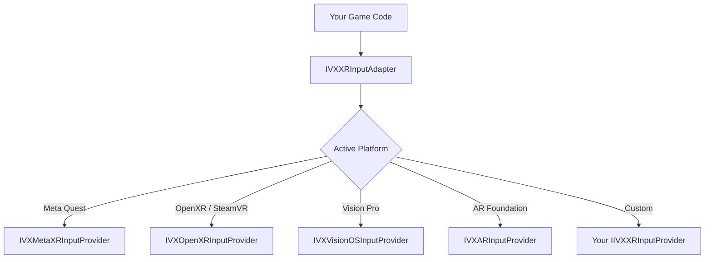

# XR / VR / AR Platforms

> IntelliVerseX provides a unified XR abstraction layer that works across Meta Quest, SteamVR, Apple Vision Pro, and AR Foundation — without requiring any XR SDK as a hard dependency.

---

## Supported XR Platforms

| Platform | Devices | XR SDK | Unity Target | Status |
|----------|---------|--------|--------------|--------|
| **Meta Quest** | Quest 2, Quest 3, Quest Pro | Meta XR SDK (formerly Oculus) | Android | Stable |
| **SteamVR** | Valve Index, HTC Vive, any OpenXR headset | OpenXR Plugin | Windows | Stable |
| **Apple Vision Pro** | Vision Pro | PolySpatial + visionOS | visionOS | Beta |
| **PSVR2** | PlayStation VR2 | Sony PS VR2 SDK (NDA) | PS5 | Beta |
| **Windows Mixed Reality** | HP Reverb G2, Samsung Odyssey | OpenXR Plugin / WMR Plugin | Windows | Stable |
| **AR Foundation** | Any ARKit / ARCore device | AR Foundation 5.x+ | iOS / Android | Stable |
| **Generic OpenXR** | Any OpenXR-compliant HMD | Unity OpenXR Plugin | Windows / Android | Stable |

---

## Setup

### Compile Defines

IntelliVerseX uses compile defines to keep XR support **zero-dependency**. The SDK never pulls in an XR package — you add the define only after you have installed the corresponding XR SDK yourself.

| Define | When to Set | What It Enables |
|--------|-------------|-----------------|
| `INTELLIVERSEX_HAS_META_XR` | Meta XR SDK installed in project | `IVXMetaXRInputProvider`, Quest-specific haptics, passthrough helpers |
| `INTELLIVERSEX_HAS_OPENXR` | Unity OpenXR Plugin installed | `IVXOpenXRInputProvider`, SteamVR / generic HMD support |
| `INTELLIVERSEX_HAS_VISIONOS` | PolySpatial + visionOS target configured | `IVXVisionOSHelper`, spatial UI placement, gaze input |
| `INTELLIVERSEX_HAS_ARFOUNDATION` | AR Foundation 5.x+ installed | `IVXARHelper`, plane detection wrappers, AR session lifecycle |

Add defines in **Player Settings → Other Settings → Scripting Define Symbols** or in your `.csproj` / `.asmdef`:

```
INTELLIVERSEX_HAS_META_XR;INTELLIVERSEX_HAS_OPENXR
```

### Per-Platform Setup

=== "Meta Quest"

    1. Install **Meta XR SDK** from the Unity Asset Store or Meta's developer site
    2. Add `INTELLIVERSEX_HAS_META_XR` to Scripting Define Symbols
    3. `IVXXRPlatformHelper` auto-detects Quest via `OVRPlugin`
    4. Configure **Android** build target with ARM64, Vulkan, and minimum API 29

    ```csharp
    // IVXXRPlatformHelper auto-detection (simplified)
    #if INTELLIVERSEX_HAS_META_XR
    if (OVRPlugin.initialized)
    {
        _activePlatform = XRPlatform.MetaQuest;
        _inputProvider = new IVXMetaXRInputProvider();
    }
    #endif
    ```

=== "SteamVR / OpenXR"

    1. Install **Unity OpenXR Plugin** from Package Manager
    2. Add `INTELLIVERSEX_HAS_OPENXR` to Scripting Define Symbols
    3. `IVXXRPlatformHelper` detects via `XRGeneralSettings.Instance.Manager.activeLoader`
    4. Add interaction profiles for your target controllers in **XR Plug-in Management → OpenXR**

    ```csharp
    #if INTELLIVERSEX_HAS_OPENXR
    var loader = XRGeneralSettings.Instance?.Manager?.activeLoader;
    if (loader != null && loader.name.Contains("OpenXR"))
    {
        _activePlatform = XRPlatform.SteamVR;
        _inputProvider = new IVXOpenXRInputProvider();
    }
    #endif
    ```

=== "Apple Vision Pro"

    1. Install **PolySpatial** and configure **visionOS** build target
    2. Add `INTELLIVERSEX_HAS_VISIONOS` to Scripting Define Symbols
    3. `IVXVisionOSHelper` activates spatial placement and gaze-based input
    4. Use **Shared Space** for mixed reality or **Full Space** for immersive VR

    ```csharp
    #if INTELLIVERSEX_HAS_VISIONOS
    IVXVisionOSHelper.Instance.ConfigureSpatialUI(volumeCamera);
    #endif
    ```

=== "AR Foundation"

    1. Install **AR Foundation 5.x+** and the relevant provider (ARKit XR Plugin / ARCore XR Plugin)
    2. Add `INTELLIVERSEX_HAS_ARFOUNDATION` to Scripting Define Symbols
    3. `IVXARHelper` wraps `ARSession` lifecycle, plane detection, and raycasting

    ```csharp
    #if INTELLIVERSEX_HAS_ARFOUNDATION
    IVXARHelper.Instance.StartSession(detectionMode: PlaneDetectionMode.Horizontal);
    IVXARHelper.Instance.OnPlaneDetected += HandlePlaneDetected;
    #endif
    ```

---

## XR Input Abstraction

`IVXXRInputAdapter` provides a unified input layer across all XR platforms so your game code never references platform-specific APIs directly.



### IIVXXRInputProvider Interface

```csharp
namespace IntelliVerseX.Core
{
    /// <summary>
    /// Implement this interface to provide XR input from a custom platform.
    /// </summary>
    public interface IIVXXRInputProvider
    {
        /// <summary>The platform this provider supports.</summary>
        XRPlatform Platform { get; }

        /// <summary>Current head (HMD) pose in world space.</summary>
        Pose GetHeadPose();

        /// <summary>Pose of the specified hand/controller.</summary>
        Pose GetHandPose(XRHand hand);

        /// <summary>Gaze direction ray from the user's eyes.</summary>
        Ray GetGazeRay();

        /// <summary>Whether the primary action button is pressed.</summary>
        bool GetPrimaryButton(XRHand hand);

        /// <summary>Trigger axis value (0–1).</summary>
        float GetTriggerValue(XRHand hand);

        /// <summary>Grip axis value (0–1).</summary>
        float GetGripValue(XRHand hand);

        /// <summary>Thumbstick / touchpad 2D axis.</summary>
        Vector2 GetThumbstick(XRHand hand);

        /// <summary>Whether hand tracking is active (vs. controller).</summary>
        bool IsHandTrackingActive { get; }

        /// <summary>Whether eye tracking is available and active.</summary>
        bool IsEyeTrackingActive { get; }

        /// <summary>Trigger a haptic pulse on the specified hand.</summary>
        void SendHapticPulse(XRHand hand, float amplitude, float duration);
    }
}
```

### Using the Adapter

```csharp
var input = IVXXRInputAdapter.Instance;

Pose head = input.GetHeadPose();
Ray gaze = input.GetGazeRay();

if (input.GetPrimaryButton(XRHand.Right))
    FireProjectile(input.GetHandPose(XRHand.Right));

if (input.GetTriggerValue(XRHand.Left) > 0.8f)
    GrabObject();
```

### Registering a Custom Provider

```csharp
// At startup, before any XR input queries
IVXXRInputAdapter.Instance.RegisterProvider(new MyCustomInputProvider());
```

---

## Recommended XR Settings

`IVXXRPlatformHelper.GetRecommendedSettings()` returns platform-tuned defaults:

| Setting | Meta Quest 2 | Meta Quest 3 | SteamVR | Vision Pro | AR (Mobile) |
|---------|:------------:|:------------:|:-------:|:----------:|:-----------:|
| Target Frame Rate | 72 fps | 90 fps | 90 fps | 90 fps | 60 fps |
| Render Scale | 1.0× | 1.2× | 1.0× | 1.0× (system managed) | 1.0× |
| Fixed Foveated Rendering | High | Medium | N/A | System | N/A |
| UI Scale | 1.2× | 1.0× | 1.0× | 0.8× (spatial) | 1.0× |
| Recommended Canvas Mode | World Space | World Space | World Space | World Space (Volume) | Screen Space Overlay |
| Anti-Aliasing | MSAA 4× | MSAA 4× | MSAA 4× or TAA | System | MSAA 2× |
| Color Space | Linear | Linear | Linear | Linear | Linear |

```csharp
var settings = IVXXRPlatformHelper.GetRecommendedSettings();
Application.targetFrameRate = settings.TargetFrameRate;
XRSettings.renderViewportScale = settings.RenderScale;
```

---

## WebXR (Browser VR/AR)

For the [JavaScript SDK](javascript.md), IntelliVerseX provides `IVXWebXRHelper.ts` to detect and manage browser-based XR sessions.

### Session Detection

```typescript
import { IVXWebXRHelper } from '@intelliversex/sdk';

const xr = new IVXWebXRHelper();

// Check device capabilities
const canVR = await xr.isSessionSupported('immersive-vr');   // Meta Quest Browser, desktop VR
const canAR = await xr.isSessionSupported('immersive-ar');   // Mobile Chrome AR

if (canVR) {
    enterVRButton.disabled = false;
    enterVRButton.onclick = () => xr.requestSession('immersive-vr', {
        requiredFeatures: ['local-floor'],
        optionalFeatures: ['hand-tracking', 'bounded-floor']
    });
}
```

### WebXR + IntelliVerseX Backend

All IntelliVerseX backend modules (auth, leaderboards, Hiro RPCs, Satori events) work in WebXR because they use standard HTTP / WebSocket — no platform-specific APIs required.

```typescript
// Inside a WebXR session, SDK calls work normally
await ivx.authenticateDevice();
await ivx.submitScore('vr_high_score', 42000);
ivx.satoriTrackEvent('xr_session_start', { mode: 'immersive-vr' });
```

---

## Eye Tracking & Privacy

!!! warning "User Consent Required"
    Eye tracking data is sensitive. Always request explicit user consent before enabling eye tracking, and never transmit raw gaze data to your backend.

IntelliVerseX provides utility methods to handle this:

```csharp
bool consented = await IVXXRPlatformHelper.RequestEyeTrackingConsentAsync();
if (consented)
{
    IVXXRInputAdapter.Instance.EnableEyeTracking();
}
```

The SDK never sends eye-tracking data to Nakama/Satori. If you need gaze analytics, aggregate locally (e.g., heatmap zones) and send only the aggregated result.

---

## Best Practices

### Architecture

- **Always use compile defines** — Keep the SDK zero-dependency on XR packages. A project without any XR SDK installed should compile cleanly.
- **Test in XR Simulator** — Use Meta XR Simulator or Unity's XR Device Simulator during development to iterate without a headset.
- **World Space UI** — For VR, set Canvas `Render Mode` to **World Space** and place panels at comfortable reading distance (1.5–2 m).
- **Handle tracking loss** — Subscribe to `IVXXRPlatformHelper.OnTrackingLost` and show a "return to play area" overlay.

### Performance

- **Frame rate is critical** — Dropped frames cause nausea. Target 72–90 fps depending on platform (see table above).
- **Avoid GC in render loop** — All standard IntelliVerseX zero-GC rules apply doubly in XR.
- **Use Single Pass Instanced** rendering on all platforms that support it.
- **GPU bound?** — Lower render scale via `XRSettings.renderViewportScale` before reducing visual quality.

### Comfort

- **Never move the camera programmatically** without a comfort vignette or snap-turn.
- **Provide teleport + smooth locomotion** options — let the user choose.
- **Anchor UI to world, not head** — Head-locked UI causes discomfort; use a follow-with-lag pattern if a HUD is needed.
- **Respect the guardian/boundary** — Use `OVRBoundary` or OpenXR bounds to warn users.

---

## SDK Module Compatibility in XR

All IntelliVerseX modules that work on the base platform (Android, Windows, visionOS) continue to work in XR. There are no XR-specific module restrictions. The table below highlights XR-enhanced behaviors:

| Module | XR Enhancement |
|--------|----------------|
| **Identity** | Authenticates normally; device ID from headset hardware |
| **AI Voice** | Spatial audio positioning for AI host voice in VR |
| **Multiplayer** | Networked avatar head/hand poses via Nakama real-time |
| **Leaderboards** | World-space leaderboard panels |
| **Hiro/Economy** | Standard — no XR-specific changes |
| **Satori Analytics** | Tracks `xr_session_start`, `xr_session_end`, headset model as properties |
| **Ads** | Not recommended in immersive VR; supported in AR overlay or 2D fallback |

---

## Folder Structure

```
Assets/_IntelliVerseXSDK/
└── Runtime/
    └── XR/
        ├── IVXXRPlatformHelper.cs       # Platform detection + recommended settings
        ├── IVXXRInputAdapter.cs          # Unified input singleton
        ├── IIVXXRInputProvider.cs        # Input provider interface
        ├── IVXMetaXRInputProvider.cs     # Meta Quest implementation
        ├── IVXOpenXRInputProvider.cs     # OpenXR / SteamVR implementation
        ├── IVXVisionOSHelper.cs          # Apple Vision Pro utilities
        ├── IVXARHelper.cs                # AR Foundation wrapper
        └── IVXWebXRHelper.ts             # JavaScript SDK WebXR helper (in SDKs/javascript/)
```

---

## PSVR2 Integration

!!! note "NDA Required"
    PSVR2 development requires PlayStation Partners registration and access to the PS VR2 Unity plugin under NDA.

### Setup

1. Obtain the **PS VR2 Unity Plugin** from Sony's PlayStation Partners portal.
2. Import into your Unity project targeting PS5.
3. The SDK detects XR loaders containing "PlayStation" or "PSVR" and sets `XRPlatformType.PSVR2`.

### Capabilities

| Feature | PSVR2 Support |
|---------|--------------|
| Head tracking | Yes (6DoF) |
| Eye tracking | Yes (built-in) |
| Foveated rendering | Yes (hardware) |
| Hand tracking | No |
| Passthrough | Yes (grayscale) |
| Sense controllers | Yes (adaptive triggers, haptics) |

### Recommended Settings

`IVXXRPlatformHelper.GetRecommendedSettings()` returns:

- Target frame rate: 90 fps
- Render scale: 1.0
- World-space UI: true
- Prefer hand tracking: false

---

## Store Certification & Submission

Each VR platform has its own submission and certification requirements:

### Meta Quest Store

| Requirement | Details |
|------------|---------|
| **VRC (Virtual Reality Check)** | Must pass Meta's VRC guidelines for comfort, performance, and UX |
| **Performance** | 72 fps minimum on Quest 2; 90 fps recommended on Quest 3 |
| **Guardian/Boundary** | Must respect the Guardian boundary system |
| **Comfort rating** | Declare intensity level (Comfortable / Moderate / Intense) |
| **App Lab** | Alternative to full store — faster review, no curation gate |

### SteamVR

| Requirement | Details |
|------------|---------|
| **Steamworks** | Standard Steam submission process via Steamworks partner portal |
| **OpenXR** | OpenXR support recommended (SteamVR runtime provides backward compat) |
| **Comfort** | Steam comfort rating system (seated, standing, room-scale) |

### Apple Vision Pro (App Store)

| Requirement | Details |
|------------|---------|
| **visionOS target** | Build with Xcode and PolySpatial; submit via App Store Connect |
| **Spatial Computing guidelines** | Follow Apple HIG for spatial computing |
| **Privacy** | Eye tracking data must stay on-device (Apple requirement) |

### PSVR2 (PlayStation Store)

| Requirement | Details |
|------------|---------|
| **TRC compliance** | Must pass all Sony Technical Requirements Checklist items for VR |
| **Performance** | 90 fps native; reprojection allowed but not as primary target |
| **Eye tracking consent** | Must request user permission for eye tracking features |

---

## Troubleshooting

| Symptom | Cause | Fix |
|---------|-------|-----|
| `IVXXRPlatformHelper` returns `Unknown` | XR SDK not installed or define missing | Install SDK, add `INTELLIVERSEX_HAS_*` define |
| Controllers not tracked | Wrong OpenXR interaction profile | Add profile in XR Plug-in Management → OpenXR |
| Low frame rate on Quest | Render scale too high or GC spikes | Profile with Meta Quest Developer Hub; lower render scale |
| Eye tracking returns zero | User denied permission | Check `IsEyeTrackingActive`; re-prompt consent |
| Vision Pro spatial UI not appearing | PolySpatial not configured | Ensure PolySpatial package + Volume Camera in scene |
| AR planes not detected | `ARPlaneManager` missing from scene | Add `ARSession` + `ARSessionOrigin` + `ARPlaneManager` |
| PSVR2 not detected | PS VR2 plugin not installed | Obtain plugin from PlayStation Partners; import into PS5 project |
| WMR headset shows as GenericOpenXR | WMR-specific loader not matched | Ensure WMR plugin is installed; SDK matches "WindowsMR" or "WMR" in loader name |
